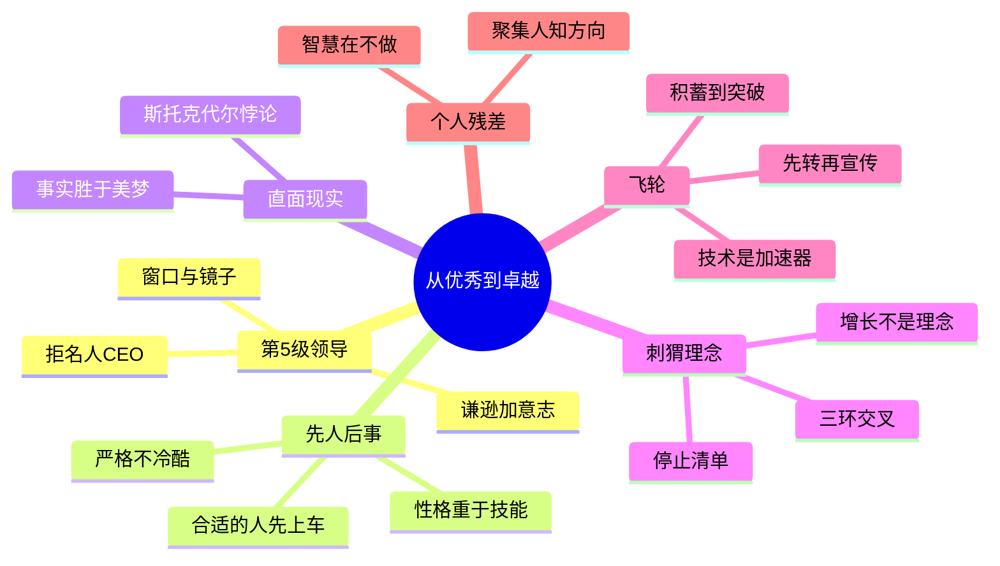

# 《从优秀到卓越》(Good to Great) 读书笔记与思维导图

**作者**：[美] 吉姆·柯林斯
**译者**：俞利军
**核心主旨**：卓越并非天赋或行业红利，而是一套可复制的决策框架——第5级领导、先人后事、直面残酷现实、刺猬理念、训练有素的文化与飞轮效应的层层叠加。

---

## 1. 第5级经理人：谦逊 + 意志

- **双重人格**：平和而执著，谦逊而无畏；个性谦逊但又表现专业——爱抛头露面、沉默寡言、内向甚至害羞的混合体。
- **窗口与镜子**：业绩不佳时向窗外望，责备外部因素；一切顺利时在镜前承担责任——把功劳归于自身以外的因素。
- **与名人 CEO 负相关**：从公司外请被奉若神明的名人做领导，往往对从优秀到卓越的跨越起消极作用；10 家跨越公司中 10 家的 CEO 来自内部提拔。
- **任人唯亲是平庸之源**：裙带关系和任期长短不能决定要职；在职责范围内不能成为该行业最好的经理人，就会失业。
- **"1 个天才与 1000 个助手"**：天才离开后剩下的人如无头苍蝇——对照公司尤为盛行此模式。

## 2. 先人后事：合适的人先上车

- **顺序不可颠倒**：在没有得到合适的人才之前，就绝口不提公司发展问题；先找合适的人，再通过正确的问题和热烈讨论找到繁荣之路。
- **合适的人才是资产**：人不是最重要的资产，合适的人才是；补偿机制不是让不合适的人作出正确举动，而是让合适的人上车并留下。
- **严格但不冷酷**：一旦发觉换人之举势在必行，就当机立断——让一个人长期不确定才是真正冷酷；一开始就妥善处理是严格。
- **性格重于技能**：拓宽对"合适人选"的定义，更多重视性格特征和天赋能力，而非专门知识、背景或实际技能。
- **留住与输送**：接受合适的人会成为其他公司 CEO 的事实——招聘并留住好员工是最终飞跃中比市场、技术、竞争、产品都更重要的事。

## 3. 直面残酷现实：斯托克代尔悖论

- **悖论核心**：平静接受最残忍的现实，同时坚信不论道路如何险阻前途一定光明——信念与原则不可混淆。
- **事实胜于美梦**：构建简单深刻的参考模式；敢于面对事实，不论多残酷；一旦人们隐瞒事实，领导个性就是罪魁祸首。
- **铁腕 vs 真相**：对照公司中员工担心领导怎么想多于担心外在事实——这会阻碍直面现实。
- **不打击积极性**：最令人泄气的是忽视残酷现实；弄清问题真相，承担错误决定的后果，但沉痛教训人人需注意。
- **机遇 vs 难题**：将杰出人才用于抓住天赐良机以图发展，而非解决最大难题——解决现成问题只会使公司变好，抓住机遇才能使公司卓越。

## 4. 刺猬理念：三环交叉的简化力量

- **三环问题**：① 你能在什么方面成为世界上最优秀的？② 什么驱动你的经济引擎（你的指标是什么）？③ 你对什么充满激情？
- **简化决策**：所有实现跨越的公司都持有一个非常简单的理念，用它做参考模式制定决策——思想分散、不集中、不连贯是对照公司的特征。
- **增长不是刺猬理念**：专注于简单而清晰的理念，而非专注于"增长"；对照公司从未提出正确的问题，更多从虚张声势而非感悟树立目标。
- **能 vs 不能**：同样重要的是了解不能做得最出色的是什么——若不能在核心业务上成为最好，核心业务就不能成为刺猬理念的基础。
- **停止清单**：与刺猬理念不一致的就不做——不涉足无关行业，不做无关兼并；预算过程决定哪些项目符合刺猬理念、哪些应完全放弃。

## 5. 训练有素的文化：框架下的自由

- **三环顺序**：先找合适的人（严格但不冷酷）→ 再面对残酷现实 → 再锁定刺猬理念 → 再建立训练有素的文化。
- **框架下的自由**：建立一贯制度，同时给予员工制度框架下的自由和责任；聘用严于自律无需管理的人，公司只需管理系统。
- **思想、行为、人**：没有训练有素的思想，训练有素的行为只能导致惨败；没有训练有素的人，训练有素的行为无法维持。
- **文化 vs 暴政**：跨越公司由第5级领导人建立持久训练有素文化；对照公司由第4级领导人通过个人权威规范组织——二者不可混淆。
- **清除松软干酪**：大多数组织缺乏纪律，不了解自己，不清楚最大优势是什么，凭借什么把潜力变成现实。

## 6. 飞轮效应：从积蓄到突破

- **可预测模式**：坚持到底的转变遵循从积累到突破的模式——不是天赐良机，而是巨大动力依赖不断改进和成果取得。
- **避免厄运之轮**：对照公司寻求一个决定性行为、伟大方案、奇迹瞬间——错误指导下的收购和废除前代成果的新领导人。
- **先转动再宣传**：避免喧嚣鼓动；先转动飞轮、创造有形结果，人们才会站在你身边支持——动量积累时内外部都会感受到。
- **连贯性**：系统中每一部分的存在都为增强其他部分的稳定性；保持前后连贯性，经过一代又一代取得最大化结果。
- **技术加速器**：技术本身不是发展主要原因，有选择地尝试使用技术才是动因——合理使用技术是动力加速器而非创造者；管理不善而非技术落后才是平庸首因。

## 个人想法与点评

- 针对"先普遍撒网，后重点培养"：联想到某公司校招做法——与"没有合适人选决不盲目录用"形成对照。
- 简单来说，能够聚集优秀的人，能够知道前进的方向——这是对全书框架的个人压缩。

## 个人补充

- 划线密集在**顺序与取舍**：先人后事、停止清单、飞轮积累——卓越公司的智慧大量体现在"不做什么"。
- 斯托克代尔悖论与个人经历共鸣：接受残酷现实的同时保持信念，是战略定力与执行韧性之间的平衡点。
- "优秀是卓越的大敌"是最常被引用的句子，但个人更关注其操作含义——对照公司已经"不错"，因此缺乏变革紧迫感。
- 技术章节祛魅：柯林斯明确技术不能使优秀变卓越也不能阻止灾难——这与当前"AI 转型焦虑"形成互文，先问技术是否直接服务刺猬理念。

---

## 思维导图 (Mind Map)

*导图画的是"我标记过的书"：叶子节点来自个人划线与想法的要点，非全书大纲。*

---

## 社区精华：热门划线 (Popular Highlights)

- "优秀是卓越的大敌。 这就是为什么鲜有优秀者实现卓越的主要原因。" -- 1632人划线
- "在一切都很顺利的时候，第5级经理人向窗外看，把功劳归于自身以外的因素（如果找不到特定的人或事件，他们就把功劳归于运气）。同时，如果事情进行得不顺利，他们会朝镜子里看，承担责任，而不是埋怨运气不好。" -- 1666人划线
- "你不能把信念与原则搞混，信念是你一定会成功——这点你可千万不要失去了——而原则是你一定要面对现状中最残忍的事实，无论它们是什么。" -- 1248人划线
- "人不是最重要的资产，合适的人才是最重要的资产。" -- 1190人划线
- "卓越并非环境的产物，在很大程度上，它是一种慎重决策的结果。" -- 1120人划线
- "那些成功实现从优秀到卓越转变的公司的人士心里十分清楚，任何卓越公司的最终飞跃，靠的不是市场，不是技术，不是竞争，也不是产品。有一件事比其他任何事都举足轻重：那就是招聘并留住好的员工。" -- 1037人划线
- "做你擅长的只是使你变得不错；一心专注于你有潜能比其他公司做得更好的事，才是通向卓越的惟一途径。" -- 990人划线
- "实现跨越的公司不仅仅关注做哪些事才能成为卓越公司；它们同样也关注哪些事不该做，哪些事应该停止做。" -- 936人划线
- "实现跨越的公司完全彻底遵循这样一条原则：与刺猬理念不一致的，我们就不用。我们不会涉足无关行业，不会做无关的兼并。只要不合适，我们就不做。" -- 782人划线
- "斯托克代尔悖论：不管遭遇什么困难，必须坚信自己一定能够并最终会获胜；与此同时，不管现实有多么残酷，都必须具有与之对抗的素质。" -- 638人划线
- "1.你能够在什么方面成为世界上最优秀的。同样重要的是，你不能在什么方面成为世界上最优秀的。" -- 611人划线
- "由优秀公司转变而来的卓越公司是受强烈的创造欲望和追求卓越的内在强制冲动激励的。相反，那些平庸公司是因为担心落后而鞭策自己前进的。" -- 560人划线
