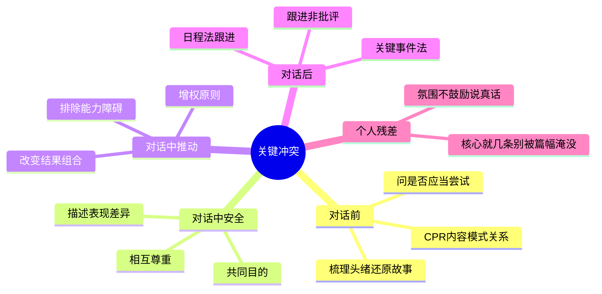

# 《关键冲突》(Crucial Accountability) 读书笔记与思维导图

**作者**：科里·帕特森、约瑟夫·格雷尼、戴维·马克斯菲尔德、罗恩·麦克米兰、艾尔·史威茨勒；译者：毕崇毅
**核心主旨**：《关键对话》的姊妹篇,聚焦"承诺已达成但一方未兑现"的场景。核心不是赢得争执,而是通过安全对话让对方对行为负责,同时强化而非损害关系。

---

## 1. 关键冲突是什么

- **与关键对话的区别**：关键对话解决意见不同、情绪激烈的高风险互动;关键冲突解决双方曾达成一致、做出承诺,但一方未能兑现的问题——特征是应对失望的结果。
- **两种失败路径**：对错误行为保持缄默,任其愈加猖狂;或冒失展开争执,带来新问题。有礼有节地对话,才能保护利益并改善关系。
- **沉默的代价被低估**：我们问的是"我能否成功应对这次冲突"而非"我是否应当尝试",当内心对"能否成功"做出否定回答,便选择不必尝试——同时忽略沉默的代价,夸大开口的代价。
- **最有价值的员工**：能够鼓励他人对行为负责的沟通大师——学习问责,就是为组织带来可预见性和信任感。

## 2. 对话前: 明确选择 (CPR 思维法)

- **先决定是否开口**：并非所有失望都值得展开关键冲突;必须决定是否有必要开口,并从中选出希望讨论的重点。
- **CPR 思维法**——定位问题的层次:
  - **C (Content 内容)**：第一次发生,谈具体事件。
  - **P (Pattern 模式)**：反复发生,谈重复模式。
  - **R (Relationship 关系)**：已影响信任和合作,谈关系层面。
- **反复解决同一问题却无效** → 很可能抓错了层次,忽略了真正需要面对的核心问题。
- **结果导向选问题**：这个问题会为我、我和对方的关系、工作任务、其他利益相关者带来怎样的结果?
- **自我检视清单**：是否常用动作暗示观点? 良心是否提醒是非? 是否害怕说出想法而保持沉默? 是否总说自己孤立无助?
- **沉默的合理化**：我们善于想象可能发生在自己身上的坏事情,从而夸大开口的风险、忽略沉默的代价——"刺儿头的下场多半身败名裂"是典型恐惧叙事。

## 3. 对话前: 梳理头绪 (控制情绪)

- **情绪决定话语**：关键冲突的出现和消失,取决于人们选择使用的话语和表达方式;而这些取决于开口之前脑中的思维结果。
- **还原故事,而非臆断**：人们判断他人行为时多用品质分析法("他就是这种人"),而非环境分析法("情境压力使然")。必须重建事件经过,控制强烈情绪。
- **把对方视为同类人**：确保脑中的想法(事实、说法和情绪)能帮助自己把对方视为和自己一样的人,而非十恶不赦的坏蛋。
- **情绪爆发有前兆**：突发性暴力宣泄基本都由长期默然承受痛苦、压力引起——沉默积累的情绪会在最不合适的时刻爆发。
- **带着情绪等于已输**：若管理者带着强烈负面情绪、不假思索认为自己完全正确,事情原委如何已不重要,结果往往两败俱伤。

## 4. 对话中: 安全开场

- **两大安全条件**：
  - **共同目的**：让对方感到你关心他们的目标,而非只关心自己的不满。
  - **相互尊重**：让对方感到被当作平等对象看待,而非被居高临下评判。
- **安全开场做法**：表明愿意了解事情来龙去脉;通过检视预期行为与实际表现之间的差异来开启,而非猜测和臆想。
- **错误开场方式**：兜圈子、打哑谜、诿过、让对方费解——这些都会触发"你不关心他们的目标"或"你没有把他们当平等对象"的解读,对话尚未开始就已失败。
- **实战高手特征**：善于为上司营造安全感——设身处地思考行为会给对方带来什么麻烦,而非只顾自己的痛苦;花时间分析对方的自然结果,以此建立影响力。

## 5. 对话中: 描述表现差异

- **核心动作**：描述观察到的预期表现与实际表现之间的差别——谈事实,不谈猜测。
- **好奇而非审判**：带着好奇心了解到底发生了什么,而非认定对方故意使坏。
- **无罪推定**："不好意思,你大概没注意到,我们已经排了 30 分钟的队了"——注意语调和无罪推定。
- **合法不等于合乎情理**：观点正确不代表能得到支持和拥护;有时需要把准备工作和调查结果联系起来,说明建议既能解决对方顾虑,又能帮助实现其渴望的目标。

## 6. 对话中: 制造动机

- **核心机制**：只要改变人们对结果组合的看法,他们的行为自然就会出现变化。
- **提醒任务重要性**：对勤奋可靠但为优先级别头疼的员工,提醒任务重要性是有效策略。
- **分析自然结果**：细致分析行为可能为对方带来的自然结果(而非威胁惩罚),帮助其重新评估结果组合。
- **表扬也是动机工具**：进展顺利时,公开场合为团队庆祝,私下场合表扬个人成绩(附录 C)。

## 7. 对话中: 简化问题 (排除能力障碍)

- **增权原则**：帮助对方面对能力障碍,使其更轻松地遵守承诺;理解不同竞争需求,必要时进行处罚。
- **结构化诊断**：问题可能出在个人动机、个人 ability、社会能力或结构化动机/能力——排除"不是不想做,而是不会做"的能力障碍,再谈动机。
- **意外状况与突发情绪**：对话中可能出现意外状况或突发性情绪,需要灵活回到安全条件重建对话。

## 8. 对话后: 制订计划与跟进

- **关键事件法**：在关键节点检查行为是否兑现,而非等最终 deadline 才发现问题。
- **日程法**：设定明确的跟进时间表,避免"谈完就忘"。
- **跟进不是批评**：对方会把检查行为视为批评而停止主动思考——跟进方式是协作式核对,而非督查式审查。
- **联系建议与目标**：最后必须把准备工作和调查结果联系起来,说明建议不但解决顾虑,还能帮助实现渴望的目标——影响力在此显著提升。

## 个人想法与点评

- 全书车轱辘话偏多,核心其实就几条: 分清楚这是不是该谈的问题(CPR), 抛弃主观臆断还原事实, 平等地征求意见并持续跟踪——方法论不复杂,难在情绪管理和组织氛围。
- 附录 C 关于"制造动机"的交叉引用写得混乱,实操时直接回到第 4 章的结果组合分析更可靠。
- 沉默的真实原因常是团队氛围不鼓励说真话——"不愿找麻烦"不是个人懦弱,而是系统信号: 说真话的代价高于忍气吞声。

## 个人补充

热门划线是共识基线,以下是个人在共识之外补上的内容:

- 社区共识集中在**沉默的代价**和**情绪管理**;个人划线密集在**CPR 分层**和**安全开场的操作细节**(共同目的/相互尊重/表现差异)——知道"该谈"不够,选对 CPR 层次和安全条件才避免重复无效对话。
- 个人残差指向**组织语境**: 当团队氛围惩罚说真话时,个人技巧只能部分生效;此时需要同时考虑"是否值得在这件事上消耗政治资本"和"能否找到意见领袖先行沟通"。
- "跟进不是批评"是对话后最容易被管理者忽略的环节——检查行为若带审判语气,对方会停止主动思考,计划沦为纸上谈兵。

---

## 思维导图 (Mind Map)

*导图画的是"我标记过的书":叶子节点来自个人划线要点与热门划线,非全书大纲。*

---

## 社区精华: 热门划线 (Popular Highlights)

- "我的问题是喜欢把所有问题都压在心底,我无法表达愤怒,而是慢慢在内心郁结痛苦。 ——伍迪·艾伦" -- 450人划线
- "为什么会出现这种情况呢?原因是在特定的场合面对特定的人时,我们都不愿'找麻烦'。不愿给老板、机长、医生、同事或亲戚,甚至不愿给插队者找麻烦。" -- 377人划线
- "如果你发现自己一直纠缠于同一个问题无法自拔,那很可能是因为没有抓到本质,忽略了真正需要解决的核心问题。" -- 319人划线
- "情绪的突发性暴力宣泄基本上都是由长期默然承受痛苦、压力引起的。" -- 315人划线
- "有时候合法的事情未必合乎情理,你的观点正确不代表能得到别人的支持和拥护。" -- 288人划线
- "面对错误行为和违反承诺的表现,有礼有节地和对方进行对话才能更好地保护自己的利益。有了这种新的认识,他们的行为当然会发生变化。" -- 273人划线
- "'不好意思,你大概没注意到,我们已经排了30分钟的队了。'(注意语调和无罪推定原则的运用。)" -- 272人划线
- "如果你采用的解决方案无法满足你的真正需要,不能让你得到期望的结果,那么你很可能面对的是完全错误的问题。" -- 231人划线
- "插队只是个无足轻重的小问题,如果闹翻脸反而会惹上大麻烦。于是,他们便选择了隐忍。" -- 187人划线
- "如果管理者带着强烈的负面情绪去面对冲突,不假思索地认为自己完全正确,那么事情的原委究竟如何根本就不重要。他们面对问题的结果很可能只有一个,即两败俱伤。" -- 187人划线
- "关键冲突的出现和消失取决于人们选择使用的话语和表达这些话语的方式;而这些话语,特别是它们的表达方式,取决于人们在开口之前脑中的思维结果。" -- 182人划线
- "关于动机,总结成一句话就是:只要改变人们对结果组合的看法,他们的行为自然就会出现变化。" -- 180人划线
- "研究结果发现,很多情况下人们都不会对违反承诺、言而无信、行为乖张或违背期望的举动挺身而出,仗义执言。" -- 170人划线
- "当你试图保持沉默时,你的身体语言却在不断发出相反的信号,或是通过讽刺挖苦的语气来暗示真实情绪,这些现象说明你应当开口表达内心的想法了。" -- 168人划线
- "至于如何说服自己保持沉默,我们通常有两种常用手段:一是忽略沉默的代价,二是夸大开口的代价。" -- 168人划线
- "如果无法改变主观认识,他是根本无法改变自己的表演行为的。" -- 165人划线
- "在为保持沉默寻找理由时,我们的思路是这样的:我们会问自己'我能否成功应对这次冲突',而不是'我是否应当尝试去面对'。显然,当内心对'能否成功'这个问题做出否定回答时,我们便会选择不必尝试的结果。" -- 160人划线
- "圈子压力是造成愚蠢决定的重要原因。" -- 160人划线
- "我更希望能和这位母亲一起想办法解决问题,否则她会把学校领导视为敌人,用不了多久她的孩子也会产生这种印象。" -- 150人划线
- "学习如何从违反承诺的行为中抓住关键问题并不容易,这是一种需要时间去练习的技巧。" -- 150人划线
