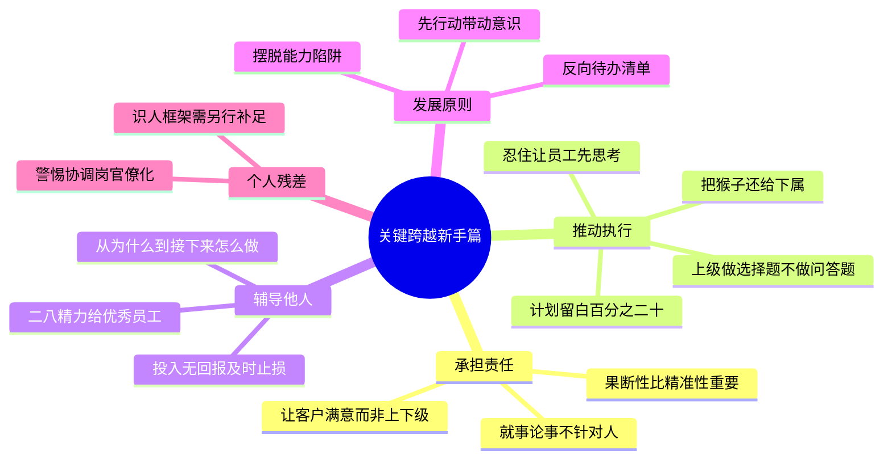

# 《关键跨越(新手篇)》读书笔记与思维导图

**作者**：北森人才管理研究院
**核心主旨**：从业务高手到优秀主管的三大关键跨越——承担管理责任、推动执行、辅导他人。高潜员工近一半在踏入管理岗后失败,因为管理者的第一职责不是让自己做得更好,而是提升团队整体效能。

---

## 1. 管理者的三大任务与失败根源

- **三大任务**:获得团队的认可和信任(信任不因职权天然存在,要表现得像个管理者);让团队稳定可靠地交付成果(制定目标计划、分配任务、组织资源、跟进过程、检验结果);帮助团队改进和提升。
- **失败根源**:沉迷于做自己擅长的事(能力陷阱);"我过去这样成功过"的路径依赖;个人执行力强不等于团队执行力强。
- **管理的价值错位**:管理工作的价值并非解决眼前的问题,而是解决未来可能面对的问题。频繁补救员工失误、总是看到团队问题甚至疏离团队,都是不胜任的迹象。
- **发展原则**:从自身优势出发,先行动起来,以行动带动意识改变——表现得像个管理者,慢慢就具备了管理的意识和能力。给自己列反向待办清单(not to do list)。

## 2. 跨越一:承担管理责任

- **为结果负责**:决定的果断性比精准性重要;不"假借"上级或公司名义做负面反馈;不打太极,不把该自己做的决定推给下属集体讨论;把下属真正的闪光点让更多人看到。收入或头衔不足以支撑管理责任,别为它们选择做管理。
- **组织意识**:管理者要成为规则的代言人,任何场合言行与企业显性和隐性规则保持一致;对组织问题做适应性改良——态度保持坚定,执行时温柔地渐进。
- **三大误区的破解**:
  - 比下属更专业 vs 可以不懂专业 -> **专业引领**:给出洞见和判断、指明方向,而非亲自解决具体问题。跟高手交朋友,优秀的人形成羊群效应。
  - 让下属满意 vs 让上级满意 -> **让客户满意**:以客户为目标本质上是对绩效负责,这才是管理的最终目的。警惕两个极端:冷冰冰的控制,或"唯上"。
  - 保持距离 vs 打成一片 -> **工作时严肃立规矩,私下可称兄道弟**:前者极端是人情绑架,后者极端是操控关系。
- **真诚坦率五点**:就事论事不针对人("报告的逻辑有些乱"而非"你的逻辑有些乱");讲具体的事;多分享背景信息;态度温和不带情绪;多给建议和指导。
- **展现真我**:虚张声势破坏信任;忠于自己而非模仿别的管理者;建立内心准则;适当暴露弱点。

## 3. 跨越二:推动执行

- **六个误区**:超人心态(事必躬亲)、完美主义(零瑕疵、不能忍受暂时不完美)、想当然、控制狂(微观管理)、疏离旁观(只看报表不问一线)、安于现状(不复盘不改进)。
- **把"猴子"还给下属**:员工现有能力可完成的,坚定交给员工;"踮脚跳一跳"能完成的,也交给员工;差距较大但员工有意愿、试错可承受的,鼓励去做。
- **忍住,让员工先思考**:不马上回应,先让员工自己分析;用不断提问代替直接告知;让员工做出解决问题的承诺。
- **要事优先的三个来源**:向上看(与高层目标对齐)、向外看(客户利益优先,比上级关心的事更优先)、看公司考核与晋升导向。与上级对焦三件事:哪些工作更重要、优先级与资源是否匹配、成功基线(60 分及格线 + 挑战性标准)。
- **向上沟通三招**:让上级做判断题或选择题而非问答题;持续同步进展;换位适应上级的沟通风格。
- **人事匹配**:意愿能力四象限分配任务;警惕"能者过劳"与明星员工的职业倦怠;挑战性工作的合理标准——员工约七成把握能完成。
- **抓与放的平衡**:任务容错率与员工成熟度四象限决定管控力度;独立性强的下属放手细节,独立性弱的给压力让其带着方案来。微观管理占用管理者时间,更削弱员工掌控感与自主性。
- **敏捷与复盘**:敏捷的核心不是快,而是以终为始,抓关键矛盾;每个闭环交付一个成果,下一个闭环是上一个的进化版。计划留白 20% 机动时间。复盘规则:及时(趁员工在任务情境中)、先"不回应不评价"还原事实、无结论无行动不复盘。

## 4. 跨越三:辅导他人

- **三个误区**:辅导目标脱离业务;假设每个员工都积极主动(忽视意愿评估);辅导过于形式化。深层病灶:理想化、以自我为中心、急于求成。
- **二八分配辅导精力**:更多关注优秀员工,而非只补差;业绩结果不是唯一分类标准,聚焦当下也关注未来潜力。
- **打开心防**:用事实让员工感受到辅导真的有收益;思维从"为什么员工做不好"转为"接下来怎么做才会更好"。
- **辅导当项目管理**:聚焦目标、明确跟进计划(时间表/阶段内容/衡量标准)、明确各方角色分工。
- **耐心与止损并存**:员工一开始逃避不代表不可造,让子弹飞一会儿;但若持续投入大量时间精力而无回报,及时终止是最好的选择。
- **辅导前先算账**:投入的时间给对方带来多大收益?自己的收益是什么?是否有人比你更合适?很多事情并非非你不可。

## 个人想法与点评

- 对"润滑协调"角色的质疑:组织真的需要这么多协调角色吗?这是否是另一种官僚?——警惕把管理岗位异化为纯协调岗。
- 对辅导边界的追问:有些人不适合被辅导,这些工作还有必要吗?判别标准是什么?书中"及时止损"给了部分答案,但前置的判别框架缺失。
- 全书很少讲"如何识别他人"——识人是人事匹配的前提,这块需要从测评类书籍补足。
- not to do list 的具体内容书中未展开,需要自己按"过去让我成功但现在应停止的事"来梳理。

## 个人补充

热门划线是共识基线,以下是个人在共识之外补上的内容:

- 社区共识集中在**角色认知**(客户满意、彼得原理、团队效能);个人划线密集在**边界与判据**:三类任务分配判据、七成把握标准、辅导止损条件、向上对焦三件事——认知解决"该不该",判据解决"怎么定"。
- 个人残差是**对管理必要性的持续怀疑**:润滑角色是否官僚、辅导是否值得——这本书当作工具箱用,不当作管理信仰。
- 识人框架的缺口是明确的下一步输入,与[[高绩效教练]]的教练心态(视人有潜能)互补:教练假设潜能存在,识人判断潜能方向。

---

## 思维导图 (Mind Map)

*导图画的是"我标记过的书":叶子节点来自个人划线要点与热门划线,非全书大纲。*

---

## 社区精华:热门划线 (Popular Highlights)

*提取自微信读书全书最受认可的观点*

1. **管理的目的** (752人): 管理者工作不是为了让上级满意,也不是让下级满意,而是让客户满意——以客户为目标本质上是对绩效负责。
2. **先行动** (512人): 了解自身优势和局限但不过度放大,先行动起来,表现得像个管理者。
3. **彼得原理** (510人): 每个人都是晋升到自己不胜任的岗位上。
4. **第一职责** (486人): 管理者的第一职责不是让自己做得更好,而是花更多时间让团队整体效能得到提升。
5. **专业引领** (476人): 给出专业洞见和判断、指明方向,而不再是运用个人专业能力解决具体问题。
6. **延迟满足** (414人): 拉长时间维度考虑投入与收益,不急于一时得失,才能走得更远。
7. **留白原则** (342人): 周计划日计划都预留 20% 机动时间,用于应对临时任务或思考。
8. **挑战标准** (323人): 富有挑战性的工作,员工大约有七成把握能完成。
9. **态度先于能力** (336人): 困难或关键时刻退缩就等于输了,态度和勇气第一,能力其次。
10. **坦率五点** (288人): 就事论事,讲具体的事,多分析背景信息,不带情绪,多给建议和指导。
