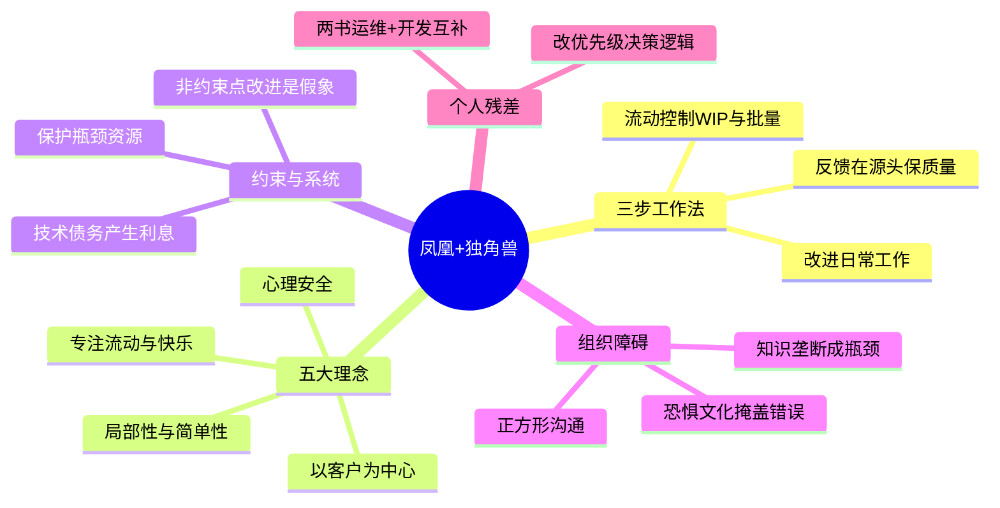

# 《凤凰项目》与《独角兽项目》读书笔记与思维导图

**作者**：吉恩·金、凯文·贝尔、乔治·斯帕福德（凤凰项目）；吉恩·金（独角兽项目）
**译者**：成小留/刘征（凤凰项目）；张乐/孙振鹏/许峰（独角兽项目）
**核心主旨**：以小说形式演绎 DevOps 三步工作法与数字化转型五大理念——技术价值流的本质是建立快速流动、缩短反馈、持续学习，并在局部性、简单性、心理安全与客户中心的文化中实现。

---

## 1. 三步工作法：技术价值流的总框架

- **技术价值流定义**：组织基于客户需求执行的一系列有序交付活动；在代码投产之前并未产生任何价值，那只是困在系统里的半成品。
- **第一步（流动）**：控制从开发到运维的工作流，建立迅速、可预测、持续不断的计划内工作流，向业务部门交付价值，同时尽可能降低计划外工作的影响。
- **第二步（反馈）**：缩短并放大反馈环路，在源头解决质量问题，避免返工；建立从运维返回开发的不间断反馈回路，在初始阶段就筹划质量。
- **第三步（持续学习）**：建立鼓励探索、从失败中吸取教训的文化；改进日常工作比开展日常工作更重要；通过反复实践达到精通。
- **整合视角**：DevOps 原则通过整合企业文化、企业架构和技术实践，让下降式螺旋变成上升式螺旋。

## 2. 第一步：流动原则——限制 WIP、小批量、可视化

- **批量大小**：工作产品在不同阶段间移动的单位数；持续部署要求小批量，传统分支开发聚合数周/数月代码是大批量——星期五的部署失败就是证明。
- **单一工作流**：任何工作系统的理想状态是单一工作流，最大化生产能力、最小化变化幅度；通过持续降低批量规模达到此状态。
- **可视化**：在把一项工作用卡片形式显示在看板上之前，任何与之相关的工作都不能开展——工作必须可视化才能管理。
- **限制在制品 (WIP)**：车间控制半成品的能力不足，是造成长期性延误和质量问题的根源；大家都没有松弛时间，半成品就会卡在系统里。
- **剔除无用功**：相比于向系统中投入更多工作，将无用的工作剔出系统更为重要；要知道与实现企业目标息息相关的是什么。
- **过度加工**：使用了超出客户需求和他们愿意支付范围的任何材料或资源的行为。
- **约束理论 (TOC)**：在瓶颈之外的任何地方做出的改进都是假象；不应根据第一个工作站的效率安排工作，而应根据瓶颈资源完成工作的速度安排。
- **保护约束点**：找出约束点后恢复理智，保护约束点确保其从不浪费时间，竭尽全力确保工作流经约束点。

## 3. 第二步：反馈原则——下游客户、源头质量、放大环路

- **下游即最重要客户**：根据精益原则，最重要的客户是下游（内部或外部）；为他们优化工作需要对他们的问题给予同情心，识别阻碍快速平滑流动的设计问题。
- **等待时间可视化**：让等待时间可视化，知道工作何时在某人那里排了几天队，或必须返工——第二工作法的关键部分。
- **反馈环路延伸**：建立一条反馈环路，一直往回通向产品定义、设计及开发的最初环节；不能花九个月发布一个项目，需要快得多的反馈。
- **管理复杂工作四要素**：识别设计和操作问题；群策群力快速构建新知识；将区域性新知识应用到全局；领导者持续培养有以上才能的人。
- **四种工作类型**：业务项目、内部 IT 项目、变更（第三种类型的工作）、计划外修复——必须协调变更、有序处理事故。

## 4. 第三步：持续学习与实验——改进日常工作、心理安全

- **改进优于执行**：改进日常工作比开展日常工作更重要；不断给系统施加压力，强化习惯并加以改进。
- **弹性工程**：系统里要经常出些故障，长此以往再遇到困难就没有原来那么痛苦；适当提高预防性工作是全面生产维护的关键。
- **事故文化**：不公正的事故处理会阻碍安全调查，让安全工作者感到恐惧而非专注，导致信息封闭、责任逃避和自我保全；技术价值流的核心是建立高度信任的文化。
- **流程持续恶化**：就算不去优化现状，流程也会因混乱和无序而持续恶化——NR 基于经验持续更新流程和系统设计。
- **从失败中学习**：强调勇于冒险以及从失败中汲取教训的价值观；强调反复实践以致炉火纯青的必要性。

## 5. 独角兽五大理念：数字化转型的文化内核

- **第一理念——局部性与简单性**：系统与构建它们的组织应具有局部性；把复杂性控制在内部（代码、组织、流程），外部世界已够复杂；决策失去局部性导致"正方形沟通"。
- **第二理念——专注、流动和快乐**：小批量工作（理想单件流），快速持续得到反馈，保持专注和流动，不断挑战、学习、精通乃至快乐。
- **第三理念——改进日常工作**：反思丰田安灯拉绳——必须重视对日常工作的改进，而不是日常工作本身；创建更安全的系统和持续改进是日常工作的一部分。
- **第四理念——心理安全**：让谈论问题变得安全；解决问题需要预防，预防需要诚实，诚实需要摆脱恐惧；惩罚失败和"枪杀信使"只会让人掩盖错误，磨灭创新欲望。
- **第五理念——以客户为中心**：无情质疑某样东西对客户是否真的重要——客户是否愿意付钱，还是只对我们的职能筒仓有价值；真正为客户争取最好的东西。

## 6. 系统思维、技术债务与价值创造

- **系统思维**：始终确保整个企业达成目标，而不只是其中一部分；有效管理 IT 是公司业绩的重要预测指标。
- **技术债务**：当前决定导致的问题随时间越来越难解决；走捷径短期内也许行得通，但会产生利息；技术债务指造成困难、重复劳动并降低敏捷性的东西。
- **开发人员生产力**：增加开发人员数量时，由于沟通、集成及测试开销，单个开发人员生产力通常会显著下降。
- **部署前置时间**：缩短部署前置时间、提高测试覆盖率、缩短测试执行时间，必要时解耦架构——代码部署前置时间、部署频率和问题解决时间是软件交付效能的预测指标。
- **核心 vs 非核心**：核心是客户愿意付钱换取、使投资者奖励的能力；在核心上投资不足，因为受到非核心业务的控制。
- **构建与测试**：如果没有好的构建、集成和测试流程，开发人员的生产力就无法提高；底层架构关乎开发人员日常使用的系统是否高效。

## 7. 组织障碍与转型路径

- **优先级混乱**：一半邮件都是紧急邮件，所有事情都那么重要——不可能；1 优先级是谁喊得最响、谁能搬出最大的领导。
- **关键人依赖**：布伦特式人物把知识看作权力，成为几乎难以取代的人——流程是用来保护人的，得想出保护约束资源（人）的办法。
- **恐惧文化**：替罪羊被解雇、惩罚失败——人们掩盖错误，创新欲望被彻底磨灭；与团队发展的五大障碍（信任缺失等）相互强化。
- **官僚壁垒**：要做几乎每一件事都必须向上汇报两级、跨越两级、再向下两级才能和工程师交谈；PMO 保证按时按预算，而非价值创造。
- **有效人际网络**：召集一群积极的人解决大问题，即使团队看起来不像官方组织——桥长官确保战略切实可行，让每个人都能完成工作。

## 个人想法与点评

- 针对"布伦特把知识看作权力"：好像很多工作都存在这样的角色——知识垄断与组织瓶颈往往同源。
- 针对独角兽项目促销转化率数据（20% 点击 x 6% 购买 vs 3k 订单）：数字前后不一致，阅读时需警惕小说中的业务数据是否经过严谨核算。

## 个人补充

- 划线密集在**约束与流动**的交汇处——非约束点改进是假象、保护布伦特（约束人）、限制 WIP，这三条构成一套完整的诊断链。
- 凤凰项目从运维视角、独角兽项目从开发视角，两书互补：前者讲"怎么让价值流动起来"，后者讲"什么样的文化和架构让开发可持续地流动"。
- "改进日常工作比日常工作更重要"与"心理安全"在独角兽中被显式并列——没有后者，前者只会变成 blameless postmortem 的形式主义。
- 个人对 DevOps 落地的残差：三步法不是工具清单，而是改变优先级决策逻辑——从"谁喊得响"到"什么流经约束点、什么服务下游客户"。

---

## 思维导图 (Mind Map)

*导图画的是"我标记过的书"：叶子节点来自个人划线与想法的要点，非全书大纲。*

---

## 社区精华：热门划线 (Popular Highlights)

### 《凤凰项目》

- "作为IT运维部的副总裁，你的工作是确保形成一条迅速、可预测、持续不断的计划内工作流，从而向业务部门交付工作价值，同时尽可能降低计划外工作的影响和破坏，那样你才能提供稳定的、可预期的、安全的IT服务。" -- 468人划线
- "要是对工作需求、优先等级、工作进度、可用资源都一无所知，怎么可能管理好生产工作呢？" -- 450人划线
- "但是现在大家显然都知道，不应该根据第一个工作站的效率来安排工作，而是根据瓶颈资源所能完成工作的速度来安排工作。" -- 416人划线
- "我深吸一口气，意识到自己如此沮丧，并不是由于驱动器故障，而是由于我们总是无法把精力集中到对公司最为重要的事情上。" -- 384人划线
- "这个世界一定是哪里不对劲了，一半邮件都是紧急邮件。所有事情都那么重要，这可能吗？" -- 336人划线
- "我需要一个可靠的、不怕告诉我坏消息的人。最重要的是，我需要一个自己可以信任的人去做正确的事。" -- 273人划线
- "我们必须用更少的资源完成更多的业绩，既要保持竞争力，又要削减成本。" -- 270人划线

### 《独角兽项目》

- "第一理念——局部性和简单性 第二理念——专注、流动和快乐 第三理念——改进日常工作 第四理念——心理安全 第五理念——以客户为中心" -- 154人划线
- "她看到了恐惧文化所造成的破坏性影响。在这种文化中，错误的行为通常会受到惩罚，替罪羊会被解雇。惩罚失败和'枪杀信使'只会让人们掩盖自己的错误。最终，所有创新的欲望都会被彻底磨灭。" -- 112人划线
- "如果没有一个好的构建、集成和测试流程，开发人员的生产力就无法提高。" -- 102人划线
- "如果你无法获取关于如何使用程序的反馈，又怎能创造出有价值的东西呢？" -- 84人划线
- "玛克辛喜欢每个人都能及时将自己的变更合并到'主分支'，比如每天一次。这样，合并的变更就不会太大。就像在制造业里，小批量生产可以创造平稳的工作流程，没有相互冲突的中断或灾难。" -- 60人划线
- "对市场过度承诺了？工程领导力很差？产品领导力很差？技术债务过多？对可以提升开发人员生产力的架构和平台没有给予足够的关注？" -- 55人划线
