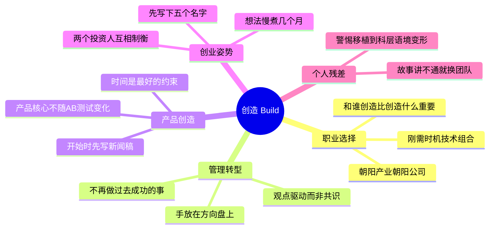

# 《创造》(Build) 读书笔记与思维导图

**作者**：托尼·法德尔 (Tony Fadell)，iPod 之父、Nest 创始人；译者：崔传刚
**核心主旨**：用非传统方式做有价值的事。从个人职业选择到产品从 0 到 1，再到创业与经营，一切围绕"做值得做的事，和值得共事的人一起做"。

---

## 1. 职业选择：追逐成长而非头衔

- **选公司的五条标准**：正在创造全新的（或以对手无法复制的方式组合现有技术的）产品；解决众多用户的切实痛点；新技术能承载公司愿景（含基础设施与平台）；领导者愿意顺应用户需求改变；思考问题的方式新颖且合理。
- **爆发性机会公式**：真正的问题（刚需）+ 正确的时机 + 创新技术的组合。创业前五问：是不是刚需、市场多大、怎么赚钱、为什么是你、护城河在哪。
- **头衔和钱不重要**：加入快速成长的公司，个人自然获得成长机遇。第一份工作选"朝阳产业里的朝阳公司"。
- **偶像的力量**：专注了解所在领域，用专业知识与最优秀的人建立基于互相尊重（而非崇拜）的关系。30-100 人且有明星人物的公司是向大师学习的最佳场所。
- **失败即学费**：走出学校后，失败是学习的唯一方法，尤其在创造前所未有的东西时。实践、失败、学习，其余自然到来。

## 2. 管理转型：从高手到领导者

- **两条铁律**：一旦成为管理者，就不要再做让你最初获得成功的事；严格追求结果而不过度管理——盯流程不盯成果就是过度管理。
- **方向盘原则**：手可以不放在产品上，但必须放在方向盘上。既不因给予太多自由而失控，也不因怕显得霸道而滑向平庸。
- **数据驱动 vs 观点驱动**：重大决策本质是观点驱动——相信直觉并为结果负责。管理者有责任解释"这不是民主"。数据可以辅助，但如果产品核心功能可以随 A/B 测试结果变化，说明产品没有核心。警惕"分析瘫痪"（过度思考引发的问题）。
- **讲故事是决策的载体**：所有重大决定的根源，都是我们相信了自己或别人讲的故事。创造人人可理解的可信叙事，是持续前进和做艰难选择的关键。
- **对付职场浑蛋**：追求卓越、对平庸零容忍、挑战假设都不会让人变成浑蛋；浑蛋的特征是主导会议、把异议当攻击、散布谎言窃取想法。团队应互相扶持，保护客户不受浑蛋决策干扰。
- **辞职的时机**：不再对使命充满激情，或已经想尽了办法。离开前先和所有能聊的人聊聊——同事、对手、客户、客户的客户。

## 3. 产品创造：无形化有形

- **先写新闻稿**：在开始（而非完成）时写虚构新闻稿。画图、做模型、定情绪板、勾勒用户从广告到网站到应用的每个触点。把想法从头脑里抽离出来，落到可触摸的东西上。
- **好的产品故事**：既感性又理性；将复杂概念简单化；聚焦回答"为什么"。受众不只是客户，也是人才和投资者。"怀疑病毒"技巧：让人反复感受现状的沮丧，从而渴望解药。
- **产品的核心不可动摇**：为保持产品核心，通常有一两个特性必须保持不变，其他一切围绕它们调整。不害怕颠覆曾让你成功的事（柯达、诺基亚之鉴）。
- **约束造就决策**：世界上最好的约束是时间。严格的截止日期让你不能随意尝试、不能没完没了地润色。
- **心跳节奏**：概念阶段约 10 人足矣；预算太多会导致过度设计、过度思考。每年至少一次大型发布 + 一到三次小型发布，保持团队心跳稳定。
- **V1 靠愿景**：在有客户之前，愿景比数据重要得多；新产品的可靠数据有限且永远不确定，无法替你做决定。

## 4. 创业的正确姿势

- **想法要慢煮**：一个可能耗费数年生命的想法，至少先花几个月研究——做粗略模型、讲清"为什么"、观察潜在风险与潜伏的灾难，看激情是否持续萦绕。做"止痛药"而非"维生素"。
- **开始前的自检**：能不假思索写下五个愿意跟你干的名字，否则可能不该开始；需要导师/教练、极度出色的创始团队、可能还有联合创始人；先在小公司和大公司都历练过（大公司教你组织、流程、治理、政治）。
- **融资就像结婚**：相互了解、信任、体谅之后再签约；坚持自己的愿景和"为什么"，不随投资人起舞；尽量找两个同等影响力的投资人互相制衡。
- **目标客户有且只有一类**：对主要客户缺乏洞见是衰亡的开始；无论商业链条多长，最终撑起商业模式的是终端消费者。

## 5. 经营与文化

- **招聘**：期望应聘者有使命感、脚踏实地、适合文化、对客户充满热情；经验再丰富，傲慢/轻蔑/控制欲/政治斗争欲的简历直接扔掉。最好的团队跨年龄跨世代。你创造的东西永远不如"和谁一起创造"重要。
- **增长断点**：团队接近断点时提前建管理层（优先内部提拔）；让团队写下最看重的文化并制定规划保障延续——珍贵文化消失时，员工也会随之消失。
- **营销即真话**：营销不能拖到最后；用营销为产品叙事做原型，与产品开发互相供给养料；产品就是品牌；整个触点体验必须统一设计；最好的营销就是说真话。
- **福利与文化**：人们珍视自己付费购买的东西，极少发生的事才特别。别把公司打造成员工离不开的地方，而是驱动大家实现使命的地方。
- **CEO 的修养**：家长型 CEO 推动成长并承担风险，保姆型 CEO 只守护现状。得到尊重永远比被人喜欢更重要。解释决策时一切只关乎客户。延迟艰难决定是对公司的慢性侵蚀。

## 个人想法与点评

- 对"消费者实验组是伪概念"深有共鸣：很多成功决策真不是在数据里摸出来的（数据从业者视角）。
- 讲故事不生效时怎么办？作者说继续讲，我认为讲了仍不生效就该考虑换团队。
- 对硅谷式管理鸡汤保持警惕：本书管理章节偏口号，细节少于其他硅谷管理书。
- "领导上心细节"在中国职场语境可能滑向"唯上"：老板自己不知道要什么、下属只学会服侍老板，最后没有标准、无人关心客户。
- 产品经理角色论质疑:很多组织真正需要的是"统筹定义和交付"的负责人,寄希望于 PM 单一角色带飞企业是角色决定论。
- 保姆型 CEO 的批判视角太资本:科层系统本身向求稳倾斜,董事会的"愿景"有多少脱离了搞钱?

## 个人补充

热门划线是共识基线,以下是个人在共识之外补上的内容:

- 社区聚焦金句(试错、坚持、机会),个人划线密集在**操作层**:选公司五标准、危机处理五规则、招聘红线、融资制衡、增长断点应对——这本书对我是操作手册而非励志读物。
- 个人残差集中于**中西职场语境差**:观点驱动决策、上心细节、家长型 CEO 这些原则移植到科层制环境时会变形,使用时需要先判断组织语境。
- "无形化有形"(先写新闻稿、画触点图)是个人标注"之前忽视但确实重要"的部分,是对自己工作方式的直接修正。

---

## 思维导图 (Mind Map)

*导图画的是"我标记过的书"：叶子节点来自个人划线要点与热门划线，非全书大纲。*

---

## 社区精华：热门划线 (Popular Highlights)

*提取自微信读书全书最受认可的观点*

1. **试错观** (630人): 20来岁时唯一的失败就是无所作为，其余的都叫试错。
2. **成长选择** (385人): 头衔和钱不重要，重要的是和什么人在一起，做什么事。机会才是最关键的东西。
3. **创业五问** (384人): 是不是刚需，市场有多大，怎么赚钱，为什么是你做，护城河在哪里。
4. **真问题** (325人): 如果你解决的不是一个真正的问题，你就不可能掀起一场革命。
5. **产品核心** (323人): 如果核心功能可以随 A/B 测试结果变化，说明你的产品没有核心。
6. **同行者** (288人): 你正在创造的东西永远不会像你和谁一起创造那么重要。
7. **新闻稿诀窍** (273人): 不要等到把事情完成再写新闻稿，而要在开始的时候写。
8. **颠覆自己** (272人): 不要害怕颠覆那些曾让你获得成功的事情。看看柯达，再看看诺基亚。
9. **时间约束** (252人): 有约束才能做出好的决策，而世界上最好的约束就是时间。
