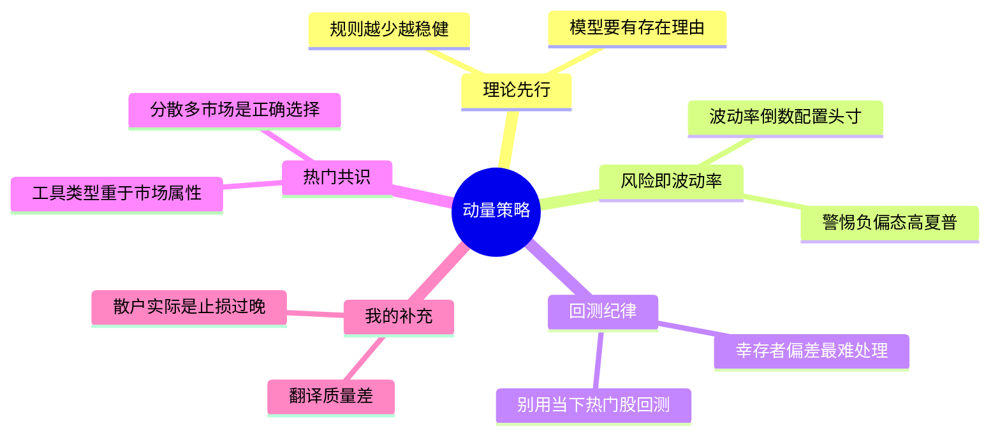

# 《动量策略：利用Python建立关键交易模型》读书笔记与思维导图

**作者**：[瑞士] 安德烈亚斯·克列诺 (Andreas F. Clenow)
**译者**：庄庆鸿 张坤 洪晓祥
**核心主旨**：系统交易的实战指南。从市场行为理论出发，用 Python 构建可回测、可量化的期货和股票交易策略，用数据验证一切直觉。

---

## 1. 核心底层逻辑：交易模型的"存在理由"

一个交易模型必须先回答"为什么"，再回答"怎么做"。

*   **理论先行**：一个恰当的交易模型需要从一个市场行为理论开始，在交易的市场现象中有一个明确的目标、一个存在的理由。
*   **可靠 vs. 曲线拟合**：一个可靠的模型，交易真实的市场现象，目标是获取特定类型的回报。过度拟合历史数据的模型不是模型，是自欺欺人。
*   **规则越少越好**：稳健的交易模式往往把事情简单化。交易规则应该尽可能简单、尽可能少。
*   **计划先于数据**：在开始考虑交易规则或数据之前，你都需要先制定一个计划。

## 2. 策略类型与核心区分

本书覆盖三大类策略，彼此互补：

*   **股票动量策略 (Equity Momentum)**：买入近期表现最好的股票，持有并定期轮换。与趋势跟随有本质区别，需要将其归类为一种不同的策略。
*   **期货趋势跟随 (Trend Following)**：价格在一段持续时间内经常向同一方向移动，策略旨在捕捉大部分此类移动，而不是试图预测波谷或波峰。简单地等待价格开始向某个方向移动，然后跳上车搭乘趋势。
*   **反趋势交易 (Counter-Trend)**：在牛市中的短期回调时买入，捕捉反弹利润。

### 动量策略 vs. 趋势跟随的关键差异
| 维度 | 动量策略 | 趋势跟随 |
|------|---------|---------|
| 交易标的 | 股票（如 S&P 500 成分股） | 期货（跨资产类别） |
| 核心信号 | 动量斜率排名 | 价格突破/移动平均 |
| 持仓方向 | 只做多 | 多空均可 |
| 再平衡频率 | 月度 | 每日信号触发 |

## 3. 系统动量策略：完整规则集

这是本书的核心模型，规则精炼到极致：

*   **投资范围**：只考虑标准普尔 500 指数中的股票，任何给定交易日只考虑当日指数成分股，以降低幸存者偏差。
*   **交易频率**：只按月进行交易。
*   **动量计算**：动量斜率使用 125 日时间窗口计算。
*   **选股**：排名前 30 的股票被选中。
*   **头寸配置**：根据波动率的倒数计算权重，波动性使用 20 日标准差计算。使用 ATR（平均真实波动幅度）作为波动性衡量标准。
*   **趋势过滤器**：基于标准普尔 500 指数 200 日均线。指数低于 200 日收盘价滚动均值时，不允许任何新的买入。
*   **最小动量阈值**：所需最小动量值设置为 40，低于此值不买入。
*   **卖出规则**：股票跌至低于最小动量值，或被剔除指数时卖出。
*   **再平衡**：每月再平衡并重复上述步骤。

### 关键策略特性
*   动量策略往往在熊市中受挫，不仅赔钱，而且往往比整体市场蒙受的损失更大。趋势过滤器是一种下行保护手段。
*   基于波动性的头寸配置 (Volatility Based Allocation) 在金融行业的专业量化领域最常见。
*   降低换手率能降低交易成本，还能降低资本利得税。

## 4. 期货趋势跟随：核心趋势模型

*   **核心假设**：核心趋势模型的投资回报率与全球趋势跟随对冲基金高度相关。
*   **投资组合视角**：整体的长期价值发展往往有较多小的损失，但也有少量的巨大收益。只要它的净期望价值是正数，一切都好。
*   **复杂性的代价**：虽然你可以按照简单的规则复制趋势跟随的大部分回报，但你可能需要增加复杂性以控制波动率，维持风险在可接受的水平，创建一个可以成功营销和融资的策略。

## 5. 时间回报趋势跟随模型

*   可能是你见过的最简单的趋势跟随模型，也可能是性能最好的模型之一。规则十分简单，回报也堪称一流。
*   避免常见的过早止损问题，不受短期回调影响。
*   **关键操作**：需要定期重置头寸大小。如果不这样做，你就会失去对头寸风险的控制，导致权益曲线出现令人讨厌的峰值。

## 6. 金融风险：不是你以为的那样

*   **风险 ≠ 损失金额**：许多交易书籍将风险解释为你的损失金额，而这与金融行业使用的"风险"一词毫无关系。量化风险最常用的方法是测量历史波动率。
*   **相关性陷阱**：持有多个头寸时必须考虑相关性。持有两支相似股票，就是在增加相同的风险因素。
*   **波动率的局限**：使用近期波动率预测未来波动是一个问题。
*   **负偏态策略**：夏普比率为 3 甚至 5 的策略确实存在，但往往属于负偏态类型——大多数时候小赢，直到突然遭受巨大损失。
*   **赌徒谬误**：一个赌徒把所有财富押在 17 号上转动轮盘然后赢了。然而，这种风险极大。高回报不等于好策略。

## 7. 回测与数据：最容易犯的错

*   **选股偏差**：可能最糟糕的选择回测股票的方式是选择那些现在很热门的股票——你的回测在开始之前就已经严重扭曲了。
*   **过拟合警告**：在一组时间序列数据上测试的策略越多，测试就越有偏见。无论有意识与否，你都会将模型与过去的数据相匹配。
*   **幸存者偏差**：程序必须知道股票何时被纳入和剔除出指数，只允许持有当天真正属于指数成分股的股票。
*   **数据质量**：数据的两个关键维度——质量和覆盖范围。
*   **工具链**：推荐阅读《系统化交易》(Carver, Systematic Trading)。

## 8. 投资组合与多模型组合

*   **分散投资**：你的目标是交易一系列市场，而不是单一市场。在单一市场交易通常不是一个好主意。
*   **多模型优势**：在低波动性的情况下，多模型投资组合的表现远远超过了每一个单独的策略——更高的年化回报率、更低的最大回撤、更低的波动率、更高的夏普比率。
*   **模型目标多样性**：模型的目标可能只是为了实现与当前使用的方法接近零或负的相关性，同时规模能够扩展到数亿美元。
*   **配置 = 风险分配**：配置是指你想分配给某个对象多少风险，而不是多少资金。

## 9. 衡量与比较表现

*   **相对表现**：所有策略都应该与某种基准进行比较。
*   **显著性 (Significance)**：不同比较的一个关键点是显著性——结果是否具有统计学意义。
*   **可比性 (Comparability)**：确保比较的策略在同等条件下评估。
*   **Beta 的含义**：beta 是策略与基准的协方差。beta=1.0 意味着期望回报与基准差不多；大于 1.0 期望回报更高但风险更大；小于 1.0 期望回报较低但敞口更小。
*   **非参数 T-检验**：金融数据通常严重违反 T-检验的假设，需要使用非参数方法。

## 10. ETF 与资产配置

*   **最佳 ETF**：被动交易的、低成本的指数跟踪工具 (Index Trackers)。
*   **最差 ETF**：杠杆反向 ETF 基金，为卖给不知道结构化产品是什么的散户而设计。
*   **资产配置本质**：按预定的权重持有多种资产类别的组合，更多是长期投资方式而非交易。
*   **指数的本质**：大多数现代市场指数基于两种主要的市场因素——长期动量和市值。

## 11. 终极认知："钱"在哪里

*   大多数想从金融市场中赚钱的人都误解了真正的钱来自哪里。它并不来自交易你自己的账户。
*   你喜欢一家公司的产品，无论如何都不会对该公司未来的股价产生影响。
*   股票就是股票，它们的走势差不多是一样的。个股选择没有你以为的那么重要。
*   电脑只和编程的人一样聪明，通常甚至没有那么聪明，因此要持续监控自动交易模型。

---

## 个人想法与点评

1. **整体评价**：翻译太糟糕了，既不是数据科学术语、也不是金融人常用术语。其他观点值得部分吸收。（评分：3/5）
2. **关于止损**（第十六章）："我咋听说的是大多散户是止损过晚呢"——书中讨论的"过早止损"是专业趋势跟随模型的问题，与散户行为是两回事。
3. **关于对标基金**（第十五章）："有哪些基金可以拿来作为参照？"——核心趋势模型与全球趋势跟随对冲基金高度相关。
4. **关于滑点**（第十二章）："计算滑点了吗"——持有期表分析中需要注意滑点和交易成本的影响。
5. **关于工具链**（第八章）："7年没更新了"——PyFolio 分析回测工具已长期未维护。

---

## 思维导图 (Mind Map)

*导图画的是"我标记过的书"：叶子节点来自个人划线要点与热门划线，非全书大纲。*

---

## 社区精华：热门划线 (Popular Highlights)
*提取自微信读书全书最受认可的观点*

1. **模型的灵魂**: 一个恰当的交易模型需要从一个市场行为理论开始。它需要在交易的市场现象中有一个明确的目标、一个存在的理由。（90人划线）
2. **可靠性定义**: 一个可靠的模型，交易真实的市场现象，目标是获取特定类型的回报。（39人划线）
3. **风险量化**: 这就是为什么我们使用资产的历史波动率来衡量它们的每日涨跌幅，以计算风险敞口。（36人划线）
4. **负偏态陷阱**: 夏普比率为3甚至5的策略确实存在，但它们往往属于负偏态类型——大多数时候小赢，直到突然遭受巨大损失。（24人划线）
5. **生存偏差**: 实施起来可能有点棘手。这可能是开发股票交易模型最困难的方面。（24人划线）
6. **分散投资**: 分散投资才是正确的选择。在多个市场应用你的交易策略，成功的概率会大大提高。（22人划线）
7. **工具属性优先**: 对于系统交易者来说，金融工具的类型往往比基础市场的属性更重要。（20人划线）
