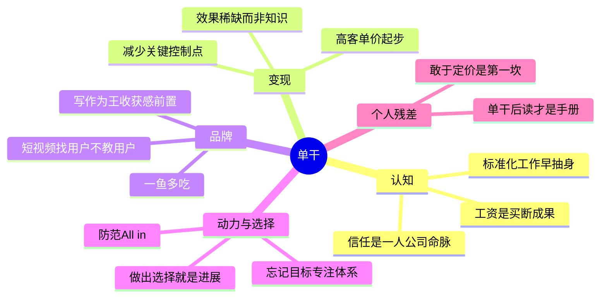

# 《单干》读书笔记与思维导图

**作者**：陈欢
**核心主旨**：成为超级个体的 49 个关键动作,分为变现、品牌、动力、学习、选择五大板块。核心公式:用杠杆撬动稀缺,提升个人价值;一个人加一两个助理就是一家公司,变现能力向年入百万看齐。

---

## 1. 认知重构:看懂打工与单干的本质

- **工资的本质是买断**:你的工作成果在未来还会持续产生收入,工资相当于一次性买断,后续收入与你无关。
- **迷茫的两个来源**:发展方向的不确定(选择问题)与发展路径的不确定(能力问题)。
- **杠杆认知**:代码和媒体是新财富阶层最好的杠杆;商业基础设施的本质是提供购买别人时间的机会,知道去哪里买时间是个体工作者的必备技能。
- **一人公司铁律**:最重要的资源是客户的信任;不追求盲目扩张,持续发展、保持盈利比什么都重要;最重要的不是管理,而是产品。

## 2. 变现:稀缺、杠杆与产品化

- **稀缺三要素**:效果(知识不稀缺,效果才稀缺,千万不要直接出售知识)、圈层(没有绝对稀缺,只有相对稀缺)、确定性(高度不确定环境中,确定性本身就是稀缺——品牌、口碑、履历、主流选择、无效退款机制都是确定性来源)。
- **职业方向判据**:凡是让你越来越稀缺的工作,不急不躁慢慢磨砺;凡是让你越来越标准化的工作,及时清醒早点抽身。
- **高客单价定律**:访谈数百位超级个体,90% 一开始就做 1000 元以上的高客单价产品。不要误以为自己不够资深就该服务低端市场——顶级专家只能服务塔尖,让出的次高端市场正适合专业能力不错的个人。
- **知识变现路径**:先做咨询解决实际问题,把共性问题提炼成课程、写成书,打包为标准化产品。
- **离钱近原则**:减少关键控制点。选题不确定就砍到只做一个行业,直播不确定就砍掉带货,不熟投放就找服务商合作——每个环节都是假设,假设越少越接近钱。
- **对标复刻三作用**:验证需求是否真实存在(完全找不到对标,要么是蓝海要么是伪需求)、找到最短路径、规避血泪教训。
- **纸板模型**:逆向开发,用户就是导航仪。细节带来虚假的计划感与掌控感,警惕在用户不在意的细节上精雕细琢。

## 3. 品牌:定位与内容

- **人设三要素**:真实、聚焦、稳定。短视频聚焦一个标签,直播间拓展相关特点,朋友圈展示立体的另一面。
- **定位诀窍"和而不同"**:用实战区别大咖、用过来人区别专家、用垂直细分区别面面俱到。
- **内容筛选用户**:短视频的作用是帮你找到目标用户,而不是教会目标用户;点名目标用户让人对号入座,也让算法知道推给谁。专业内容流量平淡但转化神奇。
- **写作为王**:精力只够学一种内容形态就选写作——能说的人太多,会写的人太少。干货文需要的是逻辑能力;用户要的不是干货而是"获得干货的感觉",收获感要前置。第一遍尽可能快地写,留足时间修改并重写开头。
- **讲故事模板**:人物遭遇问题-遇到向导-获得方案-被召唤行动-避免失败-获得成功。加心理描写("我当时手心全是汗")情绪就出来了。
- **纪录片思维**:呈现"刚好知道的艺术"。大大方方暴露商业意图,看热闹的自然离开,留下的都是精准用户;用户是纪录片的焦点,你只是线索人物。
- **一鱼多吃**:朋友圈-公众号-短视频-直播-社群笔记-课程-书,一个选题吃透整条内容链。
- **降低门槛**:口播不是效果最好而是最方便量产;持续稳定输出加复盘,胜过偶尔的精品。

## 4. 动力与学习

- **靠习惯不靠毅力**:环境、重复和奖励三件套。
- **忘记目标,专注体系**:每天按体系完成动作,只优化"比昨天顺一点"。靠谱=保持稳定输出;体系围绕时间设计,不计较今天有没有结果,只在乎有没有全情投入。
- **一段时间做好一件事**:提升专业能力时不想销售,做产品时不想宣传。
- **访谈是最好的学习工具**:你的困扰对高手微不足道;拿一位高手的观点问另一位,能钓出最深的逻辑;线上访谈全程围绕主题高能输出。
- **输出拉动输入**+**多元思维模型**:用其他行业的方法启发自己的行业,警惕成功经验形成的路径依赖。

## 5. 选择:河流模型

- **少做错误选择**:持续做出正确选择不如先防范错误选择——"All in"就是需要重点防范的错误。
- **难而正确**:笔直的大路是成熟的路,一直做容易的事会让选项越来越少。想得到什么,最好的方式是配得上它。
- **做出选择就是进展**:先做产品还是先做自媒体这类问题,纠结本身最贵。有进展才有可能性。
- **长期主义**:拒绝匮乏思维(有付出就要马上回报、见机会先想风险);减少琐事投入、开源节流、对未来有信心。
- **先胜后战**:真正重要的只有三件——提升专业稀缺性、设计商业模式杠杆、坚持长期主义建立优势。
- **小心暗礁**:准备购买时,先想能不能租赁。

## 个人想法与点评

- 整书书评(满分):适合在一人公司摸爬滚打一段时间、有自己的心得后再看;还在办公室工作时看会觉得全是鸡汤成功学。能执行七七八八,高低是个百万个体。现实的难点:人有惰性,难以分清自己喜欢什么与大众喜欢什么,走不出"一定价格的价值服务交换"这一步。
- 对"管理和领导力"的质疑:一个人管理个啥?这些能力是科层组织庞大后衍生的需求,单干语境下是伪命题。
- 对目标群体的清醒:给妈妈群体讲商业启蒙——这个群体确实是各类割韭菜生意的重灾区,做知识生意要意识到这层伦理边界。
- 全书附 49 个动作对应的五板块书单(重来、一人企业、定位、掌控习惯、卡片笔记写作法、穷查理宝典等),已存档于 private 原始摘录。

## 个人补充

热门划线是共识基线,以下是个人在共识之外补上的内容:

- 社区共识集中在**认知金句**(稀缺方向、工资买断、两条路);个人划线密集在**执行细节**:离钱近的砍法、点名目标用户、收获感前置、访谈提问技巧——共识给方向,细节才能落地。
- 个人残差的核心是**时机判断**:这本书的价值取决于读者所处阶段,单干前读是鸡汤,单干后读是操作手册。推荐他人时先问对方状态。
- 书评里"走不出价值服务交换这一步"是对自己的诚实诊断:知识付费的第一道坎不是内容,是敢于定价。

---

## 思维导图 (Mind Map)

*导图画的是"我标记过的书":叶子节点来自个人划线要点与热门划线,非全书大纲。*

---

## 社区精华:热门划线 (Popular Highlights)

*提取自微信读书全书最受认可的观点*

1. **人生三事** (1815人): 人的一生离不开三件事:锻炼身体、获取财富、寻找意义。
2. **历史韵脚** (1472人): 你今天遇到的困扰,早就有人遇到过,总有人用更好的方式做你现在做的事。
3. **稀缺方向** (1206人): 凡是让你越来越稀缺的工作,慢慢磨砺;凡是让你越来越标准化的工作,早点抽身。
4. **迷茫两源** (1054人): 发展方向的不确定是选择问题,发展路径的不确定是能力问题。
5. **识别关键** (784人): 不要妄图用动作上的勤奋掩盖思考上的懒惰,不主动识别关键成功因素就是懒惰。
6. **两条路** (672人): 在某一领域成为前1%,或在两个及以上领域成为前25%。
7. **高客单价** (663人): 90% 的超级个体一开始就做 1000 元以上的高客单价产品。
8. **杠杆公式** (696人): 挣不到钱是因为不够稀缺,挣钱太少是因为不懂杠杆,用杠杆撬动稀缺。
9. **产品重于管理** (555人): 对一人公司来说,最重要的不是管理,而是产品。
