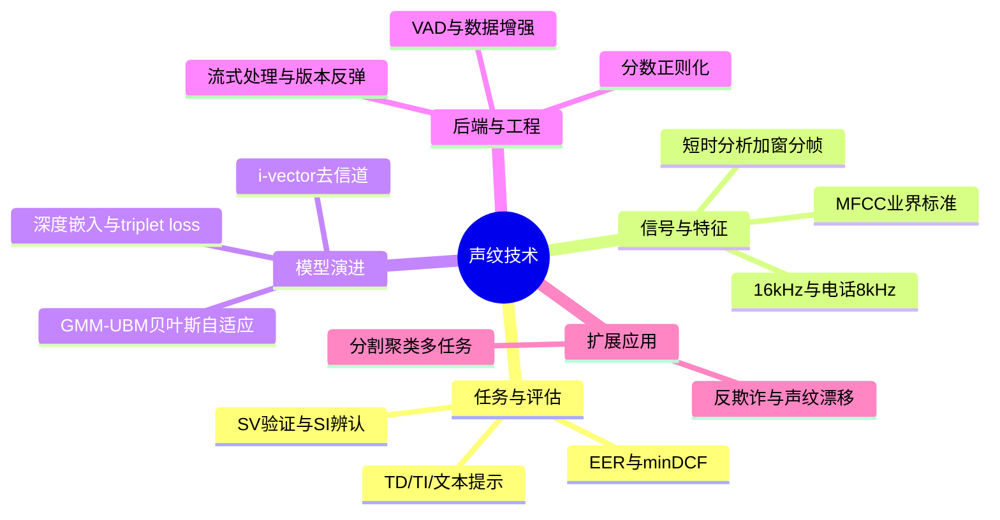

# 《声纹技术：从核心算法到工程实践》读书笔记与思维导图

**作者**：王泉（中文原著，无译者）
**核心主旨**：从音频信号处理、特征提取、后端评分到工程部署，系统梳理声纹识别（说话人识别）的技术演进与落地要点。深度学习已成主流，但 VAD 预处理、分数校准、部署架构与反欺诈仍是产品成败的关键。

---

## 1. 声纹识别基础：任务定义与评估

- **任务二分**：声纹验证（SV，1:1 确认目标说话人，用于唤醒与安全）与声纹辨认（SI，1:N 从库中识别说话人）。英文 voice/speaker/voiceprint/talker recognition 均指同一概念。
- **文本约束三分**：文本相关（TD，固定词句，常用于唤醒词/口令验证）；文本无关（TI，内容不限，学术与工业界主流）；文本提示型（随机提示词句，防录音重放）。
- **注册与建模**：目标说话人提供音频样本完成声纹录入（enrollment），提取说话人模型/声纹嵌入码（embedding），建模依赖的神经网络称声纹编码器（encoder）。
- **ROC 与 EER**：以 FA（错误接受）为横轴、FR（错误拒绝）为纵轴绘制 ROC，曲线下面积越小系统越强；等错率（EER）仅粗略反映曲线位置，不含形状信息。
- **minDCF 与代价敏感**：NIST 检测代价函数 CDet = CFR·PT·FR + CFA·PI·FA；最小检测代价阈值（minDCF）由 CFR/CFA 与先验概率 PT/PI 决定。唤醒类倾向更大 CFR，安全类倾向更大 CFA。
- **应用场景**：执法排查骚扰/勒索电话声纹；海关安检声纹采集；电话客服身份核验；智能音箱唤醒与安全验证。

## 2. 音频信号处理：从采样到 MFCC

- **听觉非线性**：频率与声强感知均非线性；MFCC 用对数函数，PLP 用立方根函数，均需纳入特征设计。
- **采样与量化**：奈奎斯特频率 = 采样率/2。语音常用 16kHz 采样；电话信道约 4kHz 带宽，常用 8kHz 采样/8 位量化；VoIP 常用 16kHz/16 位。CD 音质 44.1kHz 保真高频。
- **编码格式**：WAV 可无压缩线性 PCM，也可含 MP3 等压缩；FLAC 无损；MP3/AAC/Opus 有损压缩。ATC 频域编码用 DCT/MDCT，MP3 即改进 MDCT。
- **短时分析**：25ms 帧长 + 10ms 帧移是业界常见设置（16kHz 下每秒 100 帧 x 40 维 = 4000 特征，数据量降 75%）。分帧后须加窗（Hanning/Hamming 常用）以避免吉布斯现象与频谱泄漏。
- **频域特征链**：STFT = 分帧 + 加窗 + DFT；倒谱将时域卷积变为倒谱域加法，是 MFCC 的基础。MFCC 几乎成为语音识别与声纹识别的业界标准；PLP、PNCC 为功能模块不同的替代方案。
- **其他声学特征**：基频 F0（pitch）、共振峰 F1/F2、声强；早期曾用基音轮廓或共振峰构建声纹系统。整段 FFT 频谱或均值/标准差向量是更粗糙的全局特征。
- **工程工具**：Audacity 适合单文件；SoX + Bash 适合批量处理。扬声器-空气-麦克风链路引入失真，实验室测试宜直接用文件而非回放采集。

## 3. 特征工程演进：从 GMM 到深度嵌入

- **早期方法**：时频谱上测字间语速、字频分布等启发式差异；矢量量化（VQ）与动态时间规整（DTW）用于早期声纹与语音识别。
- **GMM-UBM 框架**：通用背景模型（UBM）初始化各说话人 GMM，贝叶斯自适应更新；录入语音少时尤其有效。只对均值自适应、固定混合权重与方差，性能最佳。
- **JFA 与 i-vector**：联合因子分析（JFA）将超向量分解为信道因子 x、说话人因子 y、公共因子 z，分离信道与说话人信息。i-vector 在低维总体因子空间移除信道影响（JFA 在高维超向量空间移除），克服 GMM 分量独立局限，迅速成为业界标准。
- **深度学习嵌入**：d-vector/x-vector 用 CNN/RNN 提取固定长度嵌入；不定长序列转固定嵌入有两种策略——全序列池化（pooling）或末帧（last frame）推理。三元损失（triplet loss）选最困难正负样本对优化。
- **训练技巧**：批内针对最困难冒名顶替者优化；文本相关用对比度广义 E2E 损失，文本无关用归一化指数广义 E2E 损失更优。MultiReader 多数据集训练：各集分开存储，每步从所有集建批、加权平均损失。
- **验证后端**：端到端系统中，验证端引入参数与编码器增参大致等价；余弦相似度足够且实现简洁。分数正则化（S-norm/AS-norm 类方法）考虑不同说话人分数分布差异，减轻全局阈值问题。

## 4. 后端评分、校准与数据增强

- **PLDA 评分**：i-vector 时代标准后端，在潜在空间建模说话人差异。
- **分数归一化**：S-norm、AS-norm 等将测试分数相对于 cohort 说话人集归一化，降低信道与说话人间差异带来的阈值偏移。
- **自适应注册**：GMM-UBM 贝叶斯自适应是经典范例；录入样本少时从 UBM 初始化再自适应，避免过拟合。
- **VAD 预处理**：用预训练 VAD 检测有效语音段，仅对该部分提取特征，去除静音与噪声。
- **数据增强**：pyroomacoustics 等多风格房间模拟增强训练鲁棒性；MultiReader 解决多数据集联合训练时的域差异。

## 5. 声纹反欺诈与攻击面

- **攻击类型**：人为冒名顶替（impersonation）；重放攻击（播放预录语音）；语音合成攻击；语音转换攻击（voice conversion）。
- **文本提示型防御**：随机提示用户朗读特定词句，提高重放攻击门槛。
- **频谱遮掩检测**：对已正则化时频谱在遮掩范围清零；未正则化时替换为时频谱均值而非清零，用于合成/转换攻击检测。
- **未来挑战**（声纹漂移）：情绪、健康状况、精神状况、生理成长、行为习惯均会导致声纹变化，长期注册模型需考虑更新策略。

## 6. 工程实践：部署、延迟与评估

- **流式处理**：语音产品对延迟要求极高，不应等用户说完再处理；流式信号处理连续输出不完整结果给下游模块，避免模块间竞争冒险（race condition）。
- **部署架构**：全设备端——无网络依赖、隐私友好、说话人模型存本地；服务器端——一套架构服务多租户，各客户模型分库存储。说话人模型仅允许暂存内存、禁止落盘以满足隐私合规。
- **版本管理**：模型版本迭代是工程部署最大挑战；新旧版本说话人模型交替切换称版本反弹（version bouncing），需统一迁移策略。
- **在线代理指标**：真实使用中连续拒绝率、多重接受率等与 FA/FR 相关的代理指标，弥补离线 EER/minDCF 与线上体验的差距。
- **软件工程纪律**：规模（scale）与生命周期（lifespan）驱动架构设计；计算图是常见设计模式；软件测试是核心能力；问题报告需含重现步骤、原因分析与潜在方案。

## 7. 声纹分割聚类与其他应用

- **分割聚类 vs 声源分离**：分割聚类处理多人轮流说话（无重叠语音）；声源分离处理多人同时说话的重叠语音。代表性方法：深度聚类、深度吸引网络、置换不变性训练（PIT）。
- **在线分割聚类**：引入 burn-in 预热阶段积累数据，离线聚类初始化各类概率模型后再在线更新。贝叶斯非参数（如中餐馆过程）可在新说话人出现时动态新建 RNN。
- **多任务架构**：共享层同时服务 ASR（CTC）、说话人转换检测（交叉熵）、监督式分割聚类（深度聚类损失），提升泛化与学习效率。
- **评估指标**：纯度（purity）、覆盖率（coverage）、完备性（completeness）、一致性（homogeneity）。
- **其他应用**：声纹克隆（声纹识别到多说话人 TTS 的迁移学习）；语音增强；声纹转换。

## 个人想法与点评

- 划线密度呈现清晰的技术演进线：时频启发式 -> GMM-UBM -> JFA/i-vector -> 深度嵌入，每一步都在解决"信道变化"与"低样本注册"两个老问题。
- 工程章（第 4 章）的划线说明读者关注点已从算法转向落地：流式延迟、版本反弹、在线代理指标，这些是论文指标（EER）覆盖不到的盲区。
- 分割聚类章的多任务学习架构值得单独记：ASR + 转换检测 + 聚类三头共享，是"一个模型多个下游"的典型工程思路。
- 反欺诈内容相对薄，更多指向未来章节；实际产品选型时需额外补充 ASVspoof 等竞赛基准与专用反欺诈模型。

## 个人补充

本书为用户自传书籍，无社区热门划线数据，以下补充全部来自个人残差：

- 个人划线在**预处理与后端**处最密（VAD、加窗分帧、分数正则化、MultiReader），而非最新网络结构——说明落地时"前后端工程"与"模型结构"同等重要。
- GMM-UBM "只自适应均值" 的经验法则，对今天 fine-tune 预训练 encoder 仍有映射：少样本注册时只调最后一层或 adapter，固定大部分参数。
- 设备端 vs 服务器端不是二选一：唤醒/离线验证走端侧，大库 1:N 辨认走云侧，需设计 embedding 格式与版本兼容策略。
- 117 条划线中 [插图] 占位较多，复习时建议对照原书图表（i-vector 提取流程、ROC/minDCF 示意、部署架构图）。

---

## 思维导图 (Mind Map)

*导图画的是"我标记过的书"：叶子节点来自个人划线要点，非全书大纲。*

---

## 社区精华：热门划线 (Popular Highlights)

本书为用户自传书籍，无社区热门划线数据。
