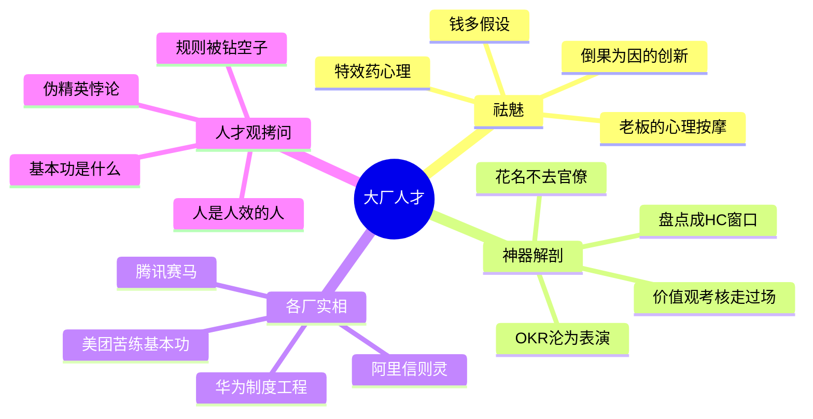

# 《大厂人才》读书笔记与思维导图

**作者**：娄珺（穆胜咨询）
**核心主旨**：对互联网大厂人才管理的"祛魅"之作。价值观考核、OKR、去 KPI、花名、弹性工作等"神器"，大多是巨头成功后被倒果为因强行总结出来的阶段性方案——它们的成功更多源于战略红利与高薪虹吸，而非管理创新。人才管理没有特效药，只有基本功。

---

## 1. 祛魅：神器为什么流行又为什么失灵

- **三大流行动力**：企业老板"浪漫思想"的牵引、互联网巨头的外宣需求、企业界寻找"特效药"的短期心理。
- **倒果为因**：巨头在人才管理上的"创新"是获得巨大成功后强行总结出来的；字节的成功更多归因于张一鸣的战略眼光而非 OKR。
- **钱多假设**：大厂人才管理的成功可能仅仅因为钱多——品牌效应和高薪导致人才聚集，管理工具只是常规操作。
- **跟风的结局**：学 OKR 的做不好 KPI 也做不好 OKR；用价值观考核的发现考不出分离度；叫花名的发现领导花名都有了"金光"。
- **真神器的标准**：平衡计分卡历经若干次迭代仍有实用价值——经得起时间检验的才是神器。

## 2. 七大神器的解剖

- **价值观考核**：宣传是一回事，用于管理是另一回事。主管"手感打分"，实际淘汰仍以失误和违纪为准。奈飞的反例最诚实："你赶走谁、留下谁、给谁发钱，这就是公司的价值观。"
- **OKR**：理念是高目标+弱考核，落地却变成"多写好看"的表演——KR 沦为任务清单、复盘靠表演、打分靠人脉、中层私改目标保完成率。OKR 对使用者的专业认知和管理训练要求极高，多数组织不具备。
- **去 KPI**：简化考核的空想。互评体系加剧小团体斗争；存量时代巨头自身也在回摆（考核频率变低、沟通变多、上级决定）。
- **花名去官僚**：职级承载着组织的责权分配信息，隐藏关键信息造成人力工作塌陷；淡化职级没有去官僚，反而加剧抱团——没有规则的环境里，抱团取暖是成年人的理性选择。当企业分不清贡献时，职级自然会被强化。
- **弹性工作**：幻想人人为爱发电。实际缩短有效工时、降低合作效率、增加管理压力、造成岗位间弹性不公。
- **人才盘点**：九宫格（能力 x 潜力）+"捧明星、杀野狗、清白兔、用黄牛"。价值在于让老板"手里有牌"，支持战略落地——但当形式公平的工具被领导私心加持，权力会肆无忌惮膨胀。
- **高人才密度/精英自治**：学奈飞的概念。关键拷问——缺乏甄别系统时存在"伪精英"，精英与伪精英并存且待遇相似，精英还能心无旁骛吗？

## 3. 各厂干部管理的真实面貌

- **阿里**：价值观与"阿里味"结合，"信则灵"的体系——进门的觉得合理，门外的觉得玄。两大隐患：建立在创始人权威上可持续性存疑；主观标准给上级"无限开火权"易失控。不被监督的权力必被滥用，政委从屠龙少年变恶龙。
- **腾讯**：扁平架构下疯狂赛马，"谁提出、谁执行，一旦做大、独立成军"。晋升答辩逼干部提炼知识体系，避免"凭手感做匪帮"。
- **美团**：通盘无妙手，苦练基本功——极致实用主义、埋头对标学习（承认自己是学习者而非创新者）、长期主义不走捷径。"开水团"没钱砸人，反而维护了职级体系的严谨。
- **华为**：以科学体系消除管理灰度。从老板讲话牵引到"干部九条"领导力模型、三优先三鼓励的选拔机制——把干部管理做成了制度工程。
- **通用逻辑**：战略确定之后组织是决定因素，组织确定之后干部是决定因素。

## 个人想法与点评

- 对"人是工具还是目的"的回答：人在这里从来不是目的。人是"人效"的人，不是"爱人"的人。
- 神器流行的补充解释：老板们很满意——这些概念让他们觉得自己在公司这台机器上还有价值，是"老板的心理按摩"。
- 对齐会议的政治经济学：低效流程还能催生食利阶级，通过流程为自己找活干。
- 规则悖论：规则也是官僚体系的一部分，总有人能钻空子让规则利于自己。
- 人才盘点的现实异化：某司成了"人力盘点"——要 HC 的窗口，无关领导力和成员发展。
- 规模的诅咒视角：与其想着打造庞然大物，社会更该给个人和小公司容错空间，才能激发整体创造力。
- 执行力叙事的轮回：当年夸大厂执行力强，如今夸 PDD，是否也是一种轮回？
- 追问基本功：书批判了神器，但"管理基本功"具体指什么，仍需向平衡计分卡、华为制度工程这类实践去找。

## 个人补充

- 社区共识集中在祛魅结论本身（倒果为因、钱多假设、奈飞金句）；个人想法（20 条，全书批注密度最高的书之一）提供了一线员工的在场证词：黑话的出处、对齐会的食利阶级、人才盘点异化为 HC 窗口、期权与执行力叙事——把书的宏观批判落到了微观体感。
- 个人立场比作者更进一步：作者说神器失灵，个人批注指出神器流行的深层原因是它服务于老板的心理需求而非管理需求。这条线索与《混合信号》的激励信号理论互文——制度传递的信号，比制度的文本更真实。

## 思维导图

## 社区精华：热门划线 (Popular Highlights)

- 大多互联网巨头企业并没有在人才管理上创造出新物种，它们在人才管理上的成功仅仅是因为钱多？（221 人划线）
- 比起用价值观管理组织，踏踏实实做好企业、做好组织管理，是不是更靠谱一些？（216 人划线）
- 互联网巨头企业在人才管理方面的绝大多数"创新"，实际上是它们在获得巨大成功后被倒果为因、强行总结出来的。（204 人划线）
- 他们想要听到的，从来不是事实的真相，而是对自己有利的证据。（160 人划线）
- 人（用户和员工）也应该是一切创新、发展、竞争的目的而不是工具。（160 人划线）
- 奈飞认为："别整那些没用的，你赶走谁，留下谁，给谁发钱，给谁扣钱，这就是公司的价值观。"（150 人划线）
- 对于干部评价，阿里也不主张精确评价，而是强调这"没有公平，只是一种选择"。（128 人划线）
- 舆论神化了 OKR，原本局部运用于谷歌绩效管理某个环节的管理工具，被说成其组织建设的底层逻辑。（119 人划线）
- 当企业内部因为缺乏甄别系统而可能存在"伪精英"时，精英自治的逻辑还成立吗？（108 人划线）
- 字节跳动的成功更多应该归因于张一鸣的战略眼光，而非其人才管理体系。（98 人划线）
