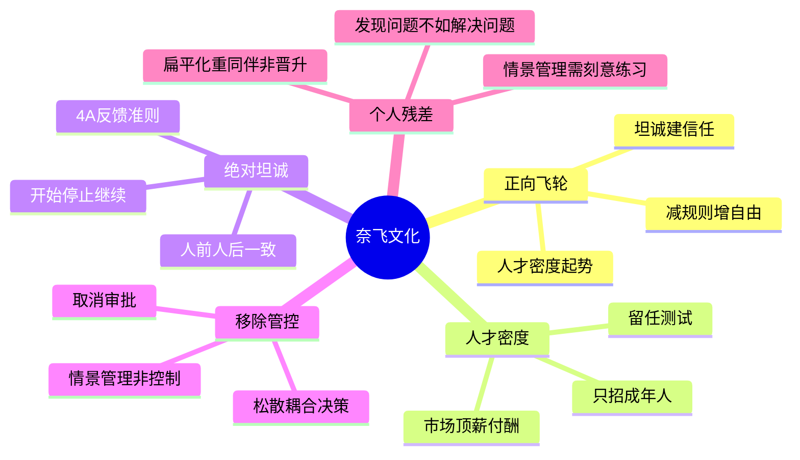

# 《奈飞文化手册》+《不拘一格》读书笔记与思维导图

**作者**：帕蒂·麦考德 / 里德·哈斯廷斯、艾琳·迈耶
**核心主旨**：以高人才密度为起点，用绝对坦诚建立信任，再逐步移除管控，形成"人才吸引人才、自由激发责任"的正向飞轮。文化不是福利清单，而是战略本身。

---

## 1. 正向飞轮：三层递进引擎

- **核心逻辑**：提高人才密度 -> 增加坦诚度 -> 移除管控 -> 自由吸引更多人才 -> 人才密度再提升。
- **文化内核**（《不拘一格》）：人才重于流程，创新高于效率，自由多于管控。
- **人才效益现象**：一个顶尖人才的创新产出数倍于中等人才，且随技术演进倍数仍在增加。
- **赋能而非赋权**：员工本就有权力；管理者的任务是从繁文缛节中解放这种权力，而非"赐予"权力。
- **用管理产品的方式管理员工**：像迭代产品一样迭代团队——面向未来 6 个月审视现有团队是否就绪，持续"进化"而非维持现状。

## 2. 第一层：提高人才密度

### 只招成年人

- 只雇用、奖励和容忍完全成熟的成年人——渴望挑战、能自律、不需要复杂激励与监控。
- 建立尽可能简洁的工作流程和强大的纪律文化；保持管理层扁平以加快决策。
- 不要让规章与制度限制高绩效者；若雇对了人并给足工具与信息，他们会出色完成工作。

### 按市场顶薪付酬

- 薪酬与年度绩效评估流程无关，只与员工绩效和对未来业绩的价值相关；反馈流程与薪酬系统必须分离。
- 不依赖滞后的薪酬调研；资历相当的应聘者应获同样薪酬，与性别、前雇主无关。
- 若无法对所有岗位支付市场最高水平，优先覆盖对业务增长最关键的岗位。
- 建立薪酬透明制度，让每个人能判断自己是否被公平定价。

### 员工留任测试与团队进化

- **留任测试**：若某员工今天辞职，我会强烈挽留吗？若不会，现在就应给他丰厚离职补偿并换人。
- **团队不是家庭，是职业运动队**：面向未来组建团队，而非保留现有成员；主动让已出色的人离开，为顶尖人才腾位置。
- **高度匹配，而非仅仅匹配**：每个岗位都要招高度匹配的人；技能与岗位不再匹配时，即便是优秀者也要说再见——这不等于失败者。
- **员工成长只能由自己负责**：公司不提供终身职业路径；保持灵活、持续学习新技能才是职场最佳建议。
- **废除 PIP 与年度绩效评估**：无可靠数据表明评估流程有助于业务指标就应废除；绩效问题应像教练"每 10 场比赛评估一次"那样及时、持续处理。

## 3. 第二层：增加坦诚度

### 人前人后言行一致

- 绝对坦诚是获得高效反馈的唯一途径；公开谈论问题，不在事后陷入相互指责。
- 领导者坦承错误，员工才敢畅所欲言；冷嘲热讽像癌细胞，会扩散为牢骚、阿谀和背后中伤。
- 不给严格反馈会让管理者掩盖事实、欺骗员工，剥夺改进机会；公开批评有价值，前提是针对行为而非定性。

### 4A 反馈准则（《不拘一格》）

- **Aim to assist（目的在于帮助）**：反馈意图必须积极，不攻击或伤害他人。
- **Actionable（具有可行性）**：反馈必须可操作，对方清楚需要改变哪些具体行为。
- **Appreciate（感激与赞赏）**：接收反馈时表达感谢，即使不认同也要先听完。
- **Accept or discard（接受或拒绝）**：你有权接受或拒绝反馈，但应认真考虑。

### 开始、停止、继续练习

- 团队会议上每人告诉一位同事：一件应开始的事、一件应停止的事、一件做得好应继续的事。
- 反馈环是提高绩效最有效的方法之一；持续提出并接收反馈，学得更快，减少对权力与规则的需求。

### 让每个人都理解业务

- 员工的无知是管理者的失职；不告知战略、业绩与挑战，信息会从同事或网络（谣言）处流入。
- 双向沟通至关重要：员工应能向上至 CEO 提问；培养基层员工的高层视角，让他们感受与全公司问题的真实联系。
- 管理者越详尽沟通任务、挑战与竞争环境，政策、审批和激励措施就越不重要。

## 4. 第三层：移除管控——情景管理而非控制管理

### 取消审批的典型实践

- **取消休假审批**：成年人自行决定何时休假；**取消差旅报销审批**：按公司政策自行报销。
- 核心问题不是"防范错误还是激励创新"——前者需要流程管控，后者需要情景管理。

### 情景管理的三个前提

- **高人才密度**（首要条件）：员工工作仍吃力时，控制管理是本能且必要的；情景管理需要练习。
- **创新性目标**（而非错误防范性目标）：防范错误靠流程，创新靠判断力。
- **松散耦合**：领导层负责"树根"——统一战略方向；各"树枝"基于业务情景自主决策（树形决策模式）。

### 当员工犯错时

- 不要指责员工，而要问：战略目标是否讲得足够清晰且令人鼓舞？是否阐明了所有可能性与风险？是否与员工在观点和目标上达成一致？
- 认识一致，松散耦合——与其监管流程减少错误，不如设定清晰情景、统一认识、确定共同目标，把决策自由交给知情指挥。

## 5. 支撑机制：HR 即业务、事实捍卫观点

- **HR 是业务部门**：服务于客户而非用人经理；用人经理是首席招聘官，招聘高绩效者是其最重要工作。
- **招聘不是数字游戏**：为岗位找最佳匹配（非"一流选手"），确保每个关键岗位有一位一流人才；面试重要性高于高管会议。
- **只有事实才能捍卫观点**：数据是提出好问题的基础，不是答案；数据可被当作挡箭牌逃避主观判断责任。
- **高敬业度不等于高绩效**：敬业是手段，服务客户和创造业绩才是目标；培养的是对成就的执着，而非"努力就有回报"的期望。

---

## 个人想法与点评

- 扁平化组织下，"和出色的人一起工作"比"明确的晋升之路"更重要——这与奈飞刻意保持扁平的结构设计一致。
- 用人经理瞧不起招聘人员、不愿深入合作——这不就是 HRBP 该做的事吗？招聘能力本身就是巨大竞争优势。
- 情景管理 vs 控制管理：控制是本能，情景管理需要刻意练习；选择后者意味着相信每个人都是优秀的，但新手厨师仍需更多指导而非放任。
- 遇到不习惯的同事不能扔一边——大概率会比预期更早离开组织；留任测试与及时沟通同样适用。
- 凯旋门交通悖论：多修路不减少拥堵，自治可能是更好方案——与"移除管控"的隐喻高度吻合。
- 阿里价值观输出仍强调控制型绩效排序——在依赖发明与创新的经济中，老一套管控思路的局限日益明显。

## 个人补充

- 划线密集在**三层递进的操作细节**（4A 准则、开始停止继续、留任测试、6 个月未来视角），而非文化口号本身——飞轮能否转起来，取决于每一层的具体动作是否落地。
- 对"只招成年人"的个人理解：不是年龄意义上的成年，而是**心智成熟**——能自驱、能担责、能接收坦诚反馈而不防御。
- "发现问题的人没多少价值"——公司需要的是热爱解决问题的人；这与 HR 从"合规部门"转型为"业务加速器"一脉相承。
- 两书合一后的残差：麦考德侧重 CHO 视角的制度设计与 8 条准则拆解；哈斯廷斯侧重 CEO 视角的自由与责任哲学及 4A 实操——合并后"坦诚"层有了可执行的反馈协议。

---

## 思维导图 (Mind Map)

*导图画的是"我标记过的书"：叶子节点来自个人划线与想法的要点，非全书大纲。*

---

## 社区精华：热门划线 (Popular Highlights)

**《奈飞文化手册》**

- "人们最希望从工作中得到的东西，是加入到让他们信任和钦佩的同事团队中，大家一起专注于完成一项伟大的任务。" -- 4320人划线
- "管理者的本职工作是建立伟大的团队，按时完成那些让人觉得不可思议的工作。只有这一项工作是管理应该做的。" -- 3468人划线
- "工作中真实和持久的幸福源于和你认识的优秀人才一起深入地解决一个问题，源于客户喜爱你付出辛勤努力所创造的产品或服务。" -- 2736人划线
- "你能够为员工做的最好的事情，就是只招聘那些高绩效的员工来和他们一起工作。" -- 2608人划线
- "人都是拥有权力的。企业的任务不是要对员工赋能，而是要从员工踏进公司大门的第一天起，就提醒他们拥有权力，而且为他们创造各种条件来行使权力。" -- 2400人划线
- "最好不要去臆想员工很笨，而是要考虑到另外一种情况：如果员工做了愚蠢的事情，要么是未被告知相关信息，要么是被告知了错误信息。" -- 2142人划线
- "不给严格反馈，会给管理者带来不必要的压力，他们不得不掩盖事实并欺骗员工，进而导致员工丧失做出改进的机会。" -- 2124人划线
- "给予反馈最重要的是要针对行为，而不是笼统地给一个人定性。反馈的内容必须是可操作的。" -- 1584人划线
- "我们会在团队会议上做一个名叫'开始、停止和继续'的练习。" -- 1316人划线
- "管理者越是花更多的时间去详尽、透彻地沟通亟待完成的工作任务、面临的挑战以及竞争环境，那些政策、审批和激励措施就越不重要。" -- 1308人划线

**《不拘一格》**

- "网飞文化的核心是'人才重于流程，创新高于效率，自由多于管控'。" -- 702人划线
- "反馈环是提高绩效最有效的办法之一。如果在我们合作共事的过程中，能不断地提出并接收到反馈，便能学得更快，完成得更多。" -- 1026人划线
- "在网飞，如果你与同事有不同意见，或者是有好的建议却不说出来，就会被视为对公司不忠。" -- 1036人划线
- "与其通过监管流程减少错误，不如设定清晰的情景，统一认识，确定共同的奋斗目标，同时把决策自由交给知情指挥。" -- 源自个人划线，社区共识见下条
- "网飞所采用的是树形的决策模式，企业领导层只负责树根部分，确保整个企业有高度一致的战略方向，同时赋能每一根树枝，让它们能基于相应的业务情景来做决策。" -- 608人划线
- "网飞认为你具有惊人的判断力……判断力几乎可以解决所有模棱两可的问题，而流程做不到。" -- 558人划线
- "工作的目的不在于取悦老板，而在于对公司有利。" -- 1155人划线
- "创造性工作要求在一定程度上解放你的大脑。如果你总想着要怎么做才能表现好，才能得到高额的奖金，那么你就缺少开放的认知空间。" -- 1122人划线
