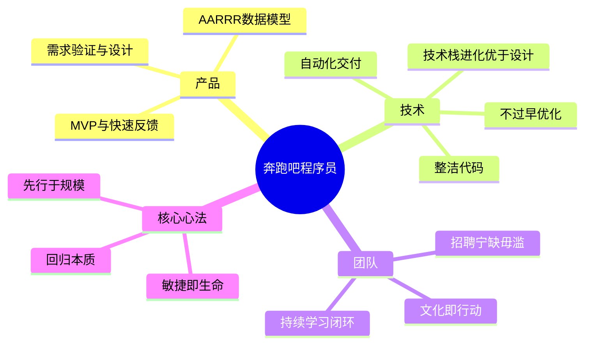

# 《奔跑吧，程序员》知识精要 (Hello Startup)

这是一本关于如何从零开始打造产品、技术和团队的实战指南。核心理念是：**成功的公司是进化的结果，而非天才的设计。**

---

## 第一部分：产品 (Product)

### 1. 核心哲学：MVP 与 快速反馈
- **MVP (最简可行产品)**: 找到成本最低的方式去验证对真实客户的假设。
- **快速迭代**: 找出风险最大、最重要的设想 -> 描述可测试假设 -> 构建最小实验 -> 分析结果 -> 重复。
- **点子迷宫**: 产品不是一个孤立的点子，而是沿途做出一千个决定的路径。

### 2. 需求验证与设计
- **市场需求**: 创业失败的首要原因是“没有市场需求”。
- **发现问题**: 倾听和观察比交谈更重要。关注频率、密度、痛苦程度。
- **设计即产品**: 在顾客看来，界面就是产品。设计是可以通过模仿和迭代学会的技能。

### 3. 数据与营销 (AARRR 模型)
- **指标**: 获取 (Acquisition)、激活 (Activation)、留存 (Retention)、推荐 (Referral)、收益 (Revenue)。
- **数据驱动**: 如果有数据就参考数据；如果只有观点就听我的。
- **教育客户**: 通过教导客户建立纽带，赢得忠诚。

---

## 第二部分：技术 (Technology)

### 1. 技术栈选择与进化
- **初始选择**: 选择你所了解的技术。
- **进化优于设计**: 构建可以不断进化的技术栈，而不是完美的初始设计。
- **开源优先**: 尽量使用开源和商业产品，只有“秘密武器”部分才内部实现。

### 2. 整洁代码 (Clean Code)
- **阅读大于编写**: 程序员 80% 的时间在理解代码。代码是给人阅读的。
- **核心原则**:
  - **DRY (Don't Repeat Yourself)**: 知识的单一无歧义表示。
  - **SRP (单一职责)**: 类、函数、变量应只有一个目的。
  - **依赖反转**: 高级模块不应依赖低级模块，二者都应依赖抽象。
  - **一致性**: 保持代码布局和命名的一致性。

### 3. 可扩展性与交付
- **不要过早优化**: 规则1：不要优化。规则2：还是不要优化（仅限专家）。
- **自动化交付**: CI/CD 是基础。手工交付是恐怖故事。
- **监控与测量**: 没有测量无法预判性能。瓶颈往往出现在你意想不到的地方。

---

## 第三部分：团队 (Team)

### 1. 创业文化与合伙人
- **文化即行动**: 文化不是口号，而是团队行动的方式。
- **寻找合伙人**: 敏思笃行、技能互补、动机类似、值得信任。
- **团队力量**: 创业低谷极深，团队精神是克服困难的关键。

### 2. 招兵买马 (Hiring)
- **宁缺毋滥**: 除非绝对有把握，否则请说“不”。
- **多面手优先**: 早期团队需要全栈工程师/多面手，而非单一专家。
- **雇主品牌**: 通过开源、博客、技术演讲吸引被动求职者。

### 3. 持续学习
- **刻意练习**: 需要反馈机制，挑选能力之上的活动。
- **学习闭环**: 研究 -> 实现 -> 分享。
- **T型人才**: “只有虫豸才讲究专长”。保持跨学科的学习能力。

---

## 核心心法
- **敏捷即生命**: 在快速变化的环境中，只有先行者受益。
- **先行于规模**: 创业须从无法规模化的事情做起。
- **回归本质**: 专门找出重要的问题，而不是挑感觉舒服的问题。

---

## 全书框架图 (Mind Map)

---

## 社区精华：热门划线 (Popular Highlights)
*提取自微信读书全书最受认可的观点*

1. **职业关注**: 很多技术人员在职业生涯早期对“创业”本身缺少关注，而这往往是成长的拐点。
2. **激励核心**: 自主权、掌控力和使命感是激励人的三个最强有力的因素。
3. **技术拐点**: 最初的技术选择往往是错的，关键在于遇到拐点时是否有“壮士断腕”的勇气重新评估。
4. **点子本质**: 所有创造性的东西都只不过是集之前的点子之大成。
5. **知识复利**: 知识就像利滚利，越早投资学习越好。
6. **速度胜出**: 一个能立即实施的出色技术栈，好过一个下周才能运用的完美技术栈。
7. **风险观**: 真正的风险不是失业，而是失去成长的机会。
8. **金钱观**: 把金钱当作事情的助推剂，而非最终目标。
9. **任务与目标**: 任务随技术变，目标始终稳定。
10. **冰球哲学**: 滑向球将要去的位置（预判），而不是它现在的位置。
