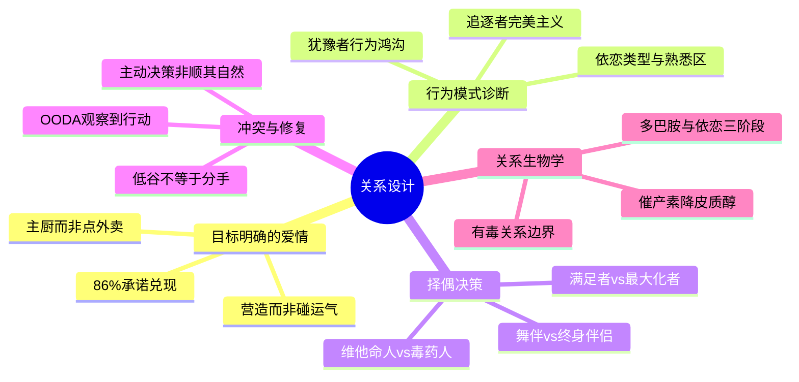

# 《如何避免孤独终老》+《寻找你的维他命人》读书笔记与思维导图

**作者**：洛根·尤里 (Logan Ury) / 玛丽安·罗哈斯·埃斯塔佩 (Marian Rojas Estapé)
**译者**：李小霞 / 冯珣
**阅读数据**：书1 评分 81.9/100，138 条划线 + 2 条想法；书2 评分 76.1/100，122 条划线 + 6 条想法
**核心主旨**：好的亲密关系不是碰运气碰来的，而是一系列主动决策与持续投入的结果；同时，关系质量有明确的生物学底座——催产素促进连接与修复，皮质醇升高则标志有毒互动。两书合一：用行为科学做择偶与关系决策，用神经科学做关系体检与边界设定。

---

## 1. 目标明确的爱情：主厨思维 vs 外卖思维

- **一系列选择，而非偶然**：感情生活应被看成何时约会、和谁约会、何时确立关系、何时分手等决策链的结果，而非"等对的人出现"。
- **营造 vs 发现**：美好的亲密关系是营造出来的，不是碰运气碰来的；灵魂伴侣思维相信"找到对的人就行"，事在人为思维相信"感情成功源于自身努力"。
- **厨师 vs 外卖**：灵魂伴侣式思维像点外卖——等待完美对象被送到门口；事在人为式思维像主厨——主动选材、调味、调整火候。即使最健康的婚姻也需要努力经营。
- **迪士尼陷阱**：社交媒体把关系包装成经过修饰的日落照片；爱情意味着更多东西，包括冲突、磨合与共同决策。
- **承诺兑现是信任底座**：和睦关系中伴侣 86% 的时间实现彼此承诺；岌岌可危的关系只有 33%。经常兑现承诺的伴侣享有更多信任、激情与满意性生活。

## 2. 现代恋爱的结构性困境

- **选择的悖论**：人们渴望选择，但太多选择反而减少幸福感、削弱决策信心；选项不再带来自由，而是不知所措。
- **身份与比较**：婚恋对象曾由社区决定，现在完全由自己决定；可从网络认识的人太多，却陷入选择障碍；我们误以为上网研究对比就能确定感情。
- **缺少榜样与过高期待**：许多人来自破裂家庭，缺少亲密关系的正向模板；婚姻终于更多考虑个人需要，但社交媒体造成攀比与绝望。
- **交友软件的结构性冲突**：软件希望你不断寻找，而你想找到伴侣——对"好用户"而言，平台并不希望你流失；软件像老虎机，多巴胺火花带来即时满足，长期却引发空虚与上瘾。
- **低估社交连接**：我们避免与陌生人交谈的本能往往是错的；只是以为自己想要独处，实际上低估了社会联系带来的快乐。

## 3. 约会行为模式：追逐者、犹豫者与适应者

- **三种婚恋倾向**（社区热门划线："你在哪种倾向中得分最高？它就是你的婚恋倾向"）：
  - **追逐者**（完美主义倾向）：标准可以很高，但找到符合标准的选择后仍停不下脚，总觉得还有更好选项；做出"正确"决定后反而感觉糟糕。
  - **犹豫者**（自我怀疑倾向）："等他准备好了就会去谈恋爱"；存在行为鸿沟——知道该约会却迟迟不动；失去学习讲故事、倾听、亲密互动的机会。
  - **适应者**（浪漫主义倾向）：相信只要找到正确的人，就能建立满意关系；被动等待童话式邂逅，把约会当成找舞伴而非找终身伴侣。
- **打破犹豫**：设定截止期限、公开承诺目标、告诉他人你在找人生伴侣、投入新身份、做自己的拉拉队队长。
- **依恋类型**（书1 + 书2 交叉验证）：
  - **安全型**：能管理破坏性冲动与情绪，可依靠他人满足情感需求。
  - **焦虑型**：害怕被抛弃，揪住伴侣问题不放，甚至幻想莫须有问题。
  - **回避型**：装作不想联系以减少被拒痛苦；关系越亲密越想离开——"只要有人说喜欢我，我立刻就会失去兴趣"。
- **大脑的熟悉区**（书2）：童年互动模式被默认设为"熟悉"；我们可能反复选择类似父母或创伤对象的人——不是因为他们合适，而是因为警报系统未被触发。

## 4. 择偶认知偏差：最大化者、满足者与初始化问题

- **最大化者 vs 满足者**：知足常乐者标准可以很高，找到符合标准的选择后就满意，不再考察其他选项；完美主义者即使找到符合标准的选项，仍觉得有必要把所有可能选项都考察一遍。
- **主观体验 vs 客观结果**：若追求幸福快乐，真正重要的是主观体验；咖啡品质重要，但对咖啡的感觉更重要——"对咖啡的感觉是否会被操控"值得警惕。
- **环境扭曲偏好**：真实与虚拟环境都会影响决定；大脑关注可量化、易比较的东西——某个特性越容易比较，看上去就越重要。
- **初始化问题 vs 持续投入**：我们把人拆成可比较的部件来找"最合适的人"；对某人只有粗略认识时，大脑会用正面信息填补空白；知道对方过去在哪里，不等于知道他们将来要去哪里。
- **可解决 vs 永远无法解决**：一旦选择终身伴侣，不可避免选择一系列无法解决的问题；目标不是找不争吵的人，而是找懂得合理争吵、不必担心争吵就会结束关系的人。
- **迷恋 vs 爱恋**：过分关注"转变"会混淆迷恋与爱；激情过后必然转变——若目标是长期关系，要接受这一规律，而非反复追逐新激情。

## 5. 终身伴侣标准：维他命人 vs 毒药人

- **舞伴 vs 终身伴侣**：不要问"和这个人谈恋爱是什么感觉"，要问"能和这个人共度一生吗"；需要顺境逆境都能陪伴、可信赖、能一起做决定的人。
- **长期关键品质**：情绪稳定、心地善良、忠诚；擅长应对压力（极度焦虑还是保持冷静）；具有成长型心态；看老朋友判断忠诚；看"和他在一起时，我怎么样"。
- **维他命人**（书2）：促进催产素分泌、缓解紧张；困境中一个真心拥抱降低皮质醇，信任的眼神鼓舞斗志，鼓励的话语缓解孤立感；保留幼态特征——好奇心、学习热情、有感染力的笑容。
- **毒药人**（书2）：导致他人体皮质醇升高；自私、消极、嫉妒、受害者心态、爱批评、善于操纵、寻求或制造冲突；可能因童年创伤而长期警戒，杏仁核激活、前额叶皮质受抑。
- **金字塔择偶**（书2）：一类标准（情绪稳定、善良、忠诚等）是维系关系的支柱；二类标准（幽默、共同爱好等）催生化学反应；择偶前先分析是否处于皮质醇中毒状态，先提升自身催产素水平。
- **激素与性**（书2）：随意性行为与抑郁、孤立感相关；有爱的性、无爱的性、有爱有承诺的性是不同层级；纯粹欢愉只带来多巴胺火花，无法替代被爱与被拥抱的需求。

## 6. 约会策略：玩耍、好奇与真实连接

- **现实社交优先**：开口让人介绍对象，明确告知找的是人生伴侣；公开承诺目标能激励完成；减少线上、增加线下。
- **玩耍而非面试**：约会不是商务会面，选更有情趣的地方；玩耍是心无旁骛展现真实自我；人们看到努力会更重视，看重努力而非速度。
- **让对方感到有趣**：喜欢提问增加好感；给出支持性回应（鼓励对方继续讲）而非转移性回应（把焦点拉回自己）；峰终定律——体验评价取决于最强烈时刻与结束时刻的感受。
- **去他的 spark**：看得越多越熟悉，熟悉带来安全与吸引；配偶价值与独特价值要分开——长期看忠诚、善良以及对方给你的感觉。
- **第二次约会礼仪**：不想被评判就不要评判他人；对方行为往往反映本质而非环境；玩消失恶劣且伤人；拒绝应礼貌、简短、亲切；不想做朋友就别说还想做朋友。
- **交友软件实操**（书1 划线）：目的是去真正约会，不是整晚刷手机选对象；先看吸引你的地方；抓拍优于摆拍，黑白照片效果好；写体现与众不同之处，吸引共同爱好者而非同好抱怨者。

## 7. 关系推进、冲突修复与低谷管理

- **主动决策 vs 顺其自然**：主动决策是有意识推动关系（确立专一、讨论生育）；顺其自然是不多想任由发展——同居效应表明，未主动决策就同居的夫妇对婚姻更不满意、离婚率更高。
- **OODA 冲突模型**（书1 行为框架）：
  - **观察 (Observe)**：看对方如何应对压力；在冲突中留意自己的精力与注意力是否在线。
  - **定向 (Orient)**：区分可解决问题与永久问题；理解损失厌恶——人们往往把损失看得比收益更重要。
  - **决策 (Decide)**：了解伴侣感受而非说服对方给想要的结果；让伴侣知道可以说心里话，即使不是你想听的。
  - **行动 (Act)**：列出伴侣五个值得欣赏之处；从分歧中恢复；一起做决定；把感情放在第一位试试——是否把最好的一面留给了工作与朋友。
- **低谷不等于分手**：关系有波谷；先关注自身状态——精力充沛时才更有能力爱人；不要问受骗后不再信任的人、八卦者、因爱你而无法客观的人。
- **分手与框架**：制订分手计划，用新活动取代旧习惯；框架效应——同一事实的不同呈现会改变选择；大脑对损失极度敏感，但分手也可以是收获。
- **婚前与长期**：婚姻美满对幸福、健康、寿命、财富与子女幸福影响巨大；激情是最猛烈也最短暂的阶段——目标是建立能适应变化的亲密关系，历久弥新。

## 8. 关系生物学：激素、共情与社交健康

- **催产素 vs 皮质醇**：催产素促进信任、慷慨、专注与共情；皮质醇在紧张威胁时分泌，长期高水平损害免疫与身心健康，削弱共情与长远决策能力。
- **此消彼长**：催产素上升时皮质醇下降；拥抱降低皮质醇，触觉小体被激活带来抚慰；焦虑时常没胃口，正在印证激素对身体的影响。
- **多巴胺与成瘾**：浪漫爱分泌多巴胺、激活伏隔核；一见钟情时往往只有一人感受到魔力；前额叶皮质停止工作，杏仁核警戒降低——进展太快时像着了魔。
- **海伦·费舍尔三阶段**：(1) 性欲——寻找多样伴侣；(2) 浪漫的爱——多巴胺成瘾式专注；(3) 依恋——激情退去、羁绊加深，需用心维护否则分崩离析。
- **性别差异**：睾酮抑制催产素效果；男性前额叶皮质约 30 岁完成强化；升职、权威、竞争可能导致睾酮飙升、催产素下降，损害关系健康。
- **提升催产素的日常工具**：健康膳食、正确呼吸、管理心率；拥抱、按摩、听音乐、冥想；减少电子设备对共情的削弱；尽心照顾身边人、打电话、线下交流。
- **有毒关系应对**：分析人际关系是否存在毒性；谨慎行事、减少接触、不在意其评判；向有毒之人传递的爱越多，其影响力越小——但前提是先与自己和睦相处；处于皮质醇中毒或生活低谷时，尽量避免与有毒之人见面。

---

## 个人想法与点评

- **对咖啡感觉的警惕**（书1）：若追求幸福快乐，主观体验比客观结果更重要——"对咖啡的感觉是否会被框架操控"值得在择偶中同样追问：你是真的了解对方，还是被呈现方式影响了判断？
- **信任与激素的直觉**（书2，读前）：没看之前以为是行为举止相似性与价值冲突；读后才理解人际关系与激素的深层关联——面善感、焦虑感背后都有生物化学成分。
- **交友软件的商业逻辑**（书2）："笑死，确实是这样。对于'好的'用户，软件才不会希望你流失"——平台激励与用户目标结构性错位，需主动设限而非被动刷。
- **有毒的人与职场**（书2）：识别 PUA 式有毒互动后联想到"互联网大厂现状"——长期警戒、低挫折承受力、不断找麻烦，组织毒性与人际毒性机制相通。
- **进展太快的关系**（书2）：后知后觉发现开端太匆忙——身体吸引、忘却旧爱、害怕孤独——"这不就是艺术吗"：激情叙事很美，但决策层需区分艺术体验与长期适配。
- **致谢里的晚宴分工**（书1）：感谢组织分工明确晚宴、让众人畅谈反馈——关系设计本身也需要刻意营造安全对话场域，而非指望自然发生。

## 个人补充

- **划线分布差异**：书1 划线覆盖约会全流程（倾向诊断、依恋、择偶标准、约会技巧、冲突、分手），社区共识集中在"选择悖论""灵魂伴侣 vs 事在人为""知足常乐 vs 完美主义"；书2 划线密集在激素机制、维他命/毒药人、依恋 familiar zone、交友软件/色情制品神经影响——社区更关注催产素-皮质醇对冲与"亲近对的人、远离错的人"。
- **两书互补的残差**：书1 提供决策框架与行为改变处方（截止期限、主动决策、OODA 式冲突处理）；书2 提供"为什么这段关系让我身体不舒服"的生理解释（皮质醇中毒、熟悉区重复、前额叶受损）——合并后"该不该继续"可从行为与 biology 双通道验证。
- **个人批判性补充**：最大化者陷阱在交友软件时代被放大——可比较维度（照片、标签、职业）越多，大脑越误判其重要性；维他命人框架不是"永远让你舒适"，而是能在压力下降低皮质醇、提升修复能力——与"从不争吵"是不同概念。

## 思维导图

## 社区精华：热门划线 (Popular Highlights)

### 《如何避免孤独终老》

- 你在哪种倾向中得分最高？它就是你的婚恋倾向。（2338 人划线）
- 尽管人们渴望选择，但太多的选择反而会减少我们的幸福感，会对自己的决定更没信心。他们称这种现象为"选择的悖论"。（1887 人划线）
- 找一个能与你互补的人，而不是和你性格一样的人。（966 人划线）
- 说到亲密关系，心理学家云妮·弗兰尼克发现，人有两种思维模式：一种是灵魂伴侣式的思维模式，相信只要找到正确的人，就能建立起令人满意的亲密关系；另一种是事在人为式的思维模式，相信感情的成功源于自身努力。（935 人划线）
- 美好的亲密关系是营造出来的，不是碰运气碰来的。（750 人划线）
- 目标明确的爱情要求你把自己的感情生活看成一系列选择的结果，而不是一系列偶然的结果。（708 人划线）
- 你的目标是什么呢？是买到全世界最好的咖啡机，还是幸福快乐？如果你追求的是幸福快乐，那么真正重要的是主观体验而不是客观结果。（688 人划线）
- 我们避免与陌生人交谈的本能是错误的。我们只是以为自己想要独处。我们低估了社会联系带来的快乐。（648 人划线）
- 完美主义者和知足常乐者的区别并不在于他们做出决定的好坏，而在于这些决定带给他们的感觉："完美主义者做出正确决定后感觉糟糕；知足常乐者做出正确决定后感觉满意。"（561 人划线）
- "一旦选择了终身伴侣，你也不可避免地选择了一系列对你而言无法解决的问题。"你的目标不是去找一个不会和你争吵的人，而是去找一个懂得合理争吵的人。（533 人划线）

### 《寻找你的维他命人》

- 有的人走到哪里都能带来快乐，而有的人只有走了才能给人带来快乐。（198 人划线）
- 我们能否获得幸福，取决于我们能否亲近对的人、远离错的人。（187 人划线）
- 维他命人对促进催产素的分泌、缓解紧张情绪有极大帮助。当一个人处于困境中时，一个真心的拥抱就能够降低他飙升的皮质醇水平。（170 人划线）
- 当催产素水平上升时，皮质醇水平会下降。（128 人划线）
- 我们的大脑和身体无法分辨真实的危机和想象出来的危机。（120 人划线）
- 当你压力重重、充满忧虑，处于高度警戒状态中时，也会很难留意到其他人的问题和困难——你的共情能力会降低。（120 人划线）
- 别忘了，你的愿望可能跟交友软件对你的期待是相反的。你想找到一位伴侣，而交友软件希望你不断地寻找下去。（108 人划线）
- 那些不去尝试理解自己的人，无法真正治愈他们生命中的伤痛，而且会不断陷入不适合自己的关系之中。（98 人划线）
- 我们的生活质量很大程度上由我们与他人的关系决定。我们爱与被爱的能力越强，我们的生活质量就越高。（84 人划线）
