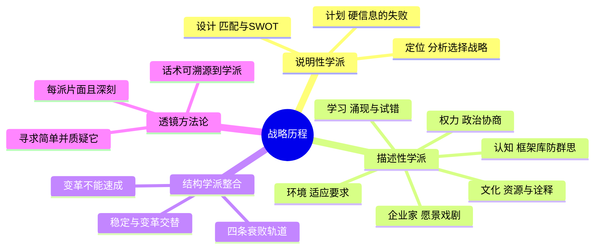

# 《战略历程》(Strategy Safari) 读书笔记与思维导图

**作者**：亨利·明茨伯格 (Henry Mintzberg)、布鲁斯·阿尔斯特兰德、约瑟夫·兰佩尔；译者：魏江
**核心主旨**：战略管理是一头大象，十个学派各摸到一部分——每一种观点都片面且夸张，但又都有趣且深刻。世界上没有纯粹深思熟虑或完全涌现的战略：前者排除了学习，后者排除了控制。管理者必须全面理解这头大象，用多个透镜交替审视自己的战略处境。

---

## 1. 十大学派总览

- **三个说明性学派（战略应该如何形成）**：设计学派（孕育过程：内部能力与外部环境匹配，SWOT 之源）、计划学派（程序化过程：预算/目标/战略/程序四体系）、定位学派（分析过程：波特五力、三大通用战略）。
- **六个描述性学派（战略实际如何形成）**：企业家学派（构筑愿景）、认知学派（心智过程：认知创造世界）、学习学派（涌现过程）、权力学派（协商过程）、文化学派（集体思维）、环境学派（适应性过程）。
- **一个整合学派**：结构学派（变革过程）——提供了整合所有其他学派观点的调和框架：组织在特定时期采用特定结构、匹配特定环境、产生特定战略。
- **战略的悖论**：战略本身不是关于变化而是关于连续；没有时间上的一致性就没有整体战略——但环境在变，所以战略管理要巧妙处理思考与行动、控制与学习、稳定与变革之间的微妙关系。

## 2. 说明性学派的价值与局限

- **设计学派**：核心是"匹配"——机遇与能力的平衡。评估框架四标准：一致性、协调性、优势、可行性。局限：CEO 唱独角戏、否定涌现与全员参与；经验表明企业实际优势比想象的小、劣势比想象的大；组织必须建立在能利用的优势上。
- **危险的前提**：办公室里编造战略而不接触真实产品与客户，滋生片面战略；"环境可预测、信息不失真上传"是虚妄的假设。
- **计划学派**：战略规划的失败是对不连续事件预测的失败、创新制度化的失败、硬信息取代软信息的失败。软信息才是战略的主要依据；情境规划的目的不是预测未来，而是建构面向不同方向的驱动力。
- **定位学派**：产业结构决定战略位置，分析者是在"选择"战略而非设计战略。局限：偏爱经济学忽视政治学、重外部环境轻内部能力；克劳塞维茨困境——计算是优势之本，但无数微小因素根本无法计算。创新战略的机会来自新阅历创造的新视角，而非陈旧的分析和数字累积（本田的成功与学习有关，与定位无关）。

## 3. 描述性学派的洞察

- **企业家学派**：愿景 = 核心理念（核心价值+核心目标）+ 未来蓝图。愿景领导是戏剧演出而非排练。风险：组织依赖个别天才决定方案。
- **认知学派**：认知创造世界；更多的信息只增强决策信心，不提高决策准确性；高级经理常成为组织信息处理系统的俘虏。避免群体思维需要丰富的"框架库"——从不同视角看事物。
- **学习学派**：有效的战略必然是涌现的——阶段学习、偶然发现、超出预期的再认识起关键作用。"既然你这么聪明，为什么不规划一个笨蛋也能执行的战略？"管理这个过程不在于预想战略，而在于识别战略的涌现并适时控制；高层要建立机制获取一线试错的知识。没有行动就不可能学习。
- **权力学派**：战略形成是政治过程，产出往往是涌现的定位与手段而非展望。微观权力（组织内政治）与宏观权力（组织对外用权）。警示：政治会耗掉服务顾客的精力——企业首先是生产产品，不是提供角斗场。
- **文化学派**：权力把组织切分，文化把个人联合成组织。组织只会看到它们希望看到的。资源基础观四标准：价值性、稀缺性、难以模仿性、不可替代性。文化的脆弱：易被不理解它的新领导贸然破坏。
- **环境学派**：四个环境维度——稳定性、复杂性、市场差异化、敌对性。有能力的经理有时最好去做竞争环境要求的事。

## 4. 结构学派与变革管理

- **结构即战略本质**：组织状态有稳定连贯期也有动荡变化期，变革是结构的必然结果。成功不是通过改变战略，而是通过开发利用既有战略取得的；但要周期性辨认变革需要，安排好破坏性变革。
- **四条衰败轨道**（Miller）：聚焦式（匠人变僵化补锅匠）、冒险式（创业者变贪婪帝国主义者）、发明式（先锋变乌托邦遁世者）、脱节式（销售商变官僚随大流者）——每条轨道都是优势的过度延伸。
- **变革不能速成**：流失的顾客不会很快回来，组织不可能六个月变成创新型、成本压力下不可能奇迹般扁平化——多年习惯与流程是刚性的。
- **变革方式谱系**：计划式、驱动式、演化式；从演化型制度建设到震动重聚焦到基层动员。优秀 CEO 创造变革氛围、让他人决定如何实施、再把最成功的分部立为榜样。
- **终极提醒**：寻求简单，并质疑它。我们想知道这些变革方法有多少不是管理者的自我中心主义和咨询公司的主意。

## 个人想法与点评

- 对"数据驱动"的透镜化解构：数据驱动的说法早已有之——就是定位学派。定位学派有其局限，那么数据驱动是不是也只描述了特定情况下的战略手段？
- 认知学派"框架库"与查理·芒格的思维模型工具箱如出一辙。
- 对愿景领导的自我反思：技术人员的我恰好相反——管理别人的期望、希望别人不要报太大期望。也许该调整：先给人期望，再控制时间成本上的期望，而不是使劲压缩最终效果。
- "商业生态系统"概念的祛魅：生态化反、生态链的话术源头在此。
- 对衰败轨道"一流公司花名册"的会心：离谱的是他们当时还都很好——优势与衰败同源。

## 个人补充

- 社区共识集中在金句层（战略是选择不做什么、战略过早敲定的危险、办公室战略的危害）；个人 210 条划线几乎完整覆盖了十个学派的论证结构、前提假设与批判——这是把书当"战略透镜手册"来读的读法，而非摘金句。
- 个人视角的核心收获是"透镜相对主义"的操作化：任何流行管理话术（数据驱动、生态系统、愿景领导）都能定位到某个学派，随即继承该学派的全部局限。识别话术出身，就能预判它的盲区。

## 思维导图

## 社区精华：热门划线 (Popular Highlights)

- 实际的战略过程必然要融入提前思考和对现实情况的适应调整。（270 人划线）
- 组织面临的危险并不是来自缺乏明确的战略，恰恰相反，它来自战略过早地被敲定。（216 人划线）
- 战略，不是选择做什么，而是选择不做什么。（198 人划线）
- 如果组织的领导者仅仅是坐在办公室里编造战略，而不是在与实实在在的产品和客户的接触中总结战略，这对组织将是极其危险的。（187 人划线）
- 在某种意义上，每一种观点都是片面且夸张的；但从另一个角度看，它们又都是非常有趣且深刻的。（104 人划线）
- 在观念不变的情况下改变定位很容易，但是在保持定位不变的情况下改变观念非常困难。（90 人划线）
- 尽管他们每人都有正确的地方，但从整体上都是错误的！（80 人划线）
- 一流的智力测验就是对头脑中同时有两种相反的观点但仍正常工作的能力的测验。（77 人划线）
- 每一次战略转变都是一次新的经历，都要承担某种风险。没有哪个组织能预见一项已有的竞争力究竟会成为优势还是劣势。（72 人划线）
- 最好的首席执行官都有做老师的潜质，他们教授的核心知识就是战略。（85 人划线）
