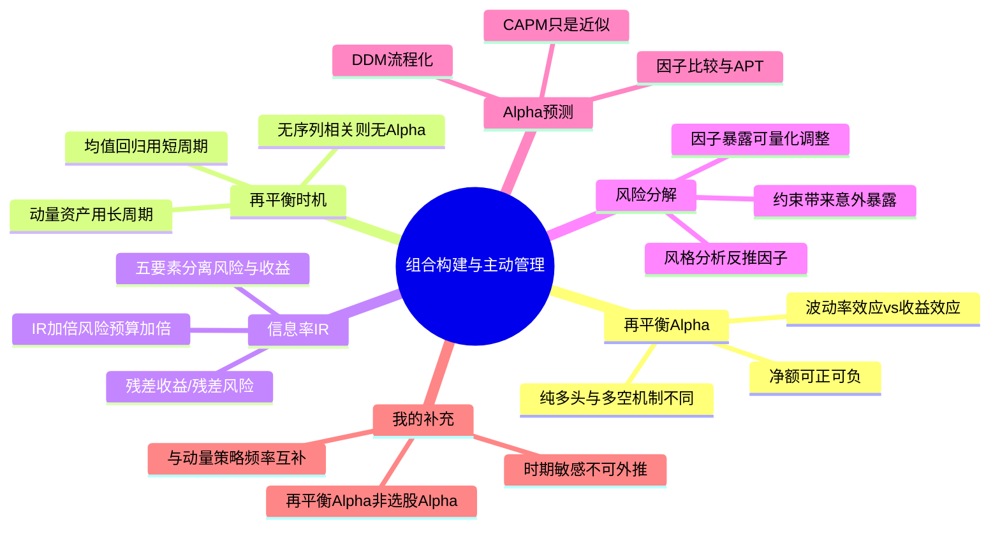

# 《投资组合再平衡》+《主动投资组合管理》读书笔记与思维导图

**书1**：《投资组合再平衡：应用量化分析增强投资组合收益》
**作者**：钱恩平 | **译者**：李腾

**书2**：《主动投资组合管理：创造高收益并控制风险的量化投资方法》（原书第2版·典藏版）
**作者**：[美] 理查德·C. 格林诺德 / [美] 雷诺德·N. 卡恩 | **评分**：73.0/100

**核心主旨**：两书构成"组合构建"与"主动管理"的一体两面——前者用量化框架拆解再平衡是否创造 Alpha、何时再平衡；后者用信息率与风险模型分离基准风险与残差收益，判断主动管理是否真正创造价值。

**技能矩阵定位**：与 `momentum-strategy`（交易策略层）、`options-strategy`（衍生品层）同属 P4 投资扩展矩阵；本笔记覆盖资产配置与组合构建层。

---

## 1. 主动管理的五要素与信息率框架

主动投资提供一套量化理论，核心是把**风险预测**与**收益预测**分离处理。

*   **五个基本元素**：收益、风险、基准、偏好、信息率（IR）。
*   **残差收益率**：资产收益率中与业绩基准不相关的部分，是主动管理的主战场。
*   **信息率定义**：IR = 残差收益率的年化预期值 / 残差风险（年化波动率）。衡量的是"信号质量"，而非绝对回报。
*   **IR 与风险预算**：信息率加倍，最优残差风险水平也加倍——更强的预测能力应匹配更大的主动风险承担。
*   **绩效归因**：对收益率和组合头寸同时进行时间序列分析，可拆解哪些赌注获得回报、哪些无功而返；风格分析甚至能在不知道头寸的条件下，从收益率序列中提取因子暴露信息。

## 2. 再平衡 Alpha 的分解：波动率效应 vs 收益效应

再平衡 Alpha 并不总是存在；其正负取决于两种相反效应的净额。

*   **波动率效应**：再平衡操作对纯多头组合往往产生增量价值，可理解为再平衡 Alpha 的"正贡献"部分。它源自底层资产收益率时间序列的**波动性**——算术平均一般高于几何平均，固定权重再平衡能"收割"这种差异。
*   **收益效应**：来自不同底层资产**平均收益率之间的差异**，往往与波动率效应方向相反。
*   **净额判定**：若收益效应 < 波动率效应，再平衡 Alpha 为正；反之则为负。
*   **纯多头 vs 多空**：再平衡对纯多头组合和多空组合的影响机制有本质不同。纯多头中，跑赢资产的权重自然上升、跑输资产权重下降——再平衡正是通过"卖高买低"恢复目标权重；多空组合中，当头资产加权平均收益率高于空头时杠杆会降低，反之杠杆上升。
*   **风险警示**：主动经理常将再平衡带来的超额收益宣称为 Alpha，但可能只是对承担额外风险的补偿，而非真正的选股能力。

## 3. 序列相关性与再平衡时机

底层资产收益率的序列相关特征，决定是否存在再平衡 Alpha 以及最优再平衡频率。

*   **无序列相关 + 同质预期收益**：固定权重组合与买入并持有组合的预期收益相等，没有再平衡 Alpha。
*   **短期动量、长期反转**：最优策略倾向于**较长再平衡周期**或**更大触发阈值**——避免在动量延续期频繁"卖赢家买输家"。
*   **均值回归特征**：更短的再平衡周期往往更有利——价格偏离目标权重后较快回归。
*   **实证线索**：商品是唯一具有一年正序列相关的风险资产，但第二、三年均逆转为负——动量与反转的时间尺度因资产类别而异，需分资产检验而非一概而论。

## 4. 风险模型与因子分解

风险模型不仅能衡量组合总体风险，更能将风险拆解到各来源。

*   **因子暴露**：规模（SMB：小盘减大盘）、价值、行业、国家/地区、个股特异风险等。
*   **主动经理工作流**：人工确定组合后，用风险模型计算对各因子的暴露并调整——与"先筛指标再深入研究"的选股流程形成互补。
*   **约束的副作用**：某些组合约束会导致显著的负向规模因子暴露，并限制多头头寸规模。
*   **离差管理**：若每期的 Alpha 和风险都在变动，组合会保持或降低当前离差水平——同一策略的不同客户账户，一年期离差可达 23%，说明执行与模型之间的落差是真实成本。

## 5. Alpha 预测的结构化方法

一切主动管理的起点是获得预期超额收益率；CAPM 只是近似指导，既不可忽视又不能全盘接受。

*   **分红折现模型（DDM）**：使投资流程化，但输出质量不优于输入数据质量。
*   **因子暴露比较法**：找出过去表现优异资产的共同特征，再筛选具备相同特征的目标资产；或找出因子暴露相同但市场定价不同的资产，暗示套利机会。
*   **因子收益预测**：直接预测由市场定价的因子（如规模、价值）的预期收益率。
*   **套利定价理论（APT）**：灵活性高，不适合作为一致预期收益率模型，但适合投资经理生成**个性化**预期收益率。
*   **信号组合**：当两个预测信号的 IC 估计相同但估计误差不同时，应赋予估计更精确的信号更高权重。

## 6. 资产配置与再平衡的实证启示

*   **算术 vs 几何**：组合收益的算术平均数是单个资产算术平均收益的加权平均数；长期财富终值受几何平均支配，小幅再平衡 Alpha（如 -83bp）经复利累积后差异显著。
*   **时期敏感性**：再平衡 Alpha 非常依赖具体历史时期——不能用一个样本期的结论外推所有环境。
*   **60/40 与传统配置**：配置国际股票可能提高再平衡 Alpha，但幅度需量化验证；不同投资期比较结果可能相反。
*   **行业与相似资产**：来自资本市场同一部分的相似资产之间，再平衡更可能实现正的再平衡 Alpha（尚未完全证实的断言）。
*   **杠杆再平衡**：杠杆投资每年的再平衡可能产生**负向**再平衡 Alpha——高波动 + 再平衡频率的交互需单独评估。
*   **夏普比率**：再平衡研究的新课题之一，需将再平衡 Alpha 与风险调整后的整体表现一并考量。

---

## 个人补充

1. **波动率 vs 收益差值的直觉**：收益差值一部分来自收益率序列的波动性（算术>几何），另一部分来自不同资产平均收益率的差异——前者是"波动率效应"的数学来源，后者是"收益效应"的来源。两者方向常相反，净额才是再平衡 Alpha。
2. **主动 vs 被动的边界**：再平衡产生的"Alpha"与主动选股产生的 Alpha 是不同概念——前者来自权重管理，后者来自残差收益预测；混淆两者是实务中最常见的归因错误。
3. **与动量策略的衔接**：序列相关性结论直接指导再平衡频率——动量资产（如一年期商品）用长周期，均值回归资产用短周期；这与 `momentum-strategy` 的月度轮换形成互补而非矛盾。
4. **APT 的实务定位**：不追求"市场一致预期"，而是作为经理构建私有预期收益率的工具——与 DDM 的流程化、因子比较的结构化形成三种并行路径。

---

## 个人想法与点评

1. **波动率效应的理解**（再平衡·前言）："咋理解"——核心是用固定权重强制"高卖低买"，从波动中收割算术-几何差；但若资产间存在持续收益差（如股票长期跑赢债券），再平衡反而会系统性卖出赢家，形成负向收益效应。
2. **商品序列相关**（再平衡·2.5）："这个相关性不显著吧"——一年期正相关在统计上可能边缘显著，但二、三年反转说明动量时间尺度很短，不宜据此设定长周期再平衡。
3. **纯多头再平衡机制**（再平衡·3.2）："这不是该降低吗，不然平衡从何而来"——正是因为自然漂移下赢家权重**上升**，才需要再平衡**降低**其权重、**提高**输家权重以回归目标；用户的直觉与书中描述一致，只是表述角度不同。
4. **主动管理书评**（APM·整体）：社区评分 73/100，个人划线偏少，核心框架（IR、风险分解、APT）来自序言与绪论，深度章节需结合社区热门划线补全。

---

## 思维导图 (Mind Map)

*导图画的是"我标记过的书"：叶子节点来自个人划线要点与热门划线，非全书大纲。*

---

## 社区精华：热门划线 (Popular Highlights)

### 《主动投资组合管理》

1. **风险分解**: 它不仅能够衡量组合的总体风险水平，更重要的是，它还可以将组合风险分解到各个来源。（954人划线）
2. **APT 定位**: APT 的灵活性使它不适合作为一致预期收益率的模型，但它适合投资经理生成自己的预期收益率。（954人划线）
3. **微观与宏观分析同构**: 实际上微观分析中的图13-5与图13-6与宏观分析中的图13-3与图13-4相似。（951人划线）
4. **估值组合属性**: 性质3和性质2共同保证了估值公式应该具有组合属性。（949人划线）
5. **风格分析**: 风格分析试图在不知道组合头寸的条件下，从组合收益率的时间序列中尽可能提取更多信息。（949人划线）
6. **信号组合**: 例如，如何组合两个预测信号，如果它们的 IC 估计值相同，但其中一个的估计误差远高于另一个？（948人划线）
7. **绩效归因**: 而对收益率和组合头寸同时进行时间序列分析则能够进一步分析投资经理的能力所在：哪些赌注获得了回报，而哪些赌注无功而返。（948人划线）
8. **规模因子 SMB**: SMB(t)(small minus big) 是一个买入小盘股、卖空大盘股的组合的收益率。（943人划线）
9. **现金流估值**: 性质3不仅使我们能够从股票层面汇总到组合层面，还能够对现金流中的每一笔现金单独估值。（941人划线）
10. **预测经验法则**: 有了这条经验法则，我们就可以更加深刻地理解预测过程，并能够在非结构化的情形中推导出精炼预测。（940人划线）
11. **CAPM 局限**: CAPM 是一个理论，就像社会科学中的其他理论一样，它也基于一些不太准确的假设。（933人划线）
12. **约束副作用**: 其中的一个意外影响是：该约束会导致显著的负向规模因子暴露，并且也会限制多头头寸。（932人划线）
13. **IR 与风险**: 信息率加倍将使最优残差风险水平加倍。（927人划线）
14. **统一维度**: 这个观点创新性地把完全不可比的几种资产特征转换到统一的维度（投资组合），并使用投资组合理论的工具来研究它们。（924人划线）
15. **离差动态**: 我们可以证明，如果每个时期的 Alpha 和风险都在变动，那么组合会保持当前离差水平，或者更常见地，会降低其离差水平。（922人划线）

### 《投资组合再平衡》

16. **商品动量**: 商品是唯一具有一年动量的风险资产，因为其一年的序列相关系数为正。然而，它在第二年和第三年均逆转为负。（22人划线）
