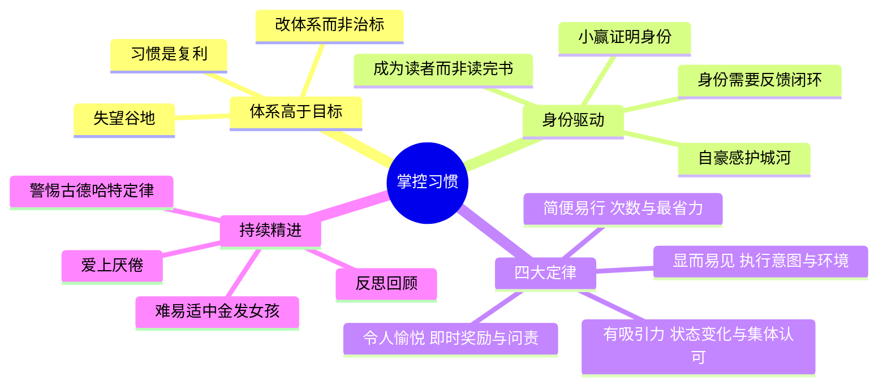

# 《掌控习惯》(Atomic Habits) 读书笔记与思维导图

**作者**：詹姆斯·克利尔 (James Clear)；译者：迩东晨
**核心主旨**：成功是日常习惯累积的产物，而非一生一次的重大转变。别紧盯目标，把精力集中在体系建设上；用"提示-渴求-反应-奖励"四步回路对应的四大定律（显而易见、有吸引力、简便易行、令人愉悦）设计习惯，并让习惯与身份融为一体。

---

## 1. 体系高于目标

- **目标与体系**：目标是你想达到的结果，体系是导致结果的过程。想要更好的结果，别紧盯目标，集中精力建设体系。
- **复利与失望谷地**：习惯是自我提高的复利，最有力的结果总是姗姗来迟。投入数周数月看不见效果的"失望谷地"是大多数人放弃的地方——突破时刻是此前一系列行动积聚的潜能。
- **治标与治本**：重蹈覆辙的根本原因是从未改变导致状况一再发生的体系。
- **目标的陷阱**：所有努力集中在特定目标上时，目标一实现动力就失去依托——这是许多人完成目标后恢复旧习惯的原因。二元的成败观（达成或失望）是自我误导。

## 2. 身份驱动习惯

- **基于身份而非结果**：目标不是阅读一本书而是成为读者，不是跑马拉松而是成为跑步者。着眼点是你希望成为什么样的人。
- **两步过程**：决定你想成为哪类人；用小赢证明给自己看。去健身房练五分钟不太可能提高表现，但它会重申你的身份。
- **信念是底层**：如果从未改变支配以往行为的潜在信念，你很难改变习惯——制定了新目标新计划，但你还是你。
- **自豪感是护城河**：一旦涉及自豪感，你就会尽心尽力保持习惯。让价值观、原则和身份驱动循环回路，而不是结果。
- **身份也要留余地**：培养好习惯的负面影响之一是身份固化——要尽量弱化你的身份，避免娴熟后的自满陷阱。

## 3. 四大定律

- **第一定律（提示）：让它显而易见**。执行意图（事先计划何时何地行动——缺的往往不是动力而是明确的计划）；习惯叠加（把新行为叠加在已有习惯上）；环境大于原动力（许多行动不是有目的的选择，而是因为最得心应手）；自控的秘密是创造有纪律的环境，而非成为自律的人。
- **第二定律（渴求）：让它有吸引力**。渴求的不是习惯本身而是状态变化（不是吸烟，是解脱感）；多巴胺在期待快乐时就分泌（赌徒下注前浓度激增）；高频行为强化低频行为；集体认可让行为有吸引力——集体身份强化个人身份。
- **第三定律（反应）：让它简便易行**。习惯基于频率而非时长——关注次数，从重复开始无须完美；最省力法则（真正的动机是贪图安逸，清除每个阻力点）；两分钟规则（先确立习惯，再改进它）；承诺机制让坏习惯变得不切实际。
- **第四定律（奖励）：让它令人愉悦**。重复有回报的行为，避免受惩罚的动作；即时满足偏好（从行动中越快享受到乐趣，越应质疑它是否符合长远利益）；视觉量度看见进步（移动曲别针、弹珠）；给坏习惯添加即时成本；问责伙伴。

## 4. 持续精进

- **金发女孩准则**：人在处理能力可及、难易适中的事务时积极性最高。可变奖励缓解倦怠、放大渴望。
- **爱上厌倦**：成为出色的人的必经之路是无休止地反复做同样的事，且痴心不改。
- **反思与回顾**：没有反思，我们会为行为找借口、自我欺骗，无法确定自己比以往更好还是更差。
- **古德哈特定律**：选择错误的测量标的，做法就会走偏。能度量的不一定最重要，不可测度的不一定不重要。
- **结语**：致力于微小、可持续、不懈的改进。

## 个人想法与点评

- 对身份驱动的补充：改变你是谁的最实际方法是改变你所做的——但如果没有反馈，身份的作用也有限。
- "要改变习惯，先改变屁股"：身份决定行为，位置决定认知。
- "自己是哪种类型的人"其实是远景 (vision) 的另一种说法——个人成长与组织管理的语言在此打通。
- 古德哈特定律的泛化：其它领域同样如此（绩效考核、OKR 皆然）。
- 一句话总结第三定律：减少阻力。

## 个人补充

- 社区共识几乎全部集中在第 1-2 章的理念层（体系高于目标、身份驱动、复利）；个人划线更均匀地覆盖了四大定律的操作层——执行意图、情境隔离（避免混合不同习惯的情境）、视觉量度、承诺机制、金发女孩准则。理念易共鸣，操作才落地。
- 个人视角的两条批判性补充：身份叙事需要反馈闭环支撑，否则是自我感动；度量陷阱（古德哈特定律）说明习惯追踪本身也可能走偏。

## 思维导图

## 社区精华：热门划线 (Popular Highlights)

- 目标是关于你想要达到的结果，而体系是涉及导致这些结果的过程。（16722 人划线）
- 人们很容易高估某个决定性时刻的重要性，也很容易低估每天进行微小改进的价值。（13923 人划线）
- 只有让生活的基本要素变得更容易，你才能创造自由思考和创造力所需的精神空间。（13498 人划线）
- 如果你想培养一种习惯，关键是从重复开始，无须力求完美。你需要关注的是次数。（10491 人划线）
- 这是所有复利进程的共同特征：最有力的结果总是姗姗来迟。（10370 人划线）
- 成为出色的人的必经之路是无休止地反复做同样的事，且痴心不改。你必须爱上厌倦。（9870 人划线）
- 内在激励的终极形式是习惯与你的身份融为一体。（9477 人划线）
- 成功是日常习惯累积的产物，而不是一生仅有一次的重大转变的结果。（9280 人划线）
- 许多人认为他们缺乏做事的动力，但实际上他们真正缺乏的是明确的计划。（8970 人划线）
- 这是一个简单的两步过程：1. 决定你想成为哪类人。2. 用小赢证明给自己看。（7425 人划线）
