# 《效率脑科学》(Your Brain at Work) 读书笔记与思维导图

**作者**：戴维·罗克 (David Rock)
**核心主旨**：按大脑自身运作规律安排工作——前额皮质是耗能有限的"舞台"，情绪与社交威胁会瞬间关闭思考能力；理解 SCARF 五维社交需求，用安全感、注意力引导和洞察替代建议来推动改变。

---

## 第一幕：前额皮质的舞台模型

### 舞台的五项功能

- **理解、决策、回忆、记忆、抑制**——五项功能构成有意识思维，用于计划、解决问题、沟通。
- 前额皮质是与世界进行有意识互动的生物基础；非重复性脑力活动都依赖这个微小、脆弱、耗能的区域。
- **改善大脑表现的最好方法是了解它的局限性**——接受限制比对抗限制更有效。

### 优先级排序

- 为各项事务排序本身是最耗费大脑能量的事情之一。
- **坚决不让不该登台的演员登台**：不思考不必要的问题，不关注非紧急任务，直到它们变得至关重要。
- 做决策时考虑的变量越少，效率越高；运用简化版概念节省资源，留给换视角、增删元素、重新排序。

### 视觉化与外部化

- 把想法从脑子里转移到现实世界（清单、白板、语音备忘），把舞台留给最重要的功能。
- 可视化比文字转化消耗更少能量；用人际互动场景解释逻辑问题，解决速度大大加快。
- 想象从未见过的事物（如未来目标）耗能极高——这解释了为何人们更花时间想问题而非想解决方案。

### 限制同时处理量

- 一心二用时，即便是哈佛高才生，大脑水平也会降到 8 岁小孩水平。
- 舞台资源有限，每次使用都要分配给重要的事；抑制某个想法（让演员远离舞台）同样耗费大量精力。
- 重复活动几次后，基底神经节会接管，进入"自动驾驶"——自动化 routine 以释放前额皮质。
- **永远在线**的代价：快速回复会收到更多信息；手机即便关机，共处一室也会降低思维能力——应关机并放到另一房间。

## 第二幕：情绪调节——在压力下保持冷静

### 情绪与舞台的关系

- 过度唤醒时"导演"不见了——前额皮质功能受损，更容易对事件做出消极反应。
- 关键不在于消除情绪，而在于**调节情绪而非受控于它**。
- 压抑情绪会让本人更焦虑、记忆受损，也会让周围人感到不舒服——压抑不是好策略。

### 标记情绪 (Labeling)

- 给情绪命名（"我注意到自己有些焦虑"）能激活直接体验回路，降低杏仁核唤醒。
- 正念练习强化觉察内心状态的回路——注意到"直接体验"与"大脑叙事"之间的切换。

### 重新评估 (Reappraisal) 三法

- **重新诠释 (Reinterpreting)**：改变对事件意义的解读（"这不是攻击，是帮助"）。
- **正常化 (Normalizing)**：认识到某种反应是人之常情（"大多数人在这种情况下都会这样"）。
- **重新定位 (Repositioning)**：对信息进行重新排序，改变关注框架。

### 期待管理

- 对积极奖赏的期待对大脑影响巨大——既创造向上螺旋，也制造向下螺旋。
- 改变期待可以显著改变感知（"一点儿也不疼"效应）；关注**一定会得到满足的积极期待**可振奋情绪。
- 关注想要的结果（打到出租车），而非过去的问题——**关注目标，而不是问题**。

## 第三幕：SCARF 模型——管理社交威胁与奖赏

### 五维社交需求

- **S 地位 (Status)**：相对排名感；人们大部分对话旨在提高自身或贬低他人地位。
- **C 确定感 (Certainty)**：对未来的可预测性；不确定性触发威胁反应。
- **A 自主感 (Autonomy)**：掌控感；被建议方案时失去自主决定权会引发抗拒。
- **R 连接感 (Relatedness)**：归属某个有凝聚力团体的感觉；失去连接感产生威胁。
- **F 公平 (Fairness)**：交换是否对等；大脑进化出识别"骗子"的公平监测机制。

### 地位的双面性

- 地位上升：多巴胺和血清素上升、皮质醇下降、睾酮上升——更快乐、更专注、更自信。
- 地位受威胁时，个人、团体、国家都会不惜代价保护——市场营销主要利用恐惧和地位承诺。
- 策略：让对方地位提高（"你能想出好主意"）；或放低姿态缓和威胁——但根本策略是**与自己比较**，提升大脑状态识别能力。

### 提供建议的社交代价

- 提出建议会让建议者显得更聪明，影响相对地位，引发对方抗拒——对方无法自主决定选哪种方案。
- "让我告诉你别人都是怎么看你的"能快捷且持续地引发高度焦虑——传统反馈模式天然触发威胁。

### 创造安全感：用 SCARF 奖赏抵消威胁

- 大脑乐于见到 SCARF 五维的提高；为大脑创造安全感的方法是**提供奖赏以抵消威胁**。
- 好领导凭直觉创造安全感：谦逊（降地位威胁）、明确期望与讨论未来（升确定感）、放手负责（升自主感）、真实关系（升连接感）、信守诺言（升公平感）。
- 具体话术示例：先说"你们已经做得很好，我不是要批评"（地位）；限定"15 分钟，不追求具体结果"（确定感）；问"大家可以吗"（自主感）；分享个人故事（连接感）；指出已与每人单独谈过（公平）。

## 第四幕：推动改变——洞察优于建议

### 影响力 vs 控制力

- 我们对他人**影响力大于控制力**——改变他人是最困难的事之一。
- 被赋予权力后，更容易把他人看作概念或工具而非有血有肉的同类——拥有权力时容易不把人当人。

### 从 CPF 到 FPC

- **CPF（建设性反馈）** -> **FPC（促进积极改变）**：不再"我告诉你问题在哪"，而是"让我们探索你的好主意"。
- 四步循环：**觉知 -> 反思 -> 洞察 -> 行动**；激活对方的"导演"以抑制整体唤醒。
- 通过提问提高 SCARF：鼓励对方提想法（地位）、澄清目标（确定感）、让对方自己决定（自主感）。

### 改变的三步框架

1. **创造安全环境**：最小化威胁反应（SCARF 奖赏话术）。
2. **引导注意力**：讲故事、提正确的问题创造空白让大脑填补——而非直接给答案。
3. **促进洞察**：让对方自己"啊哈"，然后反复使用新回路以巩固——改变文化需要让大家以新方式集中注意力并保持足够长时间。

### 聚焦正确的问题

- 确保解决**最有用的问题**，而非最有趣的问题。
- 设立目标挑战：人与人之间差异巨大；关注每一个小小成就可提升地位感。

---

## 个人想法与点评

- "拥有权力时容易不把人当人"——划线时的即时反应：精准到令人发笑，也是第四幕最核心的警示。
- SCARF 模型把"社交需求未满足 -> 威胁感 -> 冲突"这条链路讲透了；工作中大量"非理性"行为，其实是大脑在保护地位或公平感。
- 第一幕的"舞台"隐喻与 GTD 外部化、番茄工作法限并发一脉相承，但给了神经科学层面的解释——不是意志力问题，是生物学限制。
- 提供建议的负面效果：这与教练式领导（coaching-grow）的"建议交换责任"高度一致，两书可互补使用。

## 个人补充

- 划线最密集在**第三幕 SCARF** 和 **第四幕 FPC 转变**——社交威胁管理和"不给建议给洞察"是个人最可能复用的两块。
- 对"导演"隐喻的个人理解：就是**元认知能力**——观察自己在想什么、感受什么，而非被思维和情绪裹挟；正念练习是训练导演的日常手段。
- 残差：书中用小说形式展开，笔记按四幕重组后逻辑更清晰，但丢失了埃米莉/保罗故事中的情感节奏——需要案例时可回读原书场景。
- 与奈飞文化的交叉点：奈飞 4A 反馈准则与本书 FPC 方法目的一致——降低威胁、提高地位、促进行为改变——但 SCARF 提供了更底层的神经机制解释。

---

## 思维导图 (Mind Map)

*导图画的是"我标记过的书"：叶子节点来自个人划线与想法的要点，非全书大纲。*

```mermaid
mindmap
  root((效率脑科学))
    第一幕舞台
      五项有意识功能
      优先级最耗能
      视觉化外部化
      限制同时处理量
    第二幕情绪
      标记情绪
      重新诠释正常化
      期待管理
    第三幕SCARF
      地位确定自主
      连接公平
      奖赏抵消威胁
    第四幕改变
      安全感第一
      引导注意力
      洞察优于建议
    个人残差
      权力时不把人当人
      与教练式领导互补
```

---

## 社区精华：热门划线 (Popular Highlights)

- "每一次使用舞台资源时，都要把它分配给重要的事情。舞台资源是有限的，所以不能浪费。" -- 1560人划线
- "尽管大脑功能强大，但一心二用时，即便是哈佛大学的高才生，其大脑水平也会降低到 8 岁小孩的水平。" -- 1512人划线
- "做决策时考虑的变量越少，做决策的效率就越高。" -- 1440人划线
- "改善大脑表现的最好方法之一是去了解它的局限性。" -- 819人划线
- "利用将复杂想法可视化和列出清单的方法，让大脑专注于处理信息而非储存信息。" -- 702人划线
- "为各项事务进行优先级排序本身就是最耗费大脑能量的事情之一。" -- 620人划线
- "抑制某个想法，即让某些演员远离舞台，需要耗费大量的精力，但它对在生活中保持高效非常重要。" -- 612人划线
- "把注意力集中在想要的结果（打到出租车）而不是过去的事情上面。关注你的目标，而不是你的问题。" -- 555人划线
- "理解、决策、回忆、记忆和抑制，这五项功能构成了有意识思维的主要部分。" -- 546人划线
- "前额皮质是你与世界进行有意识互动的生物基础，是大脑的思考核心，它让你在生活中不会进入'自动驾驶'模式。" -- 528人划线
- "最近的研究表明，即使你的手机已经关机了，只要它仍跟你共处一室，它就可以影响你的思维能力，甚至降低你的智商。" -- 510人划线
- "运用简化版的概念可以节省大脑资源，从而将这些资源留给更重要的大脑功能，比如采取不同的视角、增删元素，或者重新排序。" -- 880人划线
