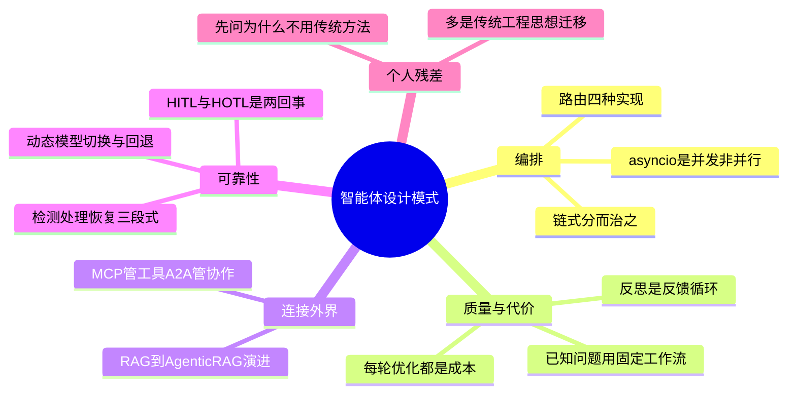

# 《智能体设计模式》(Agentic Design Patterns) 读书笔记与思维导图

**作者**：Antonio Gulli
**核心主旨**：把构建 AI Agent 的经验沉淀为 21 个可复用的设计模式。Agent 不是全新物种，而是比以往任何时候都更需要传统软件工程纪律（容错、模块化、可观测性）的复杂系统。

---

## 1. 工作流编排模式：链、路由、并行

- **提示词链 (Prompt Chaining)**：分而治之。单一多面请求会引发指令忽略、上下文漂移、错误传播、幻觉；拆成序列后每步复杂度下降，且可在模型调用之间插入确定性逻辑（中间数据处理、输出验证、条件分支）。
- **上下文重于模型**：模型输出的质量较少依赖模型架构本身，更多依赖所提供上下文的丰富性。
- **路由 (Routing) 的四种实现**：基于 LLM（生成类别标识）、基于嵌入（语义相似度）、基于规则（if-else/switch，快而确定但不灵活）、基于微调分类模型（路由逻辑编码在学习权重里，不在推理时调用生成模型）。当 Agent 需在多个工作流、工具或子 Agent 间做决策时使用。
- **并行化**：任务依赖外部 I/O 时，顺序执行的总时长是各任务之和。注意 asyncio 提供的是单线程事件循环的并发而非真正并行（受 GIL 限制）。

## 2. 质量与自治模式：反思、规划、多 Agent

- **反思 (Reflection)**：引入反馈循环——产出、检查、识别问题、生成更好版本。可由专门的评审 Agent 承担。有对话记忆时效果显著增强。代价：每轮循环都是新的 LLM 调用，成本、延迟、内存全部上升。**只在质量比速度和成本更重要时使用**。
- **规划 (Planning)**：灵活性与可预测性的权衡。动态规划是特定工具而非通用解——当问题的解决方案已被充分理解且可重复时，预定的固定工作流更有效。
- **多 Agent 协作**：形式包括顺序交接、并行处理、辩论、层次结构。生产者-评审者分组（一组产出、一组按政策/安全/质量批判评估）是常用结构。代价是通信开销与大型非结构化网络中的决策连贯性。

## 3. 记忆与学习

- **三类记忆**：语义记忆（记事实：用户偏好、领域知识，JSON 配置文件或事实文档集合）；情景记忆（记经历：过去成功交互序列，常以少样本示例实现）;程序记忆（记规则：系统提示中的核心指令，Agent 可通过反思修改自身指令）。
- **状态管理纪律**：严禁绕过标准事件机制直接改 session.state——不进事件历史、不被持久化、引发并发问题。
- **学习与适应**：Agent 从"遵循指令"演化为"基于经验调整自身行为"。警惕 reward hacking——LLM 会找到漏洞"破解"奖励模型，为劣质响应拿高分。

## 4. 连接外部世界：工具、MCP、A2A、RAG

- **工具使用**：把语言模型从文本生成器转变为能在数字/物理世界中感知、推理和行动的 Agent。
- **MCP**：传统函数调用是一对一、各厂商专有;MCP 是 LLM 发现、通信和使用外部能力的标准化接口。
- **A2A**：Agent 间协调协议。远程 Agent 是"不透明"系统;Agent 卡片(JSON)声明身份、端点、能力、鉴权。MCP 管 Agent 与工具/数据的交互,A2A 管 Agent 与 Agent 的协作。
- **RAG 的演进线**：基础 RAG(检索缓解幻觉,但受分块质量制约,信息跨块分散时答案不完整)-> 混合检索(BM25 关键字精度 + 语义搜索概念理解)-> GraphRAG(知识图谱做互联推理,构建维护成本高)-> Agentic RAG(推理层主动质疑检索质量:源验证、协调知识冲突、多步综合、识别知识差距并调用外部工具)。深度与可信度换复杂性、延迟和成本。

## 5. 可靠性工程:异常、防护栏、评估

- **异常处理三段式**：检测(校验工具输出、API 错误码、超时、监控 Agent)-> 处理(日志、重试、回退、优雅降级、通知人类)-> 恢复(状态回滚、诊断根因、重新规划)。
- **Guardrails 多层实施**：输入验证/清理、输出过滤、提示词级行为约束、工具使用限制、外部审核 API、人机协同。原则:最小权限、模块化与关注点分离、结构化日志可观测性。
- **HITL 与 HOTL 之别**：human-in-the-loop 是人参与每个决策环(验证者/引导者/合作伙伴);human-on-the-loop 是人定义总体策略,AI 处理即时执行。错误代价重大(医疗/金融/自主系统)或任务含 LLM 无法可靠处理的模糊性时,必须 HITL。
- **评估与监控**：生产环境持续跟踪准确率/延迟/资源消耗、A/B 测试对比 Agent 版本、漂移检测(输入分布变化导致性能退化)、行为异常检测、合规审计。
- **资源感知优化**：动态模型切换(简单查询用轻量模型,复杂问题用强模型)、回退机制保障优雅降级、按 simple/reasoning/internet_search 分类路由、上下文修剪与摘要。

## 6. 推理技术

- **CoT**：把困难的单步问题转化为一系列更简单的步骤,提高透明度。单一正确答案任务温度设 0,答案置于推理之后。
- **ToT**：在 CoT 基础上分支出多条推理路径成树,支持回溯、自我纠正、评估多条轨迹后再定答案。
- **ReAct**：思考-行动-观察循环交错运行,每个观察通知下一次思考,响应实时反馈,适合需要与环境多次交互的任务。
- **推理时计算换质量**：通过多样化束搜索、自一致性等方法生成多个候选答案再择优,常能让较小的模型产出优越结果——代价是同一查询多次运行模型。

## 个人想法与点评

- 通读的核心质疑:很多"模式"是传统算法与工程思想的迁移——提示词链即任务分解,ReAct 即前几章的抽象,异常处理"很工程论"。祛魅之后反而更好用。
- 反复追问"为什么用 Agent 而不是传统方法"(欺诈检测、推荐系统场景):传统方法能解决的,Agent 未必效果更好(如 AST 解析)。
- 规划模式的实战坑:搜索类 Agent 理解不到位时,搜不准或搜出来全是 SEO 污染内容。
- human-on-the-loop 与 human-in-the-loop 是两个不同概念,此前一直混为一谈——本书对我最直接的认知修正。
- 资源感知优化(动态模型切换、回退)正是各大模型厂商在生产中用的手段,是全书最"落地"的一章。

## 个人补充

本书为导入书籍,无社区热门划线数据,以下补充全部来自个人残差:

- 个人划线密集在**权衡与代价**处(反思的成本、RAG 各方案的复杂性、多 Agent 通信开销),而非模式定义本身——用哪个模式不重要,知道它的代价才重要。
- 附录 G 的编码 Agent 框架(人类主导编排、上下文核心地位、直接访问前沿模型)与我日常用 Claude Code 的体感一致,可作为团队引入编码 Agent 的检查清单。
- 提示工程"自己想清楚再让模型动手"的悖论:想清楚之后剩下的就是事务性工作,而事务性工作正是值得交给 Agent 的部分。

---

## 思维导图 (Mind Map)

*导图画的是"我标记过的书":叶子节点来自个人划线与想法的要点,非全书大纲。*

---

## 社区精华:热门划线 (Popular Highlights)

本书为微信读书导入书籍,平台无热门划线数据。共识基线缺失,本笔记以个人划线与想法为唯一来源。
