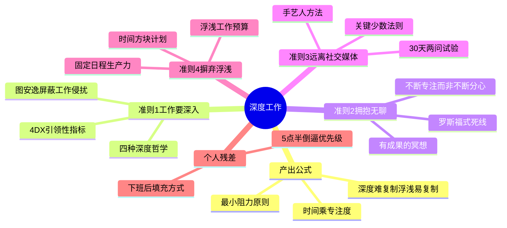

# 《深度工作》(Deep Work) 读书笔记与思维导图

**作者**：卡尔·纽波特 (Cal Newport)；译者：宋伟
**核心主旨**：知识工作者 60% 以上时间花在浮浅事务上,而真正的价值产出取决于无干扰状态下的深度专注。高质量产出 = 时间 x 专注度;深度工作不是过时技能,而是在技术垄断时代保持竞争力的系统能力。

---

## 1. 深度 vs 浮浅: 产出公式

- **深度工作 (Deep Work)**：在无干扰状态下专注进行职业活动,使认知能力达到极限。创造新价值、提升技能,且难以复制。
- **浮浅工作 (Shallow Work)**：对认知要求不高的事务性任务,常在受干扰下开展。不创造太多新价值,且容易复制。
- **产出公式**：高质量工作产出 = 时间 x 专注度。达到精英级产出,需要长时间、无干扰地高度专注于单一任务。
- **最小阻力原则**：当行为对底线的影响缺乏明确反馈时,人们倾向选择当下最简单易行的行为——这免去了短期专注与规划的焦虑,却牺牲长期满足感和真实价值。
- **忙碌不等于生产力**：知识工作不是生产线;从信息中提取价值的行为往往并不忙碌,表面忙碌常是浮浅工作的本能。

## 2. 深度工作的稀缺价值

- **新经济赢家画像**：能利用智能机器把工作做得漂亮且有创造性的人;在所处行业中最优秀的人;拥有资本的人。
- **两项核心能力**：迅速掌握复杂工具的能力;在工作质量和速度上都达到精英层次的能力——两者都要求深度工作。
- **数字网络的双刃剑**：若能创造有用之物,受众可能是无限的,奖励随之放大;若不培养深度学习能力,很可能随技术更新被淘汰。
- **对生意是坏事,对个人是好事**：深度工作难、浮浅工作易;无明确目标时,浮浅忙碌成为本能;文化默认"与网络相关的行为都是好的"。

## 3. 准则 1: 工作要深入

- **核心机制**：越过良好意图,在工作生活中加入特别设计的惯例和固定程序,使进入并保持高度专注消耗的意志力最小化。
- **选定深度哲学**（四选一,按职业匹配）：
  - **禁欲主义**：最大限度排除浮浅,几乎全天深度(如作家、思想家)。
  - **双峰**：在较长周期(周/月)内划分深度时段与开放时段(如学者、CEO)。
  - **节奏**：将深度工作转化为简单常规习惯,如"链条法"(日历上每天打红 X)。
  - **记者**：在日程中随时插入深度工作,适合日程不可预测者。
- **习惯化四问**：在何处工作、工作多久、工作开始后如何继续、如何支持工作。创造性工作者应忽略灵感,依赖惯例。
- **要有大手笔**：对惯常环境做巨大改变,辅以可观精力或金钱投入,只为支持一项深度任务——提升外现重要性,降低拖延本能。
- **不要独自工作**：纷扰心神仍是深度大敌;但在适合时充分使用白板效应与协作碰撞。
- **像经商一样执行**（4DX 四原则）：
  - 聚焦极端重要之事;
  - 抓引领性指标(衡量实现滞后性指标的新行为,如"深度工作时长");
  - 准备醒目计分板;
  - 定期问责。
- **图安逸**：工作日结束后屏蔽一切职业相关侵扰(含邮件和与工作相关的网站),否则短暂侵扰会形成自我强化的干扰流。定期休息大脑提升深度工作质量;安逸时光有助于提升洞察力。

## 4. 准则 2: 拥抱无聊

- **训练双目标**：高强度提高集中注意力能力 + 克服分心欲望。若不同步减少对分心事物的依赖,增强专注的努力可能白费。
- **不要不断分心,而要不断专注**：工作日之外也按计划使用网络;减损专注力的不是网络工具本身,而是稍有无聊就从低刺激高价值活动转向高刺激低价值活动——大脑逐渐无法容忍缺乏新奇。
- **像罗斯福一样工作**：设定几乎不可能的时间期限,用全力赶在最后期限前完成——抵抗冲动实践越多,抵抗力越强。
- **有成果的冥想**：在身体劳作而心智空闲时(走路、慢跑、淋浴),将注意力集中到定义明确的专业难题上;注意力涣散时温柔拉回,不断重新聚焦。
- **记住一副牌**：注意力控制是可训练技能;人擅长记住场景而非抽象信息。

## 5. 准则 3: 远离社交媒体

- **手艺人方法**：明确职业和私人生活中决定成功与幸福的核心因素;只有工具的实际益处大于实际害处时才选择。
- **警惕"任何益处法"**：一旦发现使用工具有任何可能益处,或担心错过什么,就不加限制地使用——可能在不知不觉中失掉在知识工作世界取得成功的能力。
- **关键少数法则**：明确 2-3 个高层次目标,列出每个目标需要的 2-3 个重要活动;逐一审查每个网络工具对这些活动的影响(实质积极/消极/无影响),只有积极影响大于消极影响才保留。
- **30 天试验**：戒掉服务后问两问——(1) 过去 30 天用了会过得更好吗? (2) 人们是否关心我有没有在用?
- **不要用网络来消遣**：给大脑找高质量替代活动(有序阅读、锻炼、面对面交往),主动思考如何度过"一天中的一天",而非在迷糊状态下漫无目的浏览。

## 6. 准则 4: 摒弃浮浅

- **浮浅的代价**：害处常被低估,作用常被高估。浮浅工作不可避免,但必须限制,使其不影响充分深度工作的能力——深度工作决定最终工作成效。
- **定量分析深度**：评估每项活动的认知要求,区分深度与浮浅;向老板申请浮浅工作预算,对非紧要任务设严格上限。
- **时间方块计划**：一天的每一分钟做好计划;预留方格处理意外事件;目标不是死守计划,而是在时间推进中掌握工作主动权。
- **固定日程生产力**：5 点半前结束工作——时间有限迫使更谨慎地思考组织习惯,产出价值反而高于长时间混乱日程;固定日程在做选择时有所侧重。

## 7. 深度工作的意义

- **神经学**：全神贯注占据感官,避开生活中难以回避的细小不快;大脑依据关注的事物构建世界观——"你的为人、思考、感受和所做之事,恰是你所关注事物的概括"。
- **心理学**：深度工作带来心流与深度满足感;工作比休闲更容易带来享受,因其有内在目标、反馈规则和挑战。
- **哲学/匠人精神**："我等采石之人当心怀大教堂之愿景";培养手艺需要完成深度任务;任何对高水平技能的追求都可带来神圣感。

## 个人想法与点评

- 拨款受挫后的转向:不再抱怨或自我怀疑,而是增加文章数量和质量——用产出证明能力,这是深度工作思维在现实中的第一次落地。
- 固定日程(5 点半下班)不是偷懒,而是倒逼优先级排序;有限时间反而提升单位产出。
- 对互联网顶礼膜拜的警惕:我们不再权衡新科技利弊,自以为是认定高科技就是好的——深度工作创建的品质、匠心和通达,恰是技术垄断时代最稀缺的价值。

## 个人补充

热门划线是共识基线,以下是个人在共识之外补上的内容:

- 社区共识集中在**定义与公式**(深度/浮浅、产出公式、最小阻力);个人划线密集在**四准则的操作细节**:四种深度哲学选型、4DX 引领性指标、时间方块计划、30 天网络试验——知道"要深度"不够,选对哲学和日程工具才落地。
- 个人残差指向**固定日程作为系统杠杆**:5 点半前结束工作不是生活与工作平衡的口号,而是迫使浮浅工作预算化和深度时间块化的硬约束。
- "不要用网络来消遣"是对准则 2 和 3 的衔接:训练专注不仅是工作时段的事,下班后的大脑填充方式决定第二天能否进入深度状态。

---

## 思维导图 (Mind Map)

*导图画的是"我标记过的书":叶子节点来自个人划线要点与热门划线,非全书大纲。*

---

## 社区精华: 热门划线 (Popular Highlights)

- "深度工作(Deep Work):在无干扰的状态下专注进行职业活动,使个人的认知能力达到极限。这种努力能够创造新价值,提升技能,而且难以复制。" -- 8424人划线
- "浮浅工作(Shallow Work):对认知要求不高的事务性任务,往往在受到干扰的情况下开展。此类工作通常不会为世界创造太多新价值,且容易复制。" -- 6912人划线
- "高质量工作产出=时间×专注度" -- 4960人划线
- "最小阻力原则(The Principle of Least Resistance):在工作环境下,若各种行为对于底线的影响没有得到明确的反馈意见,我们倾向于采用当下最简单易行的行为。" -- 3621人划线
- "如果你不产出,就不会成功,不管你的技艺多么纯熟,天资多么聪颖。" -- 3570人划线
- "培养深度工作的习惯,关键在于越过良好的意图,在工作生活中加入一些特别设计的惯例和固定程序,使得进入并保持高度专注状态消耗的意志力最小化。" -- 3500人划线
- "想要成功,你就必须产出自己能力范围内最好的产品,而这项任务需要深度。" -- 2718人划线
- "在这种新经济形势下,有三种人将获得特别的优势:可以利用智能机器把工作做得漂亮并具有创造性的,在所处行业中最优秀的,还有那些拥有资本的。" -- 2295人划线
- "工具选择的手艺人方法:明确在你的职业和个人生活中决定成功与幸福的核心因素。只有一种工具对这些因素的实际益处大于实际害处时才选择这种工具。" -- 2240人划线
- "你不需要一种稀缺的工作,你需要的是用世间少有的方式完成工作。" -- 2041人划线
- "从神经学角度来看,靠浮浅事务度过的一天很可能会是枯燥、令人沮丧的一天,即使抓住你注意力的浮浅事务看似无害甚至有趣。" -- 1926人划线
- "有成果的冥想的目标是:在身体劳作而心智空闲的时候(比如走路、慢跑、开车、淋浴),将注意力集中到一件定义明确的专业难题上。" -- 1920人划线
- "对周围惯常环境做出巨大改变,辅以可观的精力或金钱投入,都只为支持一项深度工作任务,由此你也提升了这项任务的外现重要性。" -- 1911人划线
- "有一点需要提醒的是,一定要给自己设定一个几乎不可能的时间期限。你应该总是可以赶在最后期限前完成任务(至少是接近),但是这期间需要你用上吃奶的力气。" -- 1696人划线
- "(1)你的注意力全情投入到某个你希望提升的技能或想要掌握的理念上;(2)你能得到反馈意见,这样你就可以调整自己的方法,保持注意力的投入有最佳产出。" -- 1665人划线
- "选择网络工具的'任何益处法':一旦发现使用一款网络工具有任何可能的益处,或者是不使用就可能错过某些事,你就觉得有足够理由使用这款网络工具。" -- 1610人划线
- "你的为人、你的思考、你的感受和所做之事,以及你的喜好,恰是你所关注事物的概括。" -- 1484人划线
- "节奏日程安排者通过雷打不动的惯例支持深度工作,确保能够定期完成一定的工作,在一年的时间里往往能够累积更多的深度工作时长。" -- 1458人划线
- "深度的生活才是优质生活。" -- 1430人划线
- "如果你无法学习,就无法成功。" -- 1430人划线
