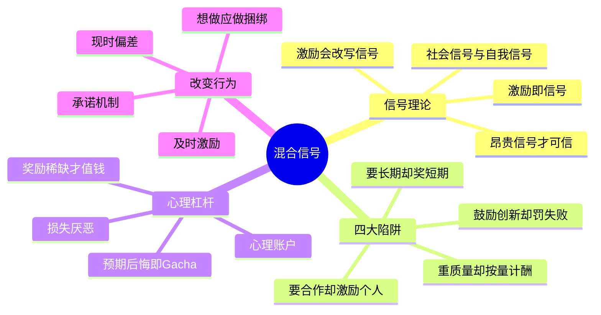

# 《混合信号》(Mixed Signals) 读书笔记与思维导图

**作者**：尤里·格尼茨 (Uri Gneezy)，行为经济学家；译者：江生、于华
**核心主旨**：激励会传递信号，而你的所言和激励信号之间经常存在冲突——鼓励团队合作却激励个人成功、鼓励长期目标却奖励短期成果、鼓励创新冒险却惩罚失败、强调质量却按数量计酬。激励设计的终极目标是消除混合信号，在期望的方向上强化自我信号和社会信号。

---

## 1. 信号理论：激励为什么会说话

- **激励即信号**：激励是激发人们做原本不会做的事情的工具，但它同时在传递信号。人类的生活是由他人设计的激励机制塑造的。
- **可靠信号**：能让代理人将价值观、能力或偏好可靠展现出来的信息。斯宾塞模型：昂贵的信号（如教育投资）之所以可信，是因为实现难度大、耗费时间。
- **社会信号与自我信号**：社会信号是在意自己在他人眼中的形象；自我信号是在意从自身行为中做出的自我推断（保持友善、聪慧、公平的自我形象）。普锐斯案例：车主既自我感觉良好，又向他人传递环保信号。
- **激励会改写信号**：给回收易拉罐付钱，环保主义者就变成了贪小便宜的邻居——激励改变了行为传递的社会信号和自我信号。

## 2. 四大混合信号陷阱

- **强调质量，却按数量计酬**：激励某个维度的产出，会对其他维度产生意外影响。解法：为数量设激励时必须配质量检查机制——既让次品代价高昂，又传递管理层在乎质量的信号。
- **鼓励创新，却惩罚失败**：从不犯错的人也从不尝试新事物。惩罚失败会阻止冒险、扼杀新想法。解法：不应惩罚失败，而应惩罚不作为（萨顿）；及时终止失败也应获得奖励。
- **鼓励长期目标，却奖励短期成果**：高管股权若基于短期业绩，创造长期价值的项目就会被推迟或舍弃。解法：延长股权固定期等结构性设计。
- **鼓励团队合作，却激励个人成功**：团队激励会因"搭便车"适得其反，个人激励则催生内部竞争。没有标准答案，但团队内部的激励结构必须与目标一致。

## 3. 激励设计的心理杠杆

- **心理账户**：加油卡"感觉"比购车折扣更有分量。把激励锁定在满足需求的特定心理账户上，比总价打折更有效；要积极塑造达成激励目标的故事，别让消费者自己编出你不想要的故事。
- **损失厌恶**：损失框架的激励效果优于收益框架（先发奖金、不达标收回）。
- **预期后悔**：人们会为避免将来后悔而行动，增加后悔因素可以重塑故事、放大影响（彩票式激励）。
- **亲社会激励**：回报甚微时亲社会激励更有效（人们在乎行为本身），回报较大时自利激励更有效；微薄的奖励反而抑制动机。
- **奖励的稀缺性**：奖励越少，其社会信号和自我信号的价值就越大；频繁颁发同一奖励会降低关注度。
- **付费者与受益者分离**：了解谁为产品付费、谁享受奖励——他们可能不是同一个人（机票忠诚计划）。

## 4. 用激励改变行为与习惯

- **现时偏差**：改变的根本难题是成本发生在当下、收益在遥远未来。人们倾向于接受现在较小的回报。解法：及时激励，不要间隔太久；消除障碍降低当前行动成本。
- **过度自信**：人们对远期自制力过度自信（健身房年卡悖论）。
- **激励只能助推初始行动**：激励干预促成的习惯只在有限时间内有效；长期改变要靠承诺机制（利用损失厌恶和自我信号——违背承诺传递意志薄弱的消极自我信号）与社会支持。
- **捆绑策略**：把"想做"之事（追剧）与"应做"之事（健身）捆绑。
- **谈判中的信号**：首次报价的四个行为原则——锚定与调整不足、对比效应、价格传递质量信号、互惠原则。要传递出你期望值很高的信号。

## 个人想法与点评

- 预期后悔机制的犀利联想：这不就是 Gacha（抽卡）吗——游戏行业早已把行为经济学用到极致。
- 损失框架优于收益框架的现实映射：期权牛马现状——用"可能失去"绑住员工。
- 对书中 NBA 案例的批评：球员带伤上场的分析太浅，缺乏深度。
- 对"增加激励维度控制质量损失"的质疑：会不会变成"既要又要"——多维激励在实践中可能变成全方位压榨。

## 个人补充

- 社区共识集中在引言的信号概念与经典案例（普锐斯、易拉罐）；个人划线系统性覆盖了全书的操作框架：四大陷阱的解法、心理账户/后悔/亲社会等具体杠杆、习惯养成与谈判应用。共识记住了"激励会说话"，个人笔记记下了"怎么让它说对话"。
- 个人视角的独特贡献是从被激励者（员工/玩家）立场反向审视：期权的损失框架、Gacha 的后悔设计、"既要又要"的多维考核——设计者眼中的杠杆，正是被设计者身上的枷锁。这与《大厂人才》的祛魅视角形成互补。

## 思维导图

## 社区精华：热门划线 (Popular Highlights)

- 它描述了完全相同的事实，但讲述了截然不同的故事。（54 人划线）
- 人类总在构建激励机制，我们的生活是由他人设计的激励机制塑造的。（51 人划线）
- 矛盾信号可以理解为，你说的是一套，但在激励面前做的却是另一套。（40 人划线）
- 信号是向他人展现价值观、能力和偏好的可靠方式。（40 人划线）
- 激励是一种工具，用来激发人们做那些原本不会去做的事情。（39 人划线）
- 激励改变了回收易拉罐传递的社会信号与自我信号。（36 人划线）
- 激励设计的终极目标是让传递的信号发挥效力，同时在期望的方向上强化自我信号和社会信号。（30 人划线）
- 如果想鼓励创新和冒险，就不要通过惩罚失败来传递混合信号——要给予奖励！（28 人划线）
- 鼓励团队合作，却激励个人成功；鼓励长期目标，却奖励短期成果；鼓励创新和冒险，却惩罚失败；强调质量的重要性，却按数量计酬。（28 人划线）
