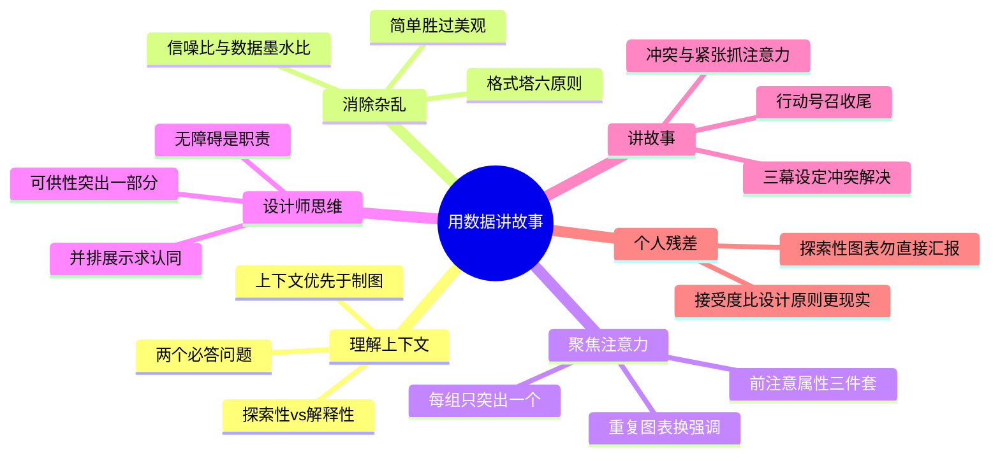

# 《用数据讲故事》(Storytelling with Data) 读书笔记与思维导图

**作者**：[美] 科尔·努斯鲍默·纳福利克
**译者**：陆昊、吴梦颖
**评分**：77.1/100（63 条个人划线）
**核心主旨**：数据分析的终点不是图表，而是让受众理解事实并据此行动。展示是整个流程中受众唯一能接触到的环节——要有数据、理解数据、干净地可视化，并围绕呈现讲述一个好故事。

---

## 1. 理解上下文：受众、大想法与沟通目标

- **两个必答问题**：谁是你的受众？你需要他们了解什么或者做什么？简洁回答这两个问题，是一切可视化的起点。
- **细分受众**：识别决策者；你对受众了解得越多，就越能准确理解如何与之产生共鸣，如何在沟通中满足双方的需求。
- **关系与视角**：思考你与受众的关系以及你期望他们如何看待你，有助于校准语气与叙事角度。
- **探索性 vs 解释性分析**：探索性分析用于自己找规律；解释性分析面向受众，应讲述一个特定的故事，而非展示全部发现。
- **上下文优先**：在开始数据可视化或沟通之前，应在理解上下文上多花些时间和精力——社区共识与个人划线均指向此处。
- **大想法与三分钟故事**：用一句话概括核心信息（大想法），再用三分钟内能讲完的版本检验是否足够聚焦。
- **工具不等于专业能力**：掌握 Excel/Tableau 的操作，不等于掌握了用数据沟通的专业能力——数据背后存在故事，工具不会理解，需要分析师或信息沟通者用可视化和情境化使故事生动。

## 2. 选择恰当的可视化形式

- **简单文字**：当只有一两项数据需要分享时，直接使用数据本身，不必强行制图。
- **表格**：让设计融入背景，让数据占据核心地位。窄边框或空白区分元素；灰色边框融入背景，或干脆去掉边框。厚重边框和阴影与数据争夺注意力。
- **线图**：展示随时间连续变化的趋势。
- **条形图**：比较类别间的数值，水平条形图便于阅读长标签。
- **瀑布图**：抽离堆叠条形图中的一部分进行重点关注，或展示起点、结果及中间的上升下降变化。
- **散点图**：展示两个变量之间的关系与分布。
- **饼图陷阱**：扇区难以精确比较，类别超过两三个时尤其如此——优先条形图。
- **核心原则**：我们要的不是数据，而是数据告诉我们的事实；我们不仅仅要知道数据，更重要的是要利用数据做出决策。

## 3. 消除杂乱：格式塔、信噪比与数据墨水比

- **认知负荷**：消耗受众脑力却对他们理解信息毫无帮助的设计，必须避免。目标是最大化信噪比与数据墨水比。
- **两个信条**：不要成为数据流行的受害者（丢弃花哨剪贴画、图表和字体，专注信息本身）；简单胜过美观（重点在于清楚地讲述故事，而非绘制美观图表）。
- **格式塔原则**：临近、相似、包围、闭合、连续、连接——大脑按这些规则自动组织视觉元素，设计应顺应而非对抗。
- **视觉无序的治理**：对齐元素布局；留白给信息呼吸空间；元素的布局和格式应一致、有意图。
- **对比的误用**：事物的差异越多，则没有任何一种差异足够突出——克制强调，一次只突出一个要点。
- **删减哲学**：一个完美的设计，不是因为它没有多余的东西可以添加，而是因为没有多余的部分可以删减。手边有全世界的信息并不会使沟通变简单，反而更难——处理的信息越多，越难过滤出最重要的部分。

## 4. 聚焦注意力：前注意属性与视觉层次

- **前注意属性**：大小、颜色和页面位置——在意识介入之前就能捕获视线的特征。
- **策略性使用**：策略地使用前注意属性，能够让受众不知不觉地看到期望展现的内容；视线会被每组中唯一一个与众不同的元素所吸引。
- **解释性分析的用法**：对于解释性分析，向受众讲述特定故事，利用前注意属性让故事更清晰。重复使用相同图表、用不同部分强调不同问题，是有效策略。
- **大小**：不要让设计选择成为偶然事件，它应该是明确决策的结果。
- **颜色**：少量使用、保持一致、考虑色盲、深思熟虑色调、是否使用品牌色。
- **页面位置**：元素摆放应让受众感到自然；利用位置建立阅读顺序。
- **记忆机制**：形象记忆非常迅速——视觉设计直接影响受众能记住什么。呈现在 PPT 上的信息越少，被听众记住的信息反而越多。

## 5. 像设计师一样思考

- **形式服从功能**：每个设计选择都应服务于沟通目标，而非装饰。
- **可供性 (Affordance)**：视觉特点暗示如何使用或与元素交互。关键：只应突出整体图表中的一部分；不是所有数据都同样重要；当不需要细节时请总结。在视觉上将某些元素前置、另一些融入背景，向受众提示处理信息的一般顺序。
- **三层职责**：突出重要内容、消除干扰、建立视觉层次——使数据可视化更易理解。
- **无障碍 (Accessibility)**：你可能是一名工程师，但不能要求别人有工程师学位才能理解你的图表。让图表无障碍是设计师的职责。
- **美观三要素**：明智地使用颜色、注意对齐、利用留白。
- **接受度**：与有影响力的受众合作；提供多种选择并寻求反馈；并排展示新旧方案；阐述新方法益处；花费更多精力让新方式获得认同。

## 6. 讲故事：叙事结构与行动号召

- **故事的说服力**：好的故事会吸引注意、带你经历旅程、唤起情感共鸣。故事将想法和情绪结合，唤起受众的注意力和精力——我们可以用故事以超越事实的方式让受众从情感上参与。
- **三幕结构**：设定（背景与现状）-> 冲突（问题与张力）-> 解决（发现与建议）。冲突和紧张是吸引并保持受众注意力的关键。
- **叙述结构选择**：先回答"受众是谁、需要什么、期望什么行动"，再决定何种叙述流最适用。
- **以行动号召开场或收尾**：让受众完全清楚地了解，你希望他们如何利用新知。以呼吁行动开始，可使受众立刻清楚该扮演什么角色、用什么视角听接下来的内容。
- **现场演讲的陷阱**：幻灯片内容过于密集或耗费精力时，受众注意力会集中在阅读上，而非聆听演讲。
- **重复的力量**：信息重复或使用得越多，到达长期记忆并保留下来的可能性就越大。水平/垂直逻辑、反向故事板、寻求新视角等策略可确保故事清晰。
- **故事板工具**：用便利贴做故事板，可简单重排（同时增删）来探索不同叙述流程。
- **迭代而非线性**：现实中很少按线性路线一次到位，需要迭代地将早期想法转化为最终解决方案。

## 个人想法与点评

- 本书对个人最有价值的区分是**探索性 vs 解释性分析**——日常工作中常把探索过程的图表直接拿去汇报，受众自然看不懂。
- **前注意属性**是全书最可操作的章节：大小、颜色、位置三件套，配合"每组只突出一个差异"就能立刻改善大多数烂图表。
- **可供性**概念把"突出一部分、其余融入背景"从审美问题变成了沟通策略——与"对比误用"形成互补：知道该强调什么，也知道该删什么。
- 讲故事章节提醒：**冲突和紧张**才是注意力引擎，纯数据罗列不是叙事。这与商业汇报中"先给结论"的习惯并不矛盾——结论就是行动号召，冲突就是现状与目标的差距。
- 推荐序的两条信条（不要成为数据流行受害者、简单胜过美观）应贴在每块显示器旁——比任何图表规范都管用。

## 个人补充

个人划线密集在**视觉设计实操**（格式塔、前注意属性、可供性）与**叙事收尾**（三幕结构、行动号召、重复），而非图表类型选择本身。以下补充来自个人残差：

- 划线时间跨度 2021-09-05 至 2021-09-08，说明阅读是集中完成的——核心收获集中在"怎么做"而非"为什么"，适合作为工具书反复查阅。
- 第 5 章"接受度"（并排展示、寻求反馈）在个人划线中出现但社区热门划线未覆盖——在组织内推新图表风格时，这条比任何设计原则都现实。
- 第 10 章团队培养（故事书友、自己动手研讨会）划线了但未展开——若要在团队落地，可结合"接受度"策略先找有影响力的早期采纳者。
- 与《硅谷增长黑客实战笔记》的互补：增长书管"用什么指标、做什么实验"，本书管"怎么把实验结果讲清楚让人行动"——数据叙事是增长闭环的最后一步。

---

## 思维导图 (Mind Map)

*导图画的是"我标记过的书"：叶子节点来自个人划线与想法的要点，非全书大纲。*

---

## 社区精华：热门划线 (Popular Highlights)

- 这个世界上的一个大误会就在于，太多人把掌握一个工具软件的操作等同于掌握某个领域需要的专业能力。（714 人划线）
- 我们要的不是数据，而是数据告诉我们的事实。（348 人划线）
- 使用表格时需要记住的一点是，让设计融入背景，让数据占据核心地位。不要让厚重的边框和阴影与数据争夺受众的注意力。相反，要使用窄边框或者空白来区分表格的元素。（306 人划线）
- 你应该能简洁地回答以下两个问题：谁是你的受众？你需要他们了解什么或者做什么？（304 人划线）
- 数据的背后存在一个故事，但工具是不会理解的。这就是为什么需要你——分析师或者信息沟通者——用可视化和情境化的方式使故事生动有趣。（288 人划线）
- 要有数据，要理解数据，要可视化呈现数据，而且要干净地呈现，还要围绕你的呈现讲述一个好故事。（240 人划线）
- 细分受众的方法之一便是识别决策者。你对受众了解得越多，就越能准确理解如何与之产生共鸣，如何在沟通中满足双方的需求。（225 人划线）
- 她提出的两个信条——"不要成为数据流行的受害者"（即丢弃花哨的剪贴画、图表和字体，专注于信息本身）和"简单胜过美观"（即重点在于清楚地讲述一个故事，而不是绘制美观的图表），是非常有用的指导原则。（221 人划线）
- 手边有全世界的信息并不会使沟通变得简单，反而会使沟通更难。你处理的信息越多，就越难过滤出最重要的部分。（210 人划线）
- 边框应该用来提升表格的易读性。用灰色让边框融入背景，或者干脆去掉边框。应该突出的是数据，而非边框。（195 人划线）
- 不要让设计选择成为偶然事件，它应该是明确决策的结果。（187 人划线）
- 我们不仅仅要知道数据，更重要的是要利用数据做出决策。（165 人划线）
- 呈现在 PPT 上的信息越少，被听众记住的信息反而越多。（144 人划线）
- 瀑布图可用于抽离出堆叠条形图中的一部分进行重点关注，或者展示起点和结果以及其中的上升下降等变化。（144 人划线）
- 其实在开始着手数据可视化或者沟通之前，应该在理解上下文上多花些时间和精力。（143 人划线）
- 一个完美的设计，不是因为它没有多余的东西可以添加，而是因为没有多余的部分可以删减。（136 人划线）
- 我喜欢用便利贴做故事板，因为可以简单地重排（同时增删）这些便利贴来探索不同的叙述流程。（132 人划线）
- 当只有一两项数据需要分享时，直接使用数据本身。（130 人划线）
- 我们能清晰地认识到数据可视化——把信息作为艺术品展现给人们——是一个值得我们另行审视且非常有深度和广度的话题。（126 人划线）
- 思考你与受众的关系以及你期望他们如何看待你是非常有帮助的。（126 人划线）
