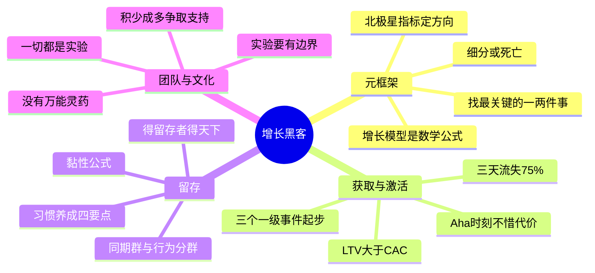

# 《硅谷增长黑客实战笔记》(Growth Hacking) 读书笔记与思维导图

**作者**：曲卉，曾在"增长黑客之父"肖恩·埃利斯麾下担任增长负责人
**核心主旨**：真正可持续的增长以用户留存为基础，覆盖用户全生命周期。增长成功的秘诀不在于同时做很多事，而在于用北极星指标、增长模型和实验流程，找到当前影响增长率的最关键的一两件事。

---

## 1. 增长的元框架：北极星指标与增长模型

- **北极星指标不只是指标**：它代表管理层对"用户价值与公司成功之间关系"的理解，指导每个基层员工的日常决策。走正和跑偏之间，也许只有一个北极星指标的区别。
- **增长模型三步**：输出变量（北极星指标）+ 输入变量（影响它的主要变量）+ 方程（变量间的关系）。精髓是把生意提炼成一个数学公式，用全面、简单、结构化的方式思考增长。
- **绘制用户旅程**：记录用户从一无所知到体验产品核心价值的步骤，这是增长模型的骨架。
- **细分或死亡**：All data in aggregate is "crap". Segment or die。聚合数据没有行动价值，必须分渠道、分新老、分行为看。
- **先导指标**：可以让你提前看到问题、尽早行动。
- **杠杆优先**：找到所有领域里"杠杆效应"最明显的地方，针对它做实验改进。找到"做什么"和"怎么做"，比"做"本身重要得多。

## 2. 获取与激活

- **永恒公式 LTV > CAC**：获客成本是公司竞争的胜负手；计算 LTV 时参照 SaaS 模型把所有收入来源考虑进去。
- **渠道筛选**：先认识产品特点（是否有网络效应等），列出备选渠道，短期用激活比例、付费比例模拟长期价值来筛选。
- **激活是关键转化点**：绝大多数应用三天内流失超过 75% 的用户；新用户注意力窗口期很短。激活有放大效应——激活率的提升会传导到后续所有环节。
- **Aha 时刻**：定义一个关键行为，"不惜一切代价"让新用户迅速到达 Aha 时刻。
- **激活是系统工程**：让用户在认识、体验、行动、情感四个方面完成一次升级，从"陌生人"变成"使用者"。
- **追踪计划从三个一级事件开始**：不要贪多，三个最重要的里程碑事件即可。

## 3. 留存：得留存者得天下

- **留存的三重收益**：付费周期变长（LTV 升高）、有预算测试更贵的渠道、忠实老用户推荐新用户。
- **回归关键行为**：衡量留存仍从关键行为开始，用同期群分析（Cohort Analysis）读留存曲线：起始群大小看增长速度、关键行为比例看参与度、不同期曲线看留存改善。
- **行为分群**：不同的人用不同方法使用产品、得到不同价值——按行为细分留存曲线才能找到增长玄机。
- **1、9、90 规则**：消极用户、核心用户、超级用户的参与度分层。
- **黏性公式**：有黏性的产品 = 用户用得越多积累的好处越多 + 用户用得越多离开后损失越大。
- **习惯养成四要点**：不固定奖励、让用户投入努力（增加储藏价值）、外在触发与内在触发结合、打造参与闭环（一个行为带来更多行为）。
- **留存八种武器**：产品改进、新用户引导、邮件、通知、客服、促销、忠诚计划、新产品。产品改进是最有力的手段。

## 4. 增长团队与实验文化

- **增长经理的职责**：搭建数据基础设施、定义增长目标、提供用户洞察、排序增长项目、设计并上线实验。
- **增长与产品的分工**：产品团队增加产品价值，增长团队帮更多用户最大限度体验现有价值、去除体验价值的障碍。
- **实验文化**：任何事情都是一个实验——或者实现增长，或者学到经验。摒除个人自尊心和一言堂决策，靠数据指导；组织要能接受适当的风险和失败。
- **没有万能灵药**：即使是增长黑客之父，也只会问"你的假设是什么？如果合理，那咱们就试试看。"
- **流程与文化是根基**：增长团队做大做强靠"流程"和"文化"，不靠单点技巧。每周增长会前 15 分钟看指标变化与异常。
- **实验要有边界**：追求增长 KPI 的同时给实验设定边界，避免过分追求指标伤害用户体验和品牌。
- **争取支持**：把小的结果积少成多呈现，有意识地宣传结果、协调团队、争取资源。

## 个人想法与点评

- 整书书评：作者的想法很接地气，一看就是一线思考过的，不像其他公司说套话空话。
- 对指标驱动的辩证提醒：过度依赖指标也是不对的。
- 对"关键行为"定义的追问：用户回来不就是激活了吗？（对 Zynga 案例的分析深度存疑）
- 前瞻联想：增长方法论工具化，是不是 GaaS（Growth as a Service）的雏形？

## 个人补充

- 社区共识集中在金句化的框架（北极星指标、黏性公式、增长模型）；个人划线更系统地覆盖了执行层细节：增长仪表盘的四层结构、移动推送的七条注意事项、增长团队的配置与工具箱、从零组建团队的顺序（先验证留存率确认 PMF，再做新用户引导/ASO/用户推荐）。
- 个人视角的独特点是对方法论的边界保持警觉：指标不可过度依赖、实验要设边界——增长是手段，用户价值是根基。

## 思维导图

## 社区精华：热门划线 (Popular Highlights)

- 增长成功的秘诀不在于同时做很多事，而在于找到目前影响增长率的最关键的那一两件事。（1275 人划线）
- 数据指标从来都不只是指标，它代表了管理层对用户价值和公司成功关系之间的理解。走正和跑偏之间，也许只有一个北极星指标的区别。（504 人划线）
- 有黏性的产品 = 用户用得越多积累的好处越多 + 用户用得越多离开后损失越大。（432 人划线）
- 增长经理在公司里负责：搭建数据基础设施，定义增长目标，提供用户洞察，排序增长项目，设计并上线实验。（432 人划线）
- 所谓绘制用户旅程，就是要记录一个用户从对产品一无所知到体验到产品核心价值要经历的步骤。（294 人划线）
- 增长模型的精髓是将生意提炼和总结成一个数学公式。（286 人划线）
- 任何事情都是一个实验，通过它，你或者实现增长，或者学到经验。（220 人划线）
- 即使是增长黑客之父，也没有做增长的万能灵药。他总是问："你的假设是什么？如果合理，那咱们就试试看。"（198 人划线）
- 没有设置好基本的监测数据看板就上线产品，无异于"盲飞"。（187 人划线）
