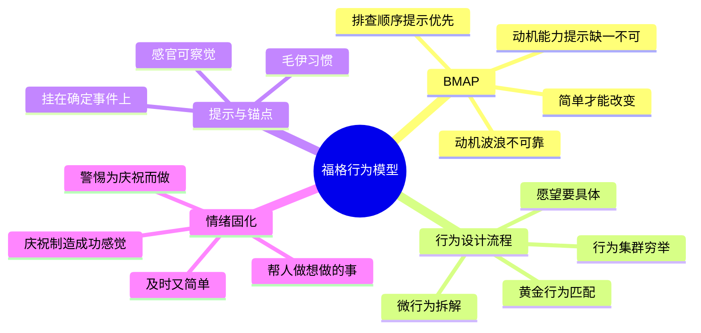

# 《福格行为模型》(Tiny Habits) 读书笔记与思维导图

**作者**：B.J. 福格 (B.J. Fogg)，斯坦福行为设计实验室创始人；译者：徐毅
**核心主旨**：行为 = 动机 x 能力 x 提示 (B=MAP)，三要素同时出现行为才会发生。大多数人以为要先解决动机问题，实际上动机是最后一步——先找好提示、把行为变简单。简单才能改变行为，用庆祝制造成功感觉让微习惯扎根。

---

## 1. B=MAP 模型

- **三要素**：动机（做出行为的欲望）、能力（执行能力）、提示（提醒你行动的信号）。三者同时出现，行为就会发生。
- **排查顺序是反直觉的**：解决行为问题的 3 个步骤——先检查有没有提示，再检查有没有能力，最后才检查动机。大多数人以为要先解决动机，实际上它是最后一步。
- **动机波浪**：动机短期激增后必然急转直下，这是动机的运作方式，不怪你没坚持。把时间精力用在激励自己追逐不明确的概念上是错误的举动。
- **简单才能改变行为**：人类天性无法长期坚持做痛苦的事，但从容易做的事开始，就能做到几乎任何想做的事。

## 2. 行为设计流程

- **明确愿望**：描述你想做的事情，越具体越好——只有知道自己想去哪里，才可能真正到达。
- **列出行为集群**：为愿望找到尽可能多的行为选项。
- **找到黄金行为**：与自己相匹配的具体行为——既有效（能实现愿望）、你又想做、且容易做到。
- **容易做分析**：从能力范围内找行为；写具体（"终止午餐时买汽水"而非"终止喝汽水"）。
- **微习惯策略**：停止自我批评；把愿望拆解成微行为；将每次错误当成新发现并不断改进。追求的不是完美，而是持续。

## 3. 提示与锚点

- **锚点时刻**：把新行为挂在已有的确定性事件上（起床、关水龙头）。对确定会发生的刺激建立习惯来"包裹"它，久而久之得到一串生活的珍珠。
- **好提示的三步**：确定锚点、让提示具体可感知（感官输入）、匹配行为发生的位置与频率。
- **毛伊习惯**：每天早晨一起床就说"今天又是美好的一天"——微小、确定、带积极情绪的起点。

## 4. 情绪固化习惯

- **感觉良好而非感觉糟糕**：通过庆祝制造成功感觉是固化习惯最有效的方法之一。情绪创造习惯，而非重复本身。
- **庆祝要及时又简单**：行为完成的瞬间立即庆祝。
- **成年人的盲区**：我们有很多种对自己说"我做得不好"的方式，却很少掌握说"我做得不错"的方式。
- **两项福格原则**：帮助人们做他们已经想做的事；帮助人们感受成功。改变他人（团队、家人）同样适用。
- **习惯忍者三技巧**：行为加工、自我洞察、循序渐进。行为设计不只为减肥或放下手机，它是向着更好的自我持续探索。

## 个人想法与点评

- 对微习惯的关键追问：小改变是可持续的成功，但问题的关键在于——如何提醒、如何激励？（这正是 B=MAP 中提示与庆祝要回答的）
- 对庆祝机制的警惕：会不会本末倒置——为了庆祝而做某事，一旦庆祝流程消失，就不再重复习惯？
- 最感兴趣的应用方向：职场行为和组织中的行为也可以设计。
- 阅读脉络自觉：《上瘾》《增长黑客》《掌控习惯》都看过，这套行为设计的思想体系是相通的。

## 个人补充

- 社区共识集中在情绪抚慰层（停止自我批评、动机波浪、温柔的爱）；个人划线聚焦在可操作的设计流程：三步排查（提示-能力-动机）、黄金行为筛选、锚点设计三步。共识负责治愈，流程负责落地。
- 个人的两条批判性视角是对方法论边界的探测：庆祝依赖症的风险、微习惯在组织场景的迁移可行性——后者与《掌控习惯》的集体身份、《高效能团队模式》的团队环境设计可以互相印证。

## 思维导图

## 社区精华：热门划线 (Popular Highlights)

- 对于那些确定会发生的刺激，建立一个习惯来"包裹"它，久而久之，也许你会得到一串生活的珍珠。（15582 人划线）
- 人为什么会抱怨，或者自我指责？因为没有达到自身期望，又无力改变现状。（11400 人划线）
- 毛伊习惯：每天早晨一起床就立刻说出"今天又是美好的一天！"（9144 人划线）
- 愿望从来不会改变现实，行动才会。（8653 人划线）
- 动机短期激增的现象称为动机波浪：动机冲到顶峰，随后急转直下。这不怪你，这就是动机的运作方式。（8220 人划线）
- 有些行为难以做到的根本原因不是缺乏动机。只要找到一个好的提示，或是让行为更容易做到，就能解决行为问题。（7154 人划线）
- 当动机、能力和提示同时出现的时候，行为就会发生。（6477 人划线）
- 大多数人都以为要想实施某种行为，就必须先解决动机问题，但实际上它是最后一步要解决的问题。（6018 人划线）
- 我们追求的不是完美，而是持续。（6154 人划线）
- 如果你只能从这本书里学到一样东西的话，我希望是：为你的微小成功而庆祝。（5950 人划线）
