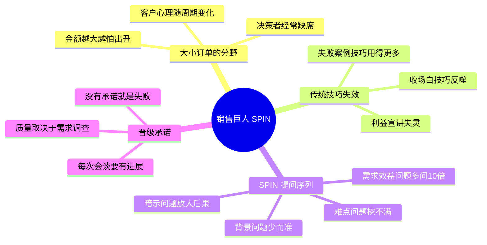

# 《销售巨人》(SPIN Selling) 读书笔记与思维导图

**作者**：尼尔·雷克汉姆 (Neil Rackham)，基于对 35000 多个销售案例的实证研究
**核心主旨**：大订单销售与小订单销售是两种完全不同的游戏。传统销售技巧（收场白、异议处理、开放/封闭式提问）在大订单中不仅无效，甚至有害。成功的关键在于用 SPIN 提问序列（背景、难点、暗示、需求-效益）让客户自己说出购买的价值。

---

## 1. 大订单与小订单是两种游戏

- **周期不同**：大订单需要多次拜访、更长时间，客户心理会在过程中变化；小订单一次成交，心理没有变化窗口。
- **决策者缺席**：大订单参与者众多，许多关键讨论发生在决策者本人缺席的场合——你无法在场说服，只能靠客户内部有人替你转述价值。
- **人货一体**：在买方看来，大订单中商品和销售人员是密不可分的整体；小订单中可以割裂。关系与售后是大订单的固有部分。
- **谨慎放大**：订单金额越大客户越谨慎，比金钱更重要的原因是怕决策失误在他人面前出丑。
- **价值理解是核心技巧**：大订单销售最重要的技巧，是让客户完全理解其购买决策可能带来的价值。

## 2. 传统技巧为何在大订单中失效

- **收场白技巧反噬**：决定越重要，人们对压力的抵制心理越消极。决策越大、买方越专业，收场白技巧的有效性越差——在大订单中它会让你失去更多订单。
- **利益宣讲失灵**：介绍产品特点与价值的"利益宣讲"在小订单大获全胜，在大订单惨遭失败——客户没有察觉价值之前，娴熟的产品介绍改变不了什么。
- **开放/封闭式提问的区分无意义**：研究没有发现优秀销售与平庸销售在开放/封闭型问题的使用上有任何不同。重要的不是问题的形式，而是问题的序列与目的。
- **技巧堆砌的反例**：研究记录显示，失败的销售过程中销售技巧的应用反而远多于成功的销售过程。

## 3. SPIN 提问序列

- **背景问题 (Situation)**：了解买方现状的事实。成功销售人员问得很少，但每一个都有偏重、有目的——背景问题问多了会让客户厌烦。
- **难点问题 (Problem)**：探询买方的不满、困难与问题。这是需求的种子。
- **暗示问题 (Implication)**：站在客户立场研究难点的影响和后果，让客户自己意识到问题的严重性和迫切性。这是大订单与小订单销售的分水岭。
- **需求-效益问题 (Need-Payoff)**：让客户自己说出解决方案的价值。出色的销售人员比普通销售人员问的需求-效益问题多 10 倍。
- **需求的定义**：买方表达的一种需要或关注，以能让卖方满意的方式陈述出来——需求必须由买方说出，而非卖方灌输。

## 4. 销售会谈的四阶段与晋级承诺

- **四阶段**：初步接触（热身）-> 需求调查（重中之重）-> 能力证实（证明你能解决问题）-> 晋级承诺（获得客户行动承诺）。
- **需求调查是重中之重**：几乎每笔生意都要通过提问做调查，这不是单纯的数据收集。提升需求调查技巧可使总销售额增加 20%。
- **晋级承诺而非成交**：大订单很少一次成交，每次会谈的成功标准是获得"晋级承诺"——客户答应一个推进销售的具体行动（引荐决策者、安排产品测试等）。没有销售进展、没有晋级承诺，就是销售不成功。
- **晋级质量取决于需求调查**：能否获得晋级承诺，取决于需求调查阶段处理得如何，而非会谈末尾的技巧。

## 个人想法与点评

- 对"收场白技巧在小订单有效、大订单失效"的论证方式提出质疑：加限定语来达到论证自身的目的，有循环论证之嫌。
- 整书书评：正文口水话偏多，方法论密度低于预期——理论内核（SPIN 序列 + 晋级承诺）可以压缩到很短的篇幅。

## 个人补充

- 个人划线集中在第 1-3 章的理论框架：大小订单的差异机制、四阶段模型、SPIN 序列的定义。相比社区共识（偏重金句和研究结论），个人关注点更偏向"为什么传统技巧会失效"的机制解释——决策压力与抵制心理、决策者缺席场景下的价值转述。
- 对本书的方法论持"批判性吸收"态度：SPIN 的提问序列有实证支撑值得用，但书中论证方式（如用限定语自证）需要警惕，不宜全盘接受。

## 思维导图

## 社区精华：热门划线 (Popular Highlights)

- 大订单销售的重要技巧就是让客户完全理解其购买决策可能带来的价值。（238 人划线）
- 决定越是重要，通常人们对压力就越有消极的抵制心理。（105 人划线）
- 在大订单销售中，收场白技巧会让你失去更多订单。（102 人划线）
- 大订单销售中每个人都可以通过提升需求调查技巧而使总销售额增加 20%。（96 人划线）
- 事实上，据我们的研究记录，在失败的销售过程中，销售技巧的应用远远多于在成功销售过程中的应用。（75 人划线）
- 背景问题是各种问题中最基本的一种，使用时要特别小心。成功销售人员会提问很少的背景问题，但他们每问一个都会有偏重、有目的。（64 人划线）
- 在每笔订单中，出色的销售人员较之普通的销售人员所问的需求—效益问题要多 10 倍。（60 人划线）
- 如果你争取订单的次数还没有超过 5 次时就放弃了，那么你就没有完成你的工作。（64 人划线）
