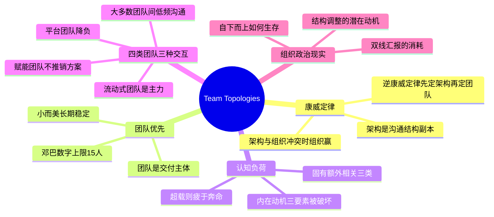

# 《高效能团队模式》(Team Topologies) 读书笔记与思维导图

**作者**：马修·斯凯尔顿 (Matthew Skelton)、曼纽尔·派斯 (Manuel Pais)；译者：石雪峰、董越、雷涛
**核心主旨**：团队（而非个人）是软件交付的基本单元。组织的沟通结构决定系统架构（康威定律），因此要反过来：先设计你想要的架构，再据此设计团队结构（逆康威定律），并用认知负荷作为划分团队职责边界的硬约束。

---

## 1. 康威定律与逆康威定律

- **康威定律**：设计系统的组织由于受到约束，这些设计往往是组织内部沟通结构的副本。四个小组合作开发编译器，你将得到一款四个步骤的编译器。
- **架构与组织冲突时，组织赢**：如果系统架构和组织结构不一致，组织结构将成为赢家。
- **逆康威定律**：组织要根据想得到的软件架构来设计团队结构，而不是期望团队盲从一个被设计好的结构。团队划分是软件架构的第一版草稿。
- **谁定团队即谁定架构**：如果让管理者决定哪些团队开发哪些服务，就相当于默认让管理者决定软件架构。组织设计需要技术专家参与。
- **职能竖井的代价**：按专业职能划分团队（QA、DBA、安全）时，难以面向端到端工作流设计良好架构。

## 2. 团队优先思维

- **团队是交付主体**：对知识密集型、问题解决型任务，有凝聚力的团队远超个人的集合。工作应指派给团队，而非个人。
- **邓巴数字定规模**：一个人可信任人数的极限约 15，深入信任约 5。高信任文化下团队最多 15 人。信任缺失时，交付速度和安全都会受损。
- **小而美的长期团队**：团队应保持稳定而非一成不变，项目结束不解散。高度信任是创新和实验的源泉。
- **三种组织架构**：官方架构（组织结构图）、非正式架构（个体影响范围）、价值创造架构（工作实际如何完成）。知识工作型组织成功的关键在后两者。

## 3. 认知负荷是团队边界的硬约束

- **三类认知负荷**：固有负荷（问题领域基本任务）、额外负荷（环境与工具摩擦）、相关负荷（增值学习）。策略：最小化固有（培训、好的技术选型）、消除额外（自动化）、为相关预留空间。
- **超载的症状**：团队疲于奔命、精力在任务切换中耗尽，表现为松散个体行为而非高效单元——对照 Dan Pink 内在动机三要素全部被破坏：自治（被请求淹没）、精通（样样懂无一精）、目标（职责过多）。
- **降负手段**：缩减会议与邮件、指派专人答疑、沟通目标而非过程（"着眼，放手"）、良好文档与开发者体验、专为降低认知负荷设计的平台。

## 4. 四种团队类型与三种交互模式

- **四类团队**：流动式团队（面向业务流的主力，长期稳定）、平台团队（提供内部服务降低流动式团队的认知负荷）、赋能团队（提升流动式团队能力而非推广自己的方案）、复杂子系统团队（封装需要专业知识的子系统）。
- **平台团队的目标**：让流动式团队高度自治地交付——流动式团队在生产环境拥有构建、运维、修复的所有权限。
- **三种交互模式**：协作模式（探索期高频互动）、服务模式（X-as-a-Service）、促进模式（赋能与辅导）。
- **限制非必要沟通**：并非所有沟通都有价值。团队内部高频、合作团队中频、大多数团队间低频。执行领域的沟通是不必要开销，探索领域才需要高带宽沟通。

## 个人想法与点评

- 对"工作指派给团队而非个人"存疑：实际执行中责任主体如何确定？基层 leader 说要做某事，事情就自动被做了吗？
- 对"执行领域沟通是开销"的冷峻观察：需要你干活就少说少听，需要你探索就多说多听——但人的社会里沟通和印象同等重要，这种设计是否把执行者只当执行单元而非人？
- 矩阵管理（双线汇报）亲历者共鸣：时间和精力的消耗更可能拖慢业务而非推动。
- "控制认知负荷"的另一面解读：本质是分级、控制信息的流入。
- "系统思维聚焦全局优化、找最大瓶颈"与《凤凰项目》说法一致——敏捷阵营的标准叙事，是时候看看敏捷的反面了。
- 对"组织应鼓励自下而上的创造力"的现实拷问：如果组织觉得你冒进、不守规矩怎么办？自下而上呈现时如何 show your influence？

## 个人补充

- 社区共识集中在康威定律、四类团队、认知负荷等框架本身；个人划线与想法的独特视角是**框架落地时的组织政治现实**：双线汇报的亲身经历、执行者视角对"沟通分层"的警惕、自下而上创新在层级组织中的生存问题。框架是理想态，落地要过权力结构这一关。
- 个人还标注了组织结构调整的潜在动机（减员或建山头）——读组织设计的书，也要读懂组织设计的政治。

## 思维导图

## 社区精华：热门划线 (Popular Highlights)

- 组织需要有意识地培养这种创造力和解决问题的能力，并从中受益，而不局限于自顶向下和自底向上的沟通和汇报。（126 人划线）
- 设计系统的组织由于受到约束，这些设计往往是组织内部沟通结构的副本。（120 人划线）
- 如果系统的架构和组织结构不一致，那么组织结构将成为赢家。（108 人划线）
- 我们需要以团队为中心的方法来实现可持续的 CI/CD，而不是以工具为中心。（102 人划线）
- 组织应该被视为一个复杂的具有适应性的有机体，而非一个机械的线性系统。（102 人划线）
- 无论流动式团队负责哪种类型的业务流，团队都应该保持长期稳定，而不是在完成某个项目后就立即解散。（96 人划线）
- 平台团队的目标是使流动式团队能够以高度自治的方式交付工作。（85 人划线）
- 赋能团队的使命是通过提升流动式团队的能力来提高其自主性，所以需要聚焦于解决流动式团队遇到的问题，而非推广自己手中的解决方案。（60 人划线）
- 团队内部高频沟通，两个合作团队之间可以保持中频沟通，而大多数团队间应该做到低频沟通。（68 人划线）
