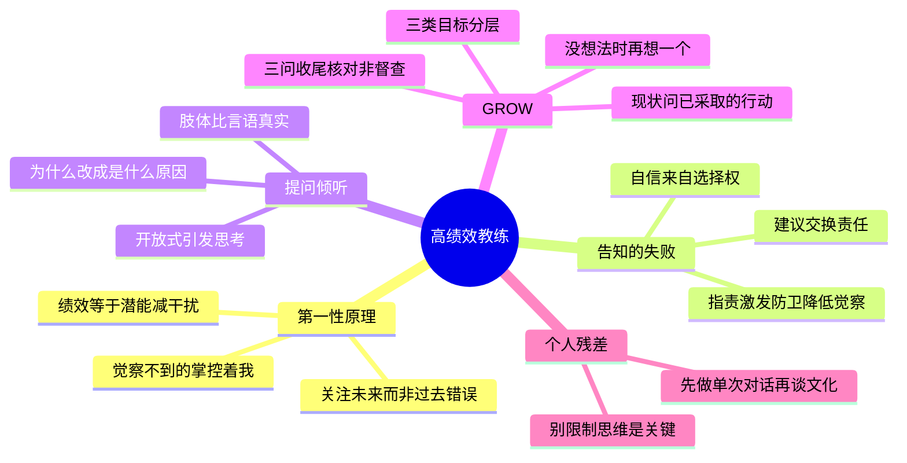

# 《高绩效教练》(Coaching for Performance) 读书笔记与思维导图

**作者**：约翰·惠特默 (John Whitmore)；译者：徐中、姜瑞、佛影
**核心主旨**：绩效 = 潜能 - 干扰。教练不是传授知识,而是通过提问创建觉察与责任感,帮助人排除内心干扰、释放潜能。GROW 模型是载体,觉察与责任感才是本质。

---

## 1. 教练的第一性原理

- **绩效公式**：绩效 = 潜能 - 干扰。真正的对手不是比赛中的对手,而是自己头脑中的对手;内心的障碍通常比外部障碍更令人生畏。
- **觉察给予力量**：我只能掌控我觉察到的一切,我觉察不到的东西掌控着我。不带评判的觉察本身就有治愈疗效。
- **教练的角色定位**：教练不是解决问题的能手、咨询师、顾问、教师或专家,而是回音壁、引导者、觉察创建者、支持者。重点是帮助人学习,而不是给人授课。
- **教练心态**：选择认为他人有能力、足智多谋、充满潜能——人像橡树的种子,成长为参天橡树的本质已在体内。教练关注未来的可能性,而不是过去的错误(这也是教练与心理咨询的区别)。

## 2. 为什么"告知"注定失败

- **记忆维度**：我们不能很好地记住被告知的东西;仅仅被告知时,记忆下降显著。
- **责任维度**：建议交换了责任——"我用我的建议来和你交换了你的责任"。命令剥夺选择权,当建议是命令时对方主动权为零,引发怨恨、暗中破坏或对着干。告知某人去承担责任,并不会让他真正感到有责任。
- **权力幻觉**：发号施令者只是在自欺欺人——对方当面屈从,转身就怨声载道、消极怠工。
- **指责的代价**:指责激发自我防卫,自我防卫降低自我觉察;没有准确的信息反馈,就没有恰当的自我调整。"一旦发现可以指责某人,对解释的追求似乎就结束了。"
- **自信来自选择权**:威望与特权只有象征意义;当某人真正拥有选择权时,自信才会建立。自我激励来自自我选择——"我想做是为了自己,我不得不做是为了你"。

## 3. 提问与倾听:教练的两大基本功

- **开放式问题引发思考**:告知或封闭式问题让人不思考;开放式问题要求描述性答案,从而提升觉察。示例组:你还想要些什么?你真正想要的是什么?到底什么正在发生?你还能做些什么?确切地说,你将会做些什么?
- **描述性优于评判性**:语汇越具体、越富有描述性,批判性越少,教练越起作用。答案描述性而非评判性,就不存在伤害自尊的风险。
- **提问禁忌**:避免引导性问题(暴露你不相信教练过程,宁可直接给建议也不要操控方向);避免暗含批评的"你到底为什么要这样做";"为什么"改为"是什么原因","如何"改为"做这件事的步骤是"。
- **积极倾听**:多数人只是在等待自己发言的时机。关注措辞与语气(负面词汇占主导、由开放转拘谨都有含义);肢体语言与言语冲突时,肢体更接近真实;监测自己身体的感觉来直觉对方情绪;警惕投射与移情。

## 4. GROW 模型

- **G 目标设定**:区分三类目标——终极目标(鼓舞人心但不全在掌控中)、绩效目标(基本可控、可衡量,支撑终极目标)、过程目标。目标要 SMART(具体/可衡量/一致同意/现实/有时限) + PURE(正向陈述/能被理解/相关/道德) + CLEAR(挑战性/合法/环保/适宜/被记录)。鼓励下属制定属于自己的挑战性目标。
- **R 现状分析**:最不会失败的问题:"到目前为止你已经采取了哪些行动?""那个行动的结果怎样?"——强调行动的价值以及行动与思考的差异。从难度较小的问题开始建立信任;解决问题背后的问题,而不是症状。
- **O 方案选择**:"当你确认你没有更多的想法时,再想出一个。"揭示隐含假设;比喻法——让对方为情境创建一个比喻,在比喻世界里延展,看解决方案是否浮现。
- **W 意愿行动**:三问收尾——你将要做什么?什么时候做?我怎么才能知道你做了?跟进核对而非督查。反馈三问:发生了什么?你从中学到了什么?未来你将怎样应用它?执行中自我激励感低时,回头核查目标的主人翁意识。
- **模型的边界**:GROW 只有在具有觉察和责任感的背景中才有效;威胁员工迫使其担责无效,因为员工没有选择。

## 5. 何时教练、何时告知

- 时间是首要因素(危机处理):自己动手或直接告知最快,但长期带来依赖。
- 工作成果品质最重要:教练提升觉察和责任感,最能达成。
- 学习效果最重要:教练对学习和记忆效果最大。
- 需要对方接受和承诺:教练比告知更能带来责任、减少抵制。
- 敬业度与人才保留最重要:教练创造意义感,是协调个人欲望与组织使命的最有效方法。
- **教练型领导者最关键的功课**:学会在什么时候分享知识和经验,什么时候不分享。

## 6. 团队教练与领导者职能

- **领导者只有两个职能**:完成任务,发展人才。管理关注运营与现状,领导力侧重发展、愿景和未来。
- **团队四阶段**:包容(需要安全感,领导者坦诚示弱带动)、主张(表达权力与边界,鼓励承担责任)、合作(警惕不允许异议的过度和谐)、共创。判断团队阶段的试金石:有成员遇到困难或获得胜利时,其他人是支持/庆祝,还是嫉妒/偷着乐/无感。
- **团队复盘五问**:哪些做得好?体现了哪些优势?面临哪些困难?学到了什么?下次会有什么不同?

## 个人想法与点评

- 对教练文化理想的清醒:"业绩、员工、环境三赢"很丰满,抵不住老板的焦虑——推行教练文化的最大阻力是管理层的时间压力与控制欲。
- 核心收获:"外行领导内行并不重要,重要的是别限制思维"——滑雪教练不懂网球反而教出更好的网球选手,正因为他不做技术规定、只问感觉。
- 联想《这是你的船》(It's Your Ship):军队场景同样在放权与提问中产生高绩效,印证教练原则的普适性。
- 对书籍装帧的吐槽:推荐序站台太多,水分大——直接从第一部分读起即可。

## 个人补充

热门划线是共识基线,以下是个人在共识之外补上的内容:

- 社区共识集中在**理念金句**(绩效公式、觉察、自我选择);个人划线密集在**操作细节**:何时教练何时告知的五条判据、提问禁忌("为什么"改写)、W 阶段三问、团队阶段试金石——理念易记,操作才是从"知道"到"做到"的桥。
- 个人残差指向**语境迁移**:教练文化预设领导者愿意让渡控制权,在时间压力与焦虑主导的组织里,先从单次对话的 GROW 提问开始,而不是推销整套文化。
- "建议交换责任"是对日常辅导行为的最大修正:每次想给答案前,先问自己是否在用建议买走对方的责任。

---

## 思维导图 (Mind Map)

*导图画的是"我标记过的书":叶子节点来自个人划线要点与热门划线,非全书大纲。*

---

## 社区精华:热门划线 (Popular Highlights)

*提取自微信读书全书最受认可的观点*

1. **面向未来** (1638人): 教练关注未来的可能性,而不是过去的错误。
2. **分享时机** (1376人): 教练型领导者最关键的是学会什么时候分享知识和经验,什么时候不分享。
3. **关注定律** (1278人): 你关注什么就会得到什么。如果你害怕失败,你就会关注失败,然后你就会失败。
4. **指责链条** (864人): 指责激发自我防卫,自我防卫降低自我觉察!没有准确的信息反馈,就不会有恰当的自我调整。
5. **觉察主权** (855人): 对于觉察到的事物,我们对其拥有主动权;没有觉察到的事物却对我们有主动权。
6. **自我激励** (810人): 我想做是为了自己,我不得不做是为了你,自我激励来自自我选择。
7. **绩效公式** (731人): 绩效 = 潜能 - 干扰。
8. **选择与自信** (690人): 当某人真正拥有选择权时,自信才会随之建立。
9. **提问改写** (644人): "为什么"最好表达成"是什么原因","如何"可以用"做这件事情的步骤是"替代。
10. **橡树种子** (527人): 人类更像橡树的种子,每一颗都蕴藏着成长为参天橡树的潜质。
