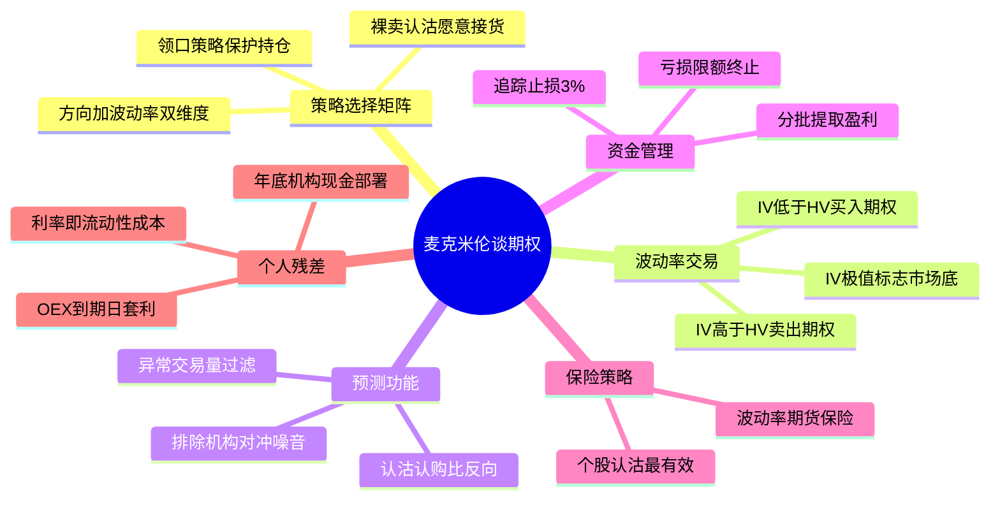

# 《麦克米伦谈期权》读书笔记与思维导图

**作者**：劳伦斯 G. 麦克米伦 (Lawrence G. McMillan)
**译者**：深圳证券交易所 衍生品丛书编译组
**核心主旨**：期权不是赌博工具，而是可定价、可组合、可预测的金融衍生品。根据市场预期（方向 + 波动率）选择策略，用隐含波动率与历史波动率的比较决定买卖方向，以严格的资金管理和止盈止损纪律实现长期生存。

---

## 1. 期权定价与核心希腊字母

*   **波动率是定价难点**：波动率是决定期权公允（理论）价格的关键变量。不知道标的波动性，就无法准确给期权定价。
*   **隐含波动率 vs 历史波动率**：当隐含波动率高时，期权比较贵；当隐含波动率低时，期权比较便宜。同一行权价、同一到期日的认购与认沽期权，隐含波动率一定相同，否则存在无风险套利机会。
*   **Delta 的实用解读**：Delta 衡量标的价格波动 1 点，对应期权价格的波动幅度。5 月 100 认购期权的 delta 是 0.20，可理解为到期前股价上涨到 100 以上的概率约为 20%。
*   **等价策略不等价收益**：买入 1 手认购期权的成本远低于买入 100 股股票和 1 手认沽期权，但两种策略等价并不意味着收益率相同。
*   **利率与流动性**：利率影响期权定价，本质与国债类似——代表资金的时间价值和流动性成本。

## 2. 策略选择矩阵：方向 + 波动率

期权策略选择的核心是先判断两个维度：**标的价格方向**和**波动率预期**。

### 2.1 看涨/看跌（方向明确，波动率中性）

*   **直接买入期权**：对股票行情的预期是最重要的——如果股价下跌，无论买什么样的认购期权都无法盈利。盈利时要及时平仓。
*   **避免深度虚值期权**：新手最常犯的错误是买入临近到期的深度虚值期权，过于乐观地寄希望于市场按自己想法运动。社区 128 人划线强调这是普遍错误。
*   **买入跨式/宽跨式**：①历史数据表明期权是便宜的；②标的曾经出现过大幅波动。若预期大幅波动且想在波动前买入，跨式比宽跨式更有利。

### 2.2 卖出期权（方向中性或略涨，低波动率）

*   **卖出认购期权**：在股票价格稳定或略有上涨时表现最好。标的价格波动很大或变得很高时，该策略不再吸引人——无法从大幅上涨中获利，却须承受大幅下跌后果。
*   **备兑认购 vs 裸卖认沽**：卖出备兑认购也许并不如人们想象的那样保守，而裸卖出认沽期权也未必那么危险。若卖出你愿意持有股票的虚值认沽期权，则处于"不败之地"——涨则收权利金，跌则以低价买入心仪股票。
*   **"90% 到期无价值"的误导**：许多人被这一错误设想误导而裸卖出期权，有时甚至损失惨重。裸卖方不应在即将到期前卖出极度便宜的期权，因为最后巨大的亏损可能抹掉所有"微小的"盈利。
*   **行权收益率 vs 无变化收益率**：卖出期权前必须计算两个数字——到期被交割时的行权收益率，以及到期价格不变时的无变化收益率。

### 2.3 价差策略（限制风险，控制成本）

*   **领口策略 (Collar)**：买入标的 + 买入虚值认沽（限制下行）+ 卖出虚值认购（限制上行）。相当受欢迎的保护股票头寸策略。适用条件：股票相对高的波动率 + 期权期限长。
*   **贷方价差替代裸卖**：裸卖出期权的主要问题在于标的突然波动或开盘跳空时风险无限。贷方价差降低风险并提供较高杠杆率，但从统计学角度并非更优。
*   **对角价差**：当近期期权相对远期期权更贵时，对角价差是替代垂直价差的颇有吸引力策略——仍保留看多可能，还获得短期期权时间衰减的好处。
*   **反向价差**：第一个标准是标的具有在某一方向上大幅变动的可能性。

### 2.4 策略选择速查

| 市场预期 | 波动率预期 | 推荐策略 |
|---------|-----------|---------|
| 看涨 | 低波动 | 买入认购 / 牛市价差 |
| 看涨 | 高波动 | 对角价差 / 卖出认沽 |
| 看跌 | 低波动 | 买入认沽 |
| 看跌 | 高波动 | 熊市价差 |
| 方向不明 | 低波动 | 买入跨式 / 宽跨式 |
| 方向不明 | 高波动 | 卖出跨式 / 铁鹰 |
| 持有股票 | 高波动 | 领口策略 / 备兑认购 |
| 持有股票 | 低波动 | 裸卖认沽（愿意接货） |

## 3. 波动率交易

*   **核心规则**：若隐含波动率低于历史波动率，合适的策略为买入期权（如买入跨式）；若隐含波动率高于历史波动率，正常情况下认为 IV 会降低并与 HV 趋同，此时适合卖出期权。
*   **特殊原因例外**：若怀疑 IV 与 HV 不一致是由某种特殊原因（如即将公布重大事件）导致，不应采用波动率交易。标的价格也会因此大幅变化，此时应避免卖出高 IV 期权。
*   **崩盘前的信号**：将要崩盘前的隐含波动率会非常低——期权往往在大幅波动之前变得非常便宜。
*   **IV 极值作为市场指标**：
    - 每当石油价格趋势开始加速时，石油期权的 IV 也会增长。
    - 当 IV 在股票下跌过程中达到极点，股票至少会稳定下来，甚至可能回弹。
    - 一旦波动率达到顶部，卖出备兑认购期权是应当选择的策略。
    - 极高的 IV（特别是作为顶部时），一般标志着宽基市场已到短期底部。
*   **Delta 中性交易**：Delta 头寸即等价股票头寸 (ESP)。Delta 中性只能在短时间内或标的价格变化范围较小时保持中性，需要持续调整。

## 4. 期权的预测功能

### 4.1 异常期权交易量

*   **基本信号**：股票期权显著增加的交易量通常是标的价格变动的先兆。当天期权总交易量超过平均两倍时值得关注。
*   **排除机构对冲**：若绝大部分交易量集中在一个期权合约（仅一个认购或认沽合约），则不太可能有特别事件——可能是机构卖出备兑认购或买入保护性认沽。不管总量多大，都与公司发展无关。
*   **投机性信号**：当所有期权交易量几乎都集中在一个合约时，几乎不可能是投机性的——这才是真正的预测信号。
*   **操作纪律**：筛选期权活动再谨慎，交易中导致亏损的概率仍略高于 50%。

### 4.2 期权价格作为指标

*   **昂贵期权 → 买入股票**：在标识潜在盈利运动时，昂贵的期权是有用的——利用期权变贵的事实，买入股票而不是期权。
*   **方向不明 → 离场**：若期权预示该股票会有重大价格变化（方向不明），也许在新闻事件公布之前不应持有该股票。若不想把积累的盈利拿去冒险，应在判决/公告之前离场。

### 4.3 隐含波动率预测趋势

*   IV 趋势加速往往伴随标的价格趋势加速，可作为趋势变动的领先指标。
*   IV 在下跌过程中达到极点是潜在的反转信号。

### 4.4 认沽认购比 (Put/Call Ratio)

*   **反向指标逻辑**：当大多数人看多市场（大量买入认购期权）时，反向投资者会反向卖空——他们认为多数人的意见往往是错误的。
*   **指数期权局限**：当一个指数期权被大量用于对冲或套利时，其指示作用被削弱。

### 4.5 移动平均线（阿姆氏指标）

*   通过观察阿姆氏指标的移动平均线：均线维持在高水平太久说明市场超卖，寻找买入信号；均线太低说明市场超买，寻找卖出信号。

## 5. 保险策略

*   **个股认沽期权**：买入股票认沽期权是个股最有效的保险策略，常常是效率最高、成本最低的股票保险方法。认沽期权的虚值部分可看作保险中的"免赔"部分。
*   **指数认沽替代**：若买入与股票组合特性差不多的行业指数认沽或宽基指数认沽，操作会简单很多。
*   **领口策略**：①股票相对高的波动率；②期权期限长。限制下行同时放弃部分上行。
*   **波动率期货保险**：使用波动率期货构建组合保险——在 IV 低位买入波动率期货，为组合提供尾部保护。
*   **期权作为标的代理**：对于保护股票多头，买入长期认沽期权更有效；但经纪商更偏好"卖出股票 + 买入认购期权"替代方案（资本效率不同）。

## 6. 资金管理与交易纪律

*   **亏损限额**：专业交易公司对一个策略设定亏损限额，达到限额则终止交易。
*   **动态头寸规模**：盈利就追加资金，亏损就减小交易规模。每次赢时增加赌注，输了回到最初下注规模（逐步下注法：每次将赌注增加 60%，赢来的 40% 留下）。
*   **止盈三件套**：
    1. 分批提取部分盈利——股票朝有利方向迅速运动时，先拿走部分盈利。
    2. 使用追踪止损 (trailing stop)。
    3. 设定具体止损比例（如 3%）。
*   **盈利锁定与延续**：获得收益后卖出部分头寸——在锁定盈利的同时保留进一步获利机会的最简办法。
*   **订单执行**：仅对流动性很好的期权（如 OEX、IBM）或小于 10 手的小订单使用市价单；流动性差的期权构建成本会远高于必要成本。
*   **坚持策略**：若有经过充分研究的确定看法，要相信自己，坚持策略——但也不要被牛市冲昏头脑，盈利可能只是市场幸运地朝有利方向运动。

## 7. 交易理念与常见错误

*   **方向第一**：在讨论应买入何种期权之前，对股票行情的预期是最重要的。
*   **避免虚值期权**：麦克米伦明确建议避免买入虚值期权——这是新手期望过高、频繁亏损的主因。
*   **等价策略思维**：最重要的等价策略是与买入/卖出股票（或期货）对等的期权头寸。
*   **不以模型为借口**：没有在交易中使用波动率（或不使用模型）是常见失误；没有合理管理资金（止损、分批提取）也是。但最大的答案是大部分新手对头寸期望过高。
*   **以自己舒适的方式交易**：不必模仿他人策略，选择与自身风险承受能力匹配的方式。
*   **利用计算机**：麦克米伦鼓励每位期权交易者利用计算机程序建立分析框架。

## 8. 特殊场景与季节性

*   **到期日效应**：若股价在期权快到期那两天接近行权价且该行权价持仓量很大，股价会被"拉到"行权价。观察实值期权持仓量的逐日变化，可"感觉"到市场存在的买压或卖压。
*   **OEX 套利窗口**：若知 OEX 套利交易者会在到期日收盘时买入大量股票，可等到东部时间下午 3 点半再买入当天到期的 OEX 实值或平值认购期权。
*   **核税抛售**：快到年底时，人们更偏向抛售小盘股来确认亏损。
*   **机构现金部署**：机构不想在账上留存大量现金，因此会大量买入股票来花掉多余现金——形成年底季节性上涨倾向。

---

## 个人想法与点评

1. **整体评价**：麦克米伦是期权领域的经典教材，100 多张图表覆盖开仓、持仓、平仓三阶段的分析与调整，实操性强。与《动量策略》同属 P4 投资扩展矩阵——动量管趋势选股，期权管波动率交易与组合保护，两者互补。（评分：87.7/100）
2. **关于利率**（1.9 节）：个人理解利率与国债类似，本质是钱/流动性的时间成本——这对理解期权定价中的无风险利率参数有帮助。
3. **关于季节性**（5.6 节）：机构年底花掉多余现金买入股票——"为什么偷看我的持仓动向"，说明季节性规律对个人投资者同样适用。
4. **关于 Delta**（1.10 节）：将 delta 视为到期实值概率的简化方法虽不完全精确，但对快速决策足够实用。
5. **关于裸卖认沽**（2.5 节）：社区 68 人划线共识——裸卖认沽未必那么危险，关键是你是否愿意以行权价买入该股票。

---

## 个人补充

热门划线是共识基线，以下是个人在共识之外补上的内容:

*   社区共识集中在**避免深度虚值期权**和**盈利时及时平仓**；个人划线密集在**波动率交易的完整决策链**——IV vs HV 比较、特殊原因例外、IV 极值作为市场底部信号，以及 Delta 中性头寸的维护限制。
*   个人残差指向**期权预测功能的过滤逻辑**：不是所有异常交易量都有预测价值——必须排除机构对冲/备兑导致的单合约集中交易，只有分散于单一合约的投机性异常量才是真信号。
*   **领口策略 vs 裸卖认沽**的取舍：社区讨论多聚焦"哪个更危险"，个人补充更关注适用条件——领口需要高波动 + 长期限；裸卖认沽需要"愿意接货"的心理准备和标的筛选。
*   **到期日 OEX 套利窗口**是个人划线中较独特的战术细节，属于短期事件驱动交易，与主线的波动率/方向策略矩阵形成补充。

---

## 思维导图 (Mind Map)

*导图画的是"我标记过的书"：叶子节点来自个人划线要点与热门划线，非全书大纲。*

---

## 社区精华：热门划线 (Popular Highlights)

*提取自微信读书全书最受认可的观点*

1. **深度虚值陷阱**: 他们普遍犯的错误是，买入深度虚值的期权。（128人划线）
2. **基本面局限**: 基本面分析更适用于长期交易，但不适用于短期交易决策。（90人划线）
3. **波动前便宜**: 期权往往在大幅波动之前变得非常便宜。（78人划线）
4. **卖认购的条件**: 整体而言，卖出认购期权在股票价格稳定或者略有上涨时表现最好。如果标的价格波动很大或变得很高，该策略就不是一个吸引人的策略。（75人划线）
5. **锁定盈利**: 即便正确预测了股价走势并买入期权获利，你还是必须采取一定的措施，在适当的时候锁定盈利。在获得收益之后，卖出部分头寸。（72人划线）
6. **裸卖末期风险**: 期权裸卖方不应该在即将到期前卖出极度便宜的期权，因为最后巨大的亏损可能会抹掉所有"微小的"盈利。（72人划线）
7. **备兑 vs 裸卖认沽**: 卖出备兑认购期权也许并不如人们想象的那样保守，而裸卖出认沽期权也未必那么危险。（68人划线）
8. **期望过高**: 大部分交易新手对头寸期望过高，总是买入临近到期的深度虚值期权。（68人划线）
9. **认沽免赔**: 你可以把认沽期权的虚值部分看作保险中的"免赔"部分。（64人划线）
10. **方向第一**: 在讨论应买入何种期权之前，必须说明一点，对股票行情的预期是最重要的。（60人划线）
11. **及时平仓**: 上述策略的关键在于，盈利时要及时平仓。（60人划线）
12. **领口策略**: 买入标的，买入虚值认沽，同时卖出虚值认购——该头寸叫作领口策略，是相当受欢迎的保护股票头寸的策略。（52人划线）
13. **IV 一致性**: 行权价格和到期日相同的认购和认沽期权，其隐含波动率一定相同，否则就会存在无风险套利机会。（52人划线）
14. **Delta 概率**: 5月100认购期权的delta是0.20，则说明在5月期权到期前股价上涨到100以上的概率是20%。（60人划线）
15. **等价不等收益**: 买入1手认购期权的成本远低于买入100股股票和1手认沽期权，但两种策略等价并不意味着收益率相同。（54人划线）
