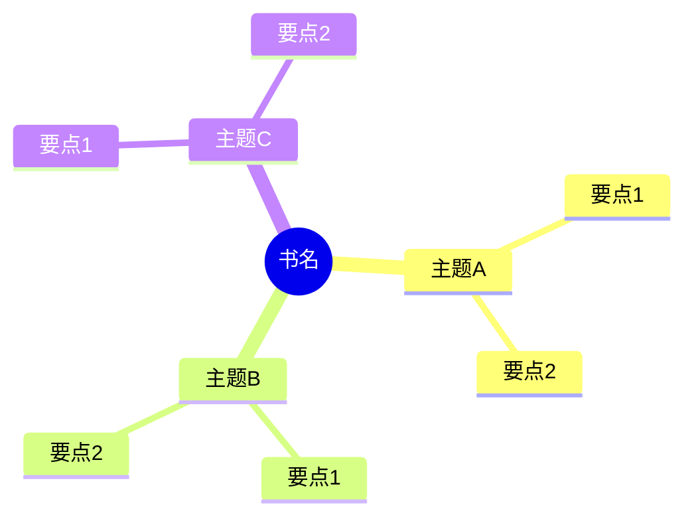

# 《书名》(English Title) 读书笔记与思维导图

**作者**: [作者名]；译者: [译者名(如有)]
**核心主旨**: [一句话概括本书核心观点]

---

## 1. [主题模块名称]

- **[关键词]**: [阐述]
- **[关键词]**: [阐述]

## 2. [主题模块名称]

- **[关键词]**: [阐述]

## 3. [主题模块名称]

- **[关键词]**: [阐述]

## 个人想法与点评

- [对书中某一观点的评价、联想或质疑]

## 个人补充

> 残差设计: 热门划线代表共识(基线)，此处记录"我"在共识之外的独特补充。

- [你认为重要但不在热门划线中的内容]

## 思维导图

## 社区精华: 热门划线 (Popular Highlights)

- "[划线原文]" —— [X人划线]
- "[划线原文]" —— [X人划线]
